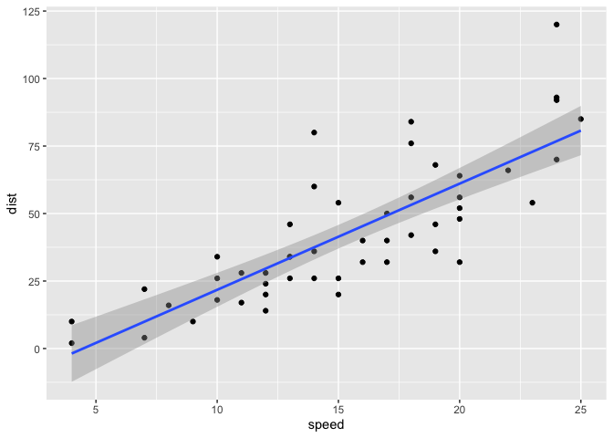
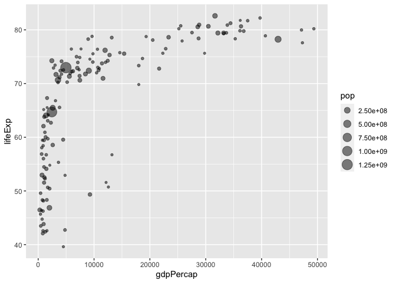
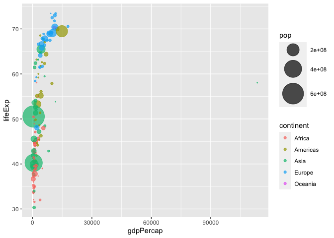
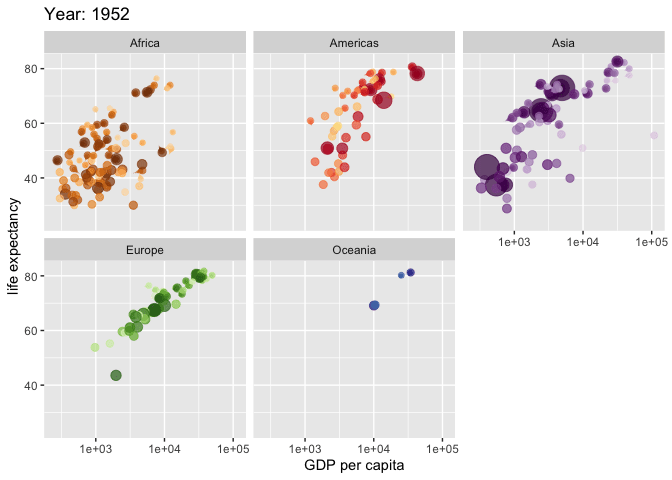

Class 05: Data Visualization
================
Andrew Kapinos
October 13th, 2021

``` r
###############################################################################
# Section 5: Creating Scatter Plots (genes)
###############################################################################

# If not installed, need to use install.packages() with name of package
# install.packages("ggplot2")

# First we need to load the package
library(ggplot2)

# We will use the inbuilt "cars" dataset as an example

# head() shows us only the top of a dataset, useful for seeing what the 
#   format is
head(cars)
```

    ##   speed dist
    ## 1     4    2
    ## 2     4   10
    ## 3     7    4
    ## 4     7   22
    ## 5     8   16
    ## 6     9   10

``` r
# All ggplots have at least 3 layers: data + aes + geoms
# For data, enter the dataset being used
# For aes, enter the data being used as the x- and y-values
# For geoms, use geom_point() to create a dot graph

ggplot(cars) +
  aes(x=speed,y=dist) +
  geom_point()
```

<!-- -->

``` r
#   Optional: can add smoothed cond. means using geom_smooth()
#     This will add another layer to the ggplot graphic
#     Use geom_smooth(method=lm) for a linear model

ggplot(data=cars) +
  aes(x=speed, y=dist) +
  geom_point() +
  geom_smooth(method=lm)
```

    ## `geom_smooth()` using formula 'y ~ x'

<!-- -->

``` r
# Optional: can add titles, change axis labels, etc. using labs()

ggplot(data=cars) +
  aes(x=speed, y=dist) +
  geom_point() +
  geom_smooth(method=lm) +
  labs(title="Stopping Distance of Old Cars",
       x="Speed (MPH)",
       y="Stopping Distance (ft)")
```

    ## `geom_smooth()` using formula 'y ~ x'

<!-- -->

``` r
# Note: ggplot is not the only graphics system
#   A very popular one is "base" R graphics, comes with R itself
#   plot(cars) yields same graphic as first three lines in ggplot code above

# Next we will plot gene expression using the "gene" dataset
# Use the following to import the tab-delimited data, assign to the object 
#   "genes" and view the top of the table
#   Note: read.delim() function imports tab-delimited data as a data frame
url <- "https://bioboot.github.io/bimm143_S20/class-material/up_down_expression.txt"
genes <- read.delim(url)
head(genes)
```

    ##         Gene Condition1 Condition2      State
    ## 1      A4GNT -3.6808610 -3.4401355 unchanging
    ## 2       AAAS  4.5479580  4.3864126 unchanging
    ## 3      AASDH  3.7190695  3.4787276 unchanging
    ## 4       AATF  5.0784720  5.0151916 unchanging
    ## 5       AATK  0.4711421  0.5598642 unchanging
    ## 6 AB015752.4 -3.6808610 -3.5921390 unchanging

``` r
# To determine number of genes in the dataset, use nrow()
nrow(genes)
```

    ## [1] 5196

``` r
# To determine number of columns, use ncol()
ncol(genes)
```

    ## [1] 4

``` r
# To determine column names, use colnames()
colnames(genes)
```

    ## [1] "Gene"       "Condition1" "Condition2" "State"

``` r
# To determine number of genes that are "up", can use table() and filter by 
#   State
table(genes$State)
```

    ## 
    ##       down unchanging         up 
    ##         72       4997        127

``` r
# To determine percentage of genes that are "up", can divide table() filtered
#   output by total number of genes, then multiple by 100
table(genes$State)/nrow(genes)*100
```

    ## 
    ##       down unchanging         up 
    ##   1.385681  96.170131   2.444188

``` r
# To provide answer with a specific number of significant figures or 
#   decimal places (eg. 2) use round() function and argument with desired 
#   number of values 
round(table(genes$State)/nrow(genes)*100,2)
```

    ## 
    ##       down unchanging         up 
    ##       1.39      96.17       2.44

``` r
# For aes() can use an additional argument, aes(col=____) to assign colors to 
#   values based on a variable
# Can save this plot as an object using, for example, p <-
p <- ggplot(data=genes) +
  aes(x=Condition1, y=Condition2, col=State) +
  geom_point()

# To assign specific color values, use scale_colour_manual(values=____) along 
#   with a vector containing the desired colors
# Can also add plot title and x/y axis labels using labs() as above
p + scale_colour_manual(values=c("blue","grey","red")) +
  labs(title="Gene Expression Changes Upon Drug Treatment",
       x="Control (no drug)",
       y="Drug Treatment")
```

<!-- -->

``` r
###############################################################################
# Section 6: Going Further (gapminder)
###############################################################################

# Next, we'll use the gapminder package to download and load a new dataset for 
#   ggplot graphic creation. For this, use:
#   install.packages("gapminder")
library(gapminder)

# After downloading gapminder, we need to install and load the dplyr package
# install.packages("dplyr")
library(dplyr)
```

    ## 
    ## Attaching package: 'dplyr'

    ## The following objects are masked from 'package:stats':
    ## 
    ##     filter, lag

    ## The following objects are masked from 'package:base':
    ## 
    ##     intersect, setdiff, setequal, union

``` r
# Now we'll filter gapminder to create a new dataf rame with only the rows that
#   have 2007 in the year column
gapminder_2007 <- gapminder %>% filter(year==2007)

# We'll use ggplot to create a basic scatter plot of the gdpPercap and lifeExp
#   variables from this new data frame
ggplot(gapminder_2007) +
  aes(x=gdpPercap,y=lifeExp) +
  geom_point()
```

<!-- -->

``` r
# We can use geom_point(alpha=0.5) to make the points slightly transparent
ggplot(gapminder_2007) +
  aes(x=gdpPercap,y=lifeExp) +
  geom_point(alpha=0.5)
```

<!-- -->

``` r
# Next, we'll use color and size arguments for aes() to add information re:
#   additional variables for each point/observation
ggplot(gapminder_2007) +
  aes(x=gdpPercap,y=lifeExp,color=continent,size=pop) +
  geom_point(alpha=0.5)
```

<!-- -->

``` r
# If we change the color argument to be based on pop instead, the color scale
#   will now be continuous and point size will be reverted to default
ggplot(gapminder_2007) +
  aes(x=gdpPercap,y=lifeExp,color=pop) +
  geom_point(alpha=0.5)
```

<!-- -->

``` r
# If we change the size argument to be based on pop only, the color scale
#   is removed and point size will be based on pop data
ggplot(gapminder_2007) +
  aes(x=gdpPercap,y=lifeExp,size=pop) +
  geom_point(alpha=0.5)
```

<!-- -->

``` r
# This size scale is not proportional to actual differences in population size,
#   so we may use scale_size_area() to adjust the point's max size
ggplot(gapminder_2007) +
  aes(x=gdpPercap,y=lifeExp,size=pop) +
  geom_point(alpha=0.5) +
  scale_size_area(max_size=10)
```

<!-- -->

``` r
# Let's reassign the color scale to reflect continent values
ggplot(gapminder_2007) +
  aes(x=gdpPercap,y=lifeExp,size=pop,color=continent) +
  geom_point(alpha=0.5) +
  scale_size_area(max_size=10)
```

<!-- -->

``` r
# We can perform these steps again to get the same data from 1957, in order to
#   compare the data from 1957 and 2007
gapminder_1957 <- gapminder %>% filter(year==1957)

# We'll set the maximum point size to 15 and the opacity to 0.7
ggplot(gapminder_1957) +
  aes(x=gdpPercap,y=lifeExp,size=pop,color=continent) +
  geom_point(alpha=0.7) +
  scale_size_area(max_size=15)
```

<!-- -->

``` r
# We can create a new variable containing the data from both 1957 and 2007,
#   use ggplot to compare them side-by-side, and use facet_wrap() to display
#   the years pertaining to each panel of the graphic.
gapminder_1957_2007 <- gapminder %>% filter(year==1957 | year==2007)
ggplot(gapminder_1957_2007) +
  aes(x=gdpPercap,y=lifeExp,size=pop,color=continent) +
  geom_point(alpha=0.7) +
  scale_size_area(max_size=10) +
  facet_wrap(~year)
```

<!-- -->

``` r
###############################################################################
# Section 7: Bar Charts (gapminder, USArrests)
###############################################################################

# First, we'll create a new data frame containing the 5 most populous countries
#   in 2007

gapminder_top5 <- gapminder %>%
  filter(year==2007) %>%
  arrange(desc(pop)) %>%
  top_n(5,pop)

gapminder_top5
```

    ## # A tibble: 5 × 6
    ##   country       continent  year lifeExp        pop gdpPercap
    ##   <fct>         <fct>     <int>   <dbl>      <int>     <dbl>
    ## 1 China         Asia       2007    73.0 1318683096     4959.
    ## 2 India         Asia       2007    64.7 1110396331     2452.
    ## 3 United States Americas   2007    78.2  301139947    42952.
    ## 4 Indonesia     Asia       2007    70.6  223547000     3541.
    ## 5 Brazil        Americas   2007    72.4  190010647     9066.

``` r
# We'll use the geom_col() layer to create a bar graph.

ggplot(gapminder_top5) +
  geom_col(aes(x=country,y=pop))
```

<!-- -->

``` r
# By default, country names (x) are sorted in alphabetical order.

# We may also use the fill aesthetic to assign a color to each bar using a variable.
#   In this case, we'll assign the colors based on continent.

ggplot(gapminder_top5) +
  geom_col(aes(x=country,y=pop,fill=continent))
```

<!-- -->

``` r
# Since continent contains a categorical variable, the bars have a color scheme
#   Ie. they are not continuous. Let's try the life expectancy variable instead.

ggplot(gapminder_top5) +
  geom_col(aes(x=country,y=pop,fill=lifeExp))
```

<!-- -->

``` r
# Using a continuous fill variable gives us a color scale instead.

# Let's create a bar chart showing population by GDP per capita of the 5 largest countries.

ggplot(gapminder_top5) +
  aes(x=country,y=pop,fill=gdpPercap) +
  geom_col()
```

<!-- -->

``` r
# We can reorder the bars by using the reorder() function in the aes argument.

ggplot(gapminder_top5) +
  aes(x=reorder(country, -pop), y=pop, fill=gdpPercap) +
  geom_col()
```

<!-- -->

``` r
# We may also just color the bars by country, as below.

ggplot(gapminder_top5) +
  aes(x=reorder(country, -pop), y=pop, fill=country) +
  geom_col(col="gray30") +
  guides(fill=FALSE)
```

    ## Warning: `guides(<scale> = FALSE)` is deprecated. Please use `guides(<scale> =
    ## "none")` instead.

<!-- -->

``` r
# Sometimes, we may want to rotate our plot to be horizontal instead of vertical.
#   We can do so using the coord_flip() function.

head(USArrests)
```

    ##            Murder Assault UrbanPop Rape
    ## Alabama      13.2     236       58 21.2
    ## Alaska       10.0     263       48 44.5
    ## Arizona       8.1     294       80 31.0
    ## Arkansas      8.8     190       50 19.5
    ## California    9.0     276       91 40.6
    ## Colorado      7.9     204       78 38.7

``` r
USArrests$State <- rownames(USArrests)
ggplot(USArrests) +
  aes(x=reorder(State,Murder), y=Murder) +
  geom_col() +
  coord_flip()
```

<!-- -->

``` r
# This arrangement is too crowded. We can change the way that crowded data is
#   visualized by combining geom_point() with geom_segment() instead of geom_col())

ggplot(USArrests) +
  aes(x=reorder(State,Murder), y=Murder) +
  geom_point() +
  geom_segment(aes(x=State, 
                   xend=State, 
                   y=0, 
                   yend=Murder), color="blue") +
  coord_flip()
```

<!-- -->

``` r
# Awesome! This looks much better.

###############################################################################
# Section 8: Plot Animation (gapminder)
###############################################################################

# We can animate our plots using gganimate! We'll need to install the package,
#   then install gifski, which allows us to make gifs.
#   install.packages("gganimate") and install.packages("gifski")

library(gapminder)
library(gganimate)

# Here is an example script which contains animated plots of life expectancy by
#   capita, faceted by continent and animated across years.

# Setup nice regular ggplot of the gapminder data
ggplot(gapminder, aes(gdpPercap, lifeExp, size = pop, colour = country)) +
  geom_point(alpha = 0.7, show.legend = FALSE) +
  scale_colour_manual(values = country_colors) +
  scale_size(range = c(2, 12)) +
  scale_x_log10() +
  # Facet by continent
  facet_wrap(~continent) +
  # Animate using gganimate
  labs(title = 'Year: {frame_time}', x = 'GDP per capita', y = 'life expectancy') +
  transition_time(year) +
  shadow_wake(wake_length = 0.1, alpha = FALSE)
```

<!-- -->

``` r
# Sweeeet!

###############################################################################
# Section 8: Plot Animation (gapminder)
###############################################################################

# We can use patchwork to combine plots into a single figure with multiple 
#   panels.

# Let's load pathwork first.
#library(ggplot2)
#library(patchwork)
#head(mtcars)

# Now we can set up some example plots that will comprise our individual panels.
#p1 <- ggplot(mtcars) + 
#  geom_point(aes(mpg,disp))
#p2 <- ggplot(mtcars) + 
#  geom_boxplot(aes(gear,disp,group=gear))
#p3 <- ggplot(mtcars) + 
#  geom_smooth(aes(disp,qsec))
#p4 <- ggplot(mtcars) + 
#  geom_bar(aes(carb))

# Finally we can use patchwork to combine the plots into a single figure.
#(p1|p2|p3) /
#  p4


###############################################################################
# Extra: In-class discussion
###############################################################################

# Making jitter plots and sorting data by color
ggplot(gapminder) +
  aes(x=year, y=lifeExp, col=continent) +
  geom_jitter(width=0.3,alpha=0.4)
```

<!-- -->

``` r
# Can overlay a boxplot to add more information
ggplot(gapminder) +
  aes(x=year, y=lifeExp, col=continent) +
  geom_jitter(width=0.3,alpha=0.4) +
  geom_boxplot(aes(group=year),alpha=0.2)
```

<!-- -->

``` r
# Can overlay a violin plot as well
ggplot(gapminder) +
  aes(x=year, y=lifeExp, col=continent) +
  geom_jitter(width=0.3,alpha=0.4) +
  geom_violin(aes(group=year),alpha=0.2,draw_quantiles=0.5)
```

<!-- -->

``` r
# Can use plotly to visualize interactive ggplots
#   Install and load plotly package
#     install.packages("plotly")
library(plotly)
```

    ## 
    ## Attaching package: 'plotly'

    ## The following object is masked from 'package:ggplot2':
    ## 
    ##     last_plot

    ## The following object is masked from 'package:stats':
    ## 
    ##     filter

    ## The following object is masked from 'package:graphics':
    ## 
    ##     layout

``` r
# Run ggplot() then ggplotly() to interact with graphics in the Viewer window
```
