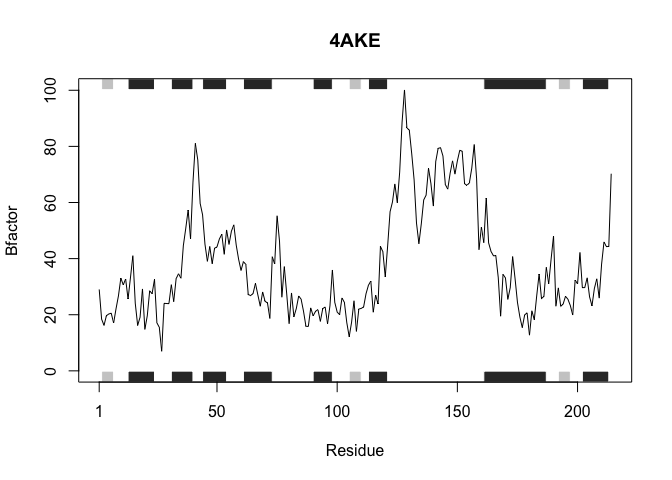
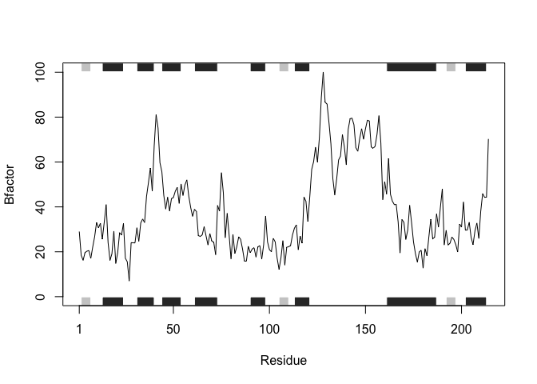
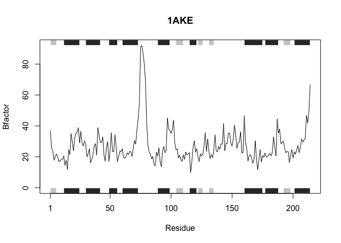
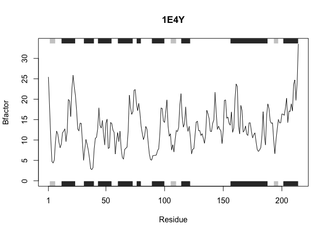

Improving analysis code by writing functions
================
Andrew Kapinos
10/23/2021

# Can you improve this analysis code?

``` r
# library(bio3d)  
# s1 <- read.pdb("4AKE") # kinase with drug  
# s2 <- read.pdb("1AKE") # kinase no drug  
# s3 <- read.pdb("1E4Y") # kinase with drug  

# s1.chainA <- trim.pdb(s1, chain="A", elety="CA")  
# s2.chainA <- trim.pdb(s2, chain="A", elety="CA")  
# s3.chainA <- trim.pdb(s3, chain="A", elety="CA")  

# s1.b <- s1.chainA$atom$b  
# s2.b <- s2.chainA$atom$b  
# s3.b <- s3.chainA$atom$b  

# plotb3(s1.b, sse=s1.chainA, typ="l", ylab="Bfactor")  
# plotb3(s2.b, sse=s2.chainA, typ="l", ylab="Bfactor")  
# plotb3(s3.b, sse=s3.chainA, typ="l", ylab="Bfactor")  
```

> Q6. How would you generalize the original code above to work with any
> set of input protein structures?

We need to break down the original code into its various steps.

Step 1: Load bio3d packages.  
Step 2: Access online PDB file and assign to an object.  
Step 3: Trim PDB file to only include chain A.  
Step 4: Describe b for atoms in chain A.  
Step 5: Plot data.

Starting at step 2, we can generalize the code given for accessing the
PDB file and assigning its output to an object.

``` r
# Original code
# library(bio3d)
# s1 <- read.pdb("4AKE") # kinase with drug

# Simplified version
library(bio3d)
x <- "4AKE"
x <- read.pdb(x)
```

    ##   Note: Accessing on-line PDB file

Moving onto step 3, let’s generalize the code used to trim the PDB file
to include only chain A.

``` r
# Original code
# s1.chainA <- trim.pdb(s1, chain="A", elety="CA")

# Simplified version
chainA <- trim.pdb(x, chain="A", elety="CA")
```

Moving onto step 4, let’s generalize the code used to describe *b
factor* for atoms in chain A.

``` r
# Original code
# s1.b <- s1.chainA$atom$b

# Simplified version
b <- chainA$atom$b
```

Finally, in step 5, we can generalize the code used to plot the data.

``` r
# Original code
# plotb3(s1.b, sse=s1.chainA, typ="l", ylab="Bfactor")

# Simplified version
plotb3(b, sse=chainA, typ="l", ylab="Bfactor")
```

<!-- -->

Let’s put our generalized pieces all together!

``` r
x <- "4AKE"
library(bio3d)
x <- read.pdb(x)
```

    ##   Note: Accessing on-line PDB file

    ## Warning in get.pdb(file, path = tempdir(), verbose = FALSE): /var/folders/08/
    ## v95p5lpj0c1dymxdpt1292pw0000gn/T//RtmpZBJEW0/4AKE.pdb exists. Skipping download

``` r
chainA <- trim.pdb(x, chain="A", elety="CA")
b <- chainA$atom$b
plotb3(b, sse=chainA, typ="l", ylab="Bfactor")
```

<!-- -->

Now, let’s write our code into a function.

``` r
prot_drug_interaction <- function(x) {
  library(bio3d)
  x <- read.pdb(x)
  chainA <- trim.pdb(x, chain="A", elety="CA")
  b <- chainA$atom$b
  plotb3(b, sse=chainA, typ="l", ylab="Bfactor")
}
```

And let’s verify that it works for one of our sample inputs.

``` r
prot_drug_interaction("4AKE")
```

    ##   Note: Accessing on-line PDB file

    ## Warning in get.pdb(file, path = tempdir(), verbose = FALSE): /var/folders/08/
    ## v95p5lpj0c1dymxdpt1292pw0000gn/T//RtmpZBJEW0/4AKE.pdb exists. Skipping download

<!-- -->

Let’s create a data frame that contains the PDB codes provided as
example inputs above. Then, we can use *apply()* to run the function on
each of the original input PDB codes, by checking each row in the data
frame for the input, x (ie. the PDB code).

``` r
PDB_codes <- data.frame(c("4AKE","1AKE","1E4Y"))
colnames(PDB_codes) <- "PDB_ID"
PDB_codes
```

    ##   PDB_ID
    ## 1   4AKE
    ## 2   1AKE
    ## 3   1E4Y

``` r
apply(PDB_codes,1,prot_drug_interaction)
```

    ##   Note: Accessing on-line PDB file

    ## Warning in get.pdb(file, path = tempdir(), verbose = FALSE): /var/folders/08/
    ## v95p5lpj0c1dymxdpt1292pw0000gn/T//RtmpZBJEW0/4AKE.pdb exists. Skipping download

<!-- -->

    ##   Note: Accessing on-line PDB file
    ##    PDB has ALT records, taking A only, rm.alt=TRUE

<!-- -->

    ##   Note: Accessing on-line PDB file

<!-- -->

    ## NULL
