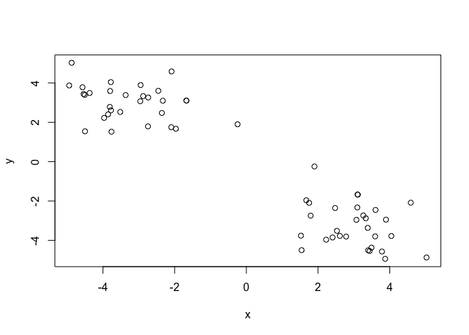
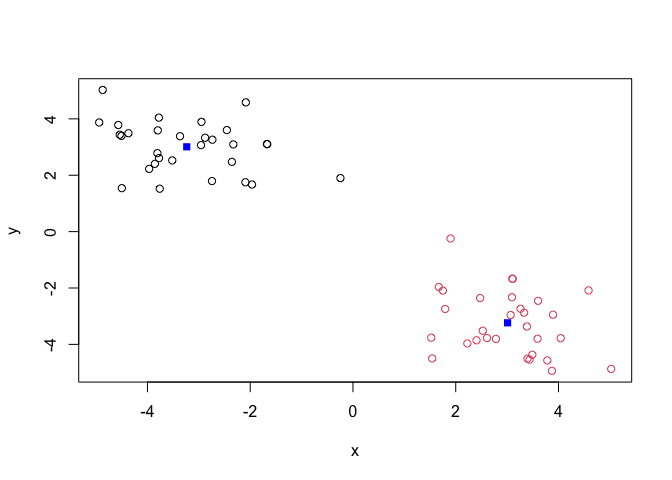

Machine Learning 01
================
Andrew Kapinos
10/22/2021

# Clustering methods

Kmeans clustering in R is done with the `kmeans()` function. First we’ll
make up some data to test and learn with.

``` r
tmp <- c(rnorm(30,3), rnorm(30,-3))
data <- cbind(x=tmp,y=rev(tmp))
plot(data)
```

<!-- -->

When using Kmeans, we’ll need to specify how many clusters (centers) we
want. Run `kmeans()`, setting k = 2 and nstart = 20.

``` r
km <- kmeans(data, centers=2, nstart=20)
km
```

    ## K-means clustering with 2 clusters of sizes 30, 30
    ## 
    ## Cluster means:
    ##           x         y
    ## 1 -3.102857  3.015015
    ## 2  3.015015 -3.102857
    ## 
    ## Clustering vector:
    ##  [1] 2 2 2 2 2 2 2 2 2 2 2 2 2 2 2 2 2 2 2 2 2 2 2 2 2 2 2 2 2 2 1 1 1 1 1 1 1 1
    ## [39] 1 1 1 1 1 1 1 1 1 1 1 1 1 1 1 1 1 1 1 1 1 1
    ## 
    ## Within cluster sum of squares by cluster:
    ## [1] 60.2203 60.2203
    ##  (between_SS / total_SS =  90.3 %)
    ## 
    ## Available components:
    ## 
    ## [1] "cluster"      "centers"      "totss"        "withinss"     "tot.withinss"
    ## [6] "betweenss"    "size"         "iter"         "ifault"

> Q. How many points are in each cluster?

``` r
km$size
```

    ## [1] 30 30

There are 30 points in each cluster.

> Q. What ‘component’ of your result object details cluster
> assignment/membership?

``` r
km$cluster
```

    ##  [1] 2 2 2 2 2 2 2 2 2 2 2 2 2 2 2 2 2 2 2 2 2 2 2 2 2 2 2 2 2 2 1 1 1 1 1 1 1 1
    ## [39] 1 1 1 1 1 1 1 1 1 1 1 1 1 1 1 1 1 1 1 1 1 1

> Q. What ‘component’ of your result object details cluster center?

``` r
km$centers
```

    ##           x         y
    ## 1 -3.102857  3.015015
    ## 2  3.015015 -3.102857

> Q. Plot x colored by the kmeans cluster assignment and add cluster
> centers as blue points.

``` r
plot(data, col=km$cluster)
points(km$centers, col="blue", pch=15)
```

<!-- -->

# Hierarchical Clustering

We will use the `hclust()` function on the same data as before and see
how this method works.

Unlike Kmeans, we’ll need to do a little more work to determine the
cluster membership when using Hclust.

``` r
hc <- hclust(dist(data))
hc
```

    ## 
    ## Call:
    ## hclust(d = dist(data))
    ## 
    ## Cluster method   : complete 
    ## Distance         : euclidean 
    ## Number of objects: 60

Hclust has a plot method:

``` r
plot(hc)
abline(h=7,col="red")
```

<!-- -->

To find our membership vector, we need to “cut the tree/dendrogram; for
this, we use the `cutree()` function and tell it the height to cut at.

``` r
cutree(hc,h=7)
```

    ##  [1] 1 1 1 1 1 1 1 1 1 1 1 1 1 1 1 1 1 1 1 1 1 1 1 1 1 1 1 1 1 1 2 2 2 2 2 2 2 2
    ## [39] 2 2 2 2 2 2 2 2 2 2 2 2 2 2 2 2 2 2 2 2 2 2

We can also use ‘cutree()’ and state the number of k clusters we want.

``` r
grps <- cutree(hc,k=2)
grps
```

    ##  [1] 1 1 1 1 1 1 1 1 1 1 1 1 1 1 1 1 1 1 1 1 1 1 1 1 1 1 1 1 1 1 2 2 2 2 2 2 2 2
    ## [39] 2 2 2 2 2 2 2 2 2 2 2 2 2 2 2 2 2 2 2 2 2 2

``` r
plot(data, col=grps)
```

<!-- -->

In sum, `kmeans()` requires that we specify the data and number of
centers, while `hclust()` requires that we specify the
distance/dissimilarity structure of the data.

## Principal Component Analysis (PCA)

PCA is a useful analysis method when you have lots of dimensions in your
data…

# PCA of UK food data

# Data Import and Checking Data

First going to import the data from the csv file

``` r
url <- "https://tinyurl.com/UK-foods"
x <- read.csv(url)
```

> Q1. How many rows and columns are in your new data frame named x? What
> R functions could you use to answer this questions?

Complete the following code to find out how many rows and columns are in
x? \_\_\_(x)

``` r
dim(x)
```

    ## [1] 17  5

There’s only meant to be 4 col in the dataset, because there are 4
countries. What’s gone wrong?

> Q. Preview the first 6 rows.

``` r
head(x)
```

    ##                X England Wales Scotland N.Ireland
    ## 1         Cheese     105   103      103        66
    ## 2  Carcass_meat      245   227      242       267
    ## 3    Other_meat      685   803      750       586
    ## 4           Fish     147   160      122        93
    ## 5 Fats_and_oils      193   235      184       209
    ## 6         Sugars     156   175      147       139

We can see that the row titles are being stored as a column. Let’s fix
it.

``` r
rownames(x) <- x[,1]
x <- x[,-1]
head(x)
```

    ##                England Wales Scotland N.Ireland
    ## Cheese             105   103      103        66
    ## Carcass_meat       245   227      242       267
    ## Other_meat         685   803      750       586
    ## Fish               147   160      122        93
    ## Fats_and_oils      193   235      184       209
    ## Sugars             156   175      147       139

``` r
x <- read.csv(url, row.names=1)
head(x)
```

    ##                England Wales Scotland N.Ireland
    ## Cheese             105   103      103        66
    ## Carcass_meat       245   227      242       267
    ## Other_meat         685   803      750       586
    ## Fish               147   160      122        93
    ## Fats_and_oils      193   235      184       209
    ## Sugars             156   175      147       139

``` r
dim(x)
```

    ## [1] 17  4

Much better! Let’s check again to see how many rows and columns there
are now.

``` r
dim(x)
```

    ## [1] 17  4

Great; there are 17 rows and 4 columns.

> Q2. Which approach to solving the ‘row-names problem’ mentioned above
> do you prefer and why? Is one approach more robust than another under
> certain circumstances?

The first approach (ie. using x \<- x\[,-1\]) will remove data each time
it is run (ie. if run again, the England column would disappear and the
row names would become the values from that deleted column). We should
instead just reload the data using an argument in the read.csv()
function, which loads the data in as we’d like without having to
manipulate the data further.

# Spotting Major Differences and Trends

Let’s plot the data

``` r
barplot(as.matrix(x), beside=T, col=rainbow(nrow(x)))
```

<!-- -->

> Q3. Changing what optional argument in the above barplot() function
> results in the following plot?

If we remove the beside=TRUE argument, then the bars will not be plotted
besides one another. See below.

``` r
barplot(as.matrix(x),col=rainbow(nrow(x)))
```

<!-- -->

> Q5. Generating all pairwise plots may help somewhat. Can you make
> sense of the following code and resulting figure? What does it mean if
> a given point lies on the diagonal for a given plot?

``` r
mycols <- rainbow(nrow(x))
pairs(x,col=mycols, pch=16)
```

<!-- -->

The axes for each plot are determined by where the countries’ names are
positioned. The vertical axis for each row of plots is indicated by the
country name in that row, while the horizontal axis for each column of
plots is indicated by the country name in that column.

Eg. the vertical axis for the first row of plots is England, while the
horizontal axis for the first column of plots is England. In the second
plot of the first row (ie. plot to the right of ‘England’), the axes are
England v. Wales.

If the values for each country are the same, the respective point for
that value should be found on the diagonal (where x=y). We can look for
departures from the diagonal to identify instances in which the values
in a comparison are significantly different.

> Q6. What is the main differences between N. Ireland and the other
> countries of the UK in terms of this data-set?

N. Ireland seems to be the most unique, given that it participates in
the most plots which exhibit values that do not fall along the diagonal
(ie. has the most values that deviate significantly from the other
countries).

# PCA to the rescue

Here we will use the base R function for PCA, which is called
`prcomp()`. We’ll need to transpose the data using `t()` so that the
prcomp() function is analyzing the proper data.

``` r
t(x)
```

    ##           Cheese Carcass_meat  Other_meat  Fish Fats_and_oils  Sugars
    ## England      105           245         685  147            193    156
    ## Wales        103           227         803  160            235    175
    ## Scotland     103           242         750  122            184    147
    ## N.Ireland     66           267         586   93            209    139
    ##           Fresh_potatoes  Fresh_Veg  Other_Veg  Processed_potatoes 
    ## England               720        253        488                 198
    ## Wales                 874        265        570                 203
    ## Scotland              566        171        418                 220
    ## N.Ireland            1033        143        355                 187
    ##           Processed_Veg  Fresh_fruit  Cereals  Beverages Soft_drinks 
    ## England              360         1102     1472        57         1374
    ## Wales                365         1137     1582        73         1256
    ## Scotland             337          957     1462        53         1572
    ## N.Ireland            334          674     1494        47         1506
    ##           Alcoholic_drinks  Confectionery 
    ## England                 375             54
    ## Wales                   475             64
    ## Scotland                458             62
    ## N.Ireland               135             41

``` r
pca <- prcomp(t(x))
summary(pca)
```

    ## Importance of components:
    ##                             PC1      PC2      PC3       PC4
    ## Standard deviation     324.1502 212.7478 73.87622 4.189e-14
    ## Proportion of Variance   0.6744   0.2905  0.03503 0.000e+00
    ## Cumulative Proportion    0.6744   0.9650  1.00000 1.000e+00

What happens if we plot this pca data?

``` r
plot(pca)
```

<!-- -->

We really want to visualize something called the score plot (a.k.a. PCA
plot). This is basically the plot of PCA1 v. PCA2… etc.

``` r
attributes(pca)
```

    ## $names
    ## [1] "sdev"     "rotation" "center"   "scale"    "x"       
    ## 
    ## $class
    ## [1] "prcomp"

We are after the pca$x component for this plot…

> Q7. Complete the code below to generate a plot of PC1 vs PC2. The
> second line adds text labels over the data points.

``` r
plot(pca$x[,1], pca$x[,2], xlab="PC1", ylab="PC2", xlim=c(-270,500))
text(pca$x[,1], pca$x[,2], colnames(x))
```

<!-- -->

``` r
# In class, a shortened version of this was used:
# plot(pca$x[,1:2])
# text(pca$x[,1:2],labels=colnames(x))
```

> Q8. Customize your plot so that the colors of the country names match
> the colors in our UK and Ireland map and table at start of this
> document.

``` r
mycols_pca <- c("orange","red","blue","green4")
plot(pca$x[,1], pca$x[,2], xlab="PC1", ylab="PC2", xlim=c(-270,500))
text(pca$x[,1], pca$x[,2], colnames(x),col=mycols_pca)
```

<!-- -->

vnskdfjbn

## PCA “Loadings”

We can also examine the PCA “loadings”, which tell us how much the
original variable contibute to each PC. Lets focus on PC1 as it accounts
for \> 90% of variance.

``` r
pca$rotation
```

    ##                              PC1          PC2         PC3          PC4
    ## Cheese              -0.056955380 -0.016012850 -0.02394295 -0.691718038
    ## Carcass_meat         0.047927628 -0.013915823 -0.06367111  0.635384915
    ## Other_meat          -0.258916658  0.015331138  0.55384854  0.198175921
    ## Fish                -0.084414983  0.050754947 -0.03906481 -0.015824630
    ## Fats_and_oils       -0.005193623  0.095388656  0.12522257  0.052347444
    ## Sugars              -0.037620983  0.043021699  0.03605745  0.014481347
    ## Fresh_potatoes       0.401402060  0.715017078  0.20668248 -0.151706089
    ## Fresh_Veg           -0.151849942  0.144900268 -0.21382237  0.056182433
    ## Other_Veg           -0.243593729  0.225450923  0.05332841 -0.080722623
    ## Processed_potatoes  -0.026886233 -0.042850761  0.07364902 -0.022618707
    ## Processed_Veg       -0.036488269  0.045451802 -0.05289191  0.009235001
    ## Fresh_fruit         -0.632640898  0.177740743 -0.40012865 -0.021899087
    ## Cereals             -0.047702858  0.212599678  0.35884921  0.084667257
    ## Beverages           -0.026187756  0.030560542  0.04135860 -0.011880823
    ## Soft_drinks          0.232244140 -0.555124311  0.16942648 -0.144367046
    ## Alcoholic_drinks    -0.463968168 -0.113536523  0.49858320 -0.115797605
    ## Confectionery       -0.029650201 -0.005949921  0.05232164 -0.003695024

``` r
par(mar=c(10,3,2,0))
barplot(pca$rotation[,1],las=2,main="PC1 Loadings")
```

<!-- -->

Along PC1 we can go in the positive or negative direction. Comparing
this plot to the plot of PC1 v. PC2, we can observe how some
observations can “push” countries to one side or the other, depending on
their loadings. Eg. high negative scores, like Fresh_fruit and
Alcoholic_drinks, push Wales, England, and Scotland to the left side of
the plot. High positive scores, like Fresh_potatoes and Soft_drinks,
push N. Ireland to the right side of the plot.

> Q9. Generate a similar ‘loadings plot’ for PC2. What two food groups
> feature prominantely and what does PC2 mainly tell us about?

``` r
par(mar=c(10,3,2,0))
barplot(pca$rotation[,2],las=2,main="PC2 Loadings")
```

<!-- -->
Fresh_potatoes and Soft_drinks feature prominently in this plot. The
loading plot for PC2 tells us which groups contribute most heavily
towards the remaining variance that is observed in the sample, after
accounting for PC1.

## One more PCA for today

``` r
url2 <- "https://tinyurl.com/expression-CSV"
rna.data <- read.csv(url2, row.names=1)
head(rna.data)
```

    ##        wt1 wt2  wt3  wt4 wt5 ko1 ko2 ko3 ko4 ko5
    ## gene1  439 458  408  429 420  90  88  86  90  93
    ## gene2  219 200  204  210 187 427 423 434 433 426
    ## gene3 1006 989 1030 1017 973 252 237 238 226 210
    ## gene4  783 792  829  856 760 849 856 835 885 894
    ## gene5  181 249  204  244 225 277 305 272 270 279
    ## gene6  460 502  491  491 493 612 594 577 618 638

> Q10: How many genes and samples are in this data set?

``` r
nrow(rna.data)
```

    ## [1] 100

``` r
ncol(rna.data)
```

    ## [1] 10

``` r
colnames(rna.data)
```

    ##  [1] "wt1" "wt2" "wt3" "wt4" "wt5" "ko1" "ko2" "ko3" "ko4" "ko5"

100 genes and 10 samples.

Let’s run PCA!

Using the scale argument helps us to normalize for the differences in
ranges between observations.

``` r
pca.rna <- prcomp(t(rna.data), scale=TRUE)
```

Let’s make a basic plot of the data.

``` r
plot(pca.rna$x[,1], pca.rna$x[,2], xlab="PC1", ylab="PC2")
text(pca.rna$x[,1:2], labels = colnames(rna.data))
```

<!-- -->

``` r
summary(pca.rna)
```

    ## Importance of components:
    ##                           PC1    PC2     PC3     PC4     PC5     PC6     PC7
    ## Standard deviation     9.6237 1.5198 1.05787 1.05203 0.88062 0.82545 0.80111
    ## Proportion of Variance 0.9262 0.0231 0.01119 0.01107 0.00775 0.00681 0.00642
    ## Cumulative Proportion  0.9262 0.9493 0.96045 0.97152 0.97928 0.98609 0.99251
    ##                            PC8     PC9      PC10
    ## Standard deviation     0.62065 0.60342 3.348e-15
    ## Proportion of Variance 0.00385 0.00364 0.000e+00
    ## Cumulative Proportion  0.99636 1.00000 1.000e+00

PC1 does very good at capturing the variance in the data, over 92% of
variance is captured by PC1! Let’s make a scree plot to visualize this.

``` r
plot(pca.rna, main="Quick scree plot")
```

<!-- -->

We can make our own scree plots too!

``` r
## Variance captured per PC 
pca.var <- pca.rna$sdev^2

## Percent variance is often more informative to look at 
pca.var.per <- round(pca.var/sum(pca.var)*100, 1)
pca.var.per
```

    ##  [1] 92.6  2.3  1.1  1.1  0.8  0.7  0.6  0.4  0.4  0.0

``` r
barplot(pca.var.per, main="Scree Plot", 
        names.arg = paste0("PC", 1:10),
        xlab="Principal Component", ylab="Percent Variation")
```

<!-- -->

We can make our PCA plot a bit more useful and attractive by updating
the script

``` r
## A vector of colors for wt and ko samples
colvec <- colnames(rna.data)
colvec[grep("wt", colvec)] <- "red"
colvec[grep("ko", colvec)] <- "blue"

plot(pca.rna$x[,1], pca.rna$x[,2], col=colvec, pch=16,
     xlab=paste0("PC1 (", pca.var.per[1], "%)"),
     ylab=paste0("PC2 (", pca.var.per[2], "%)"))

text(pca.rna$x[,1], pca.rna$x[,2], labels = colnames(rna.data), pos=c(rep(4,5), rep(2,5)))
```

<!-- -->
