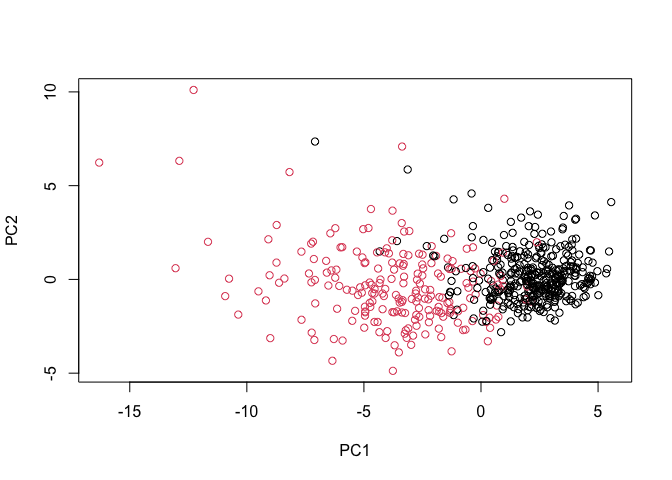
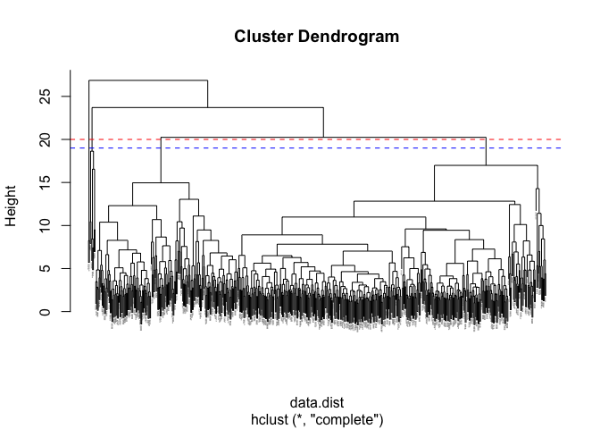
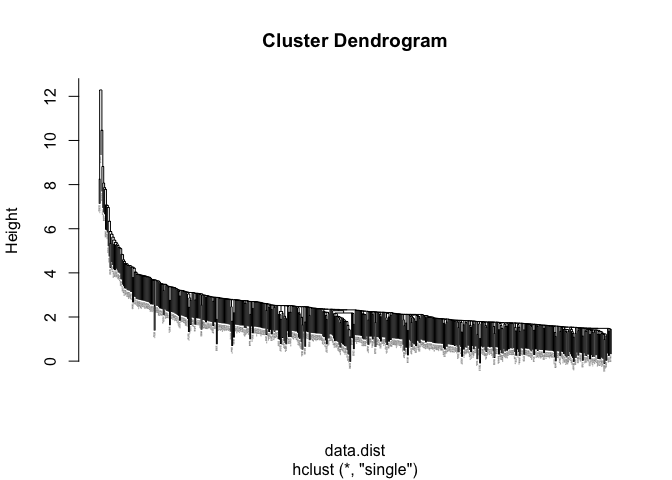
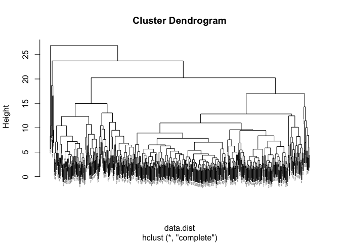
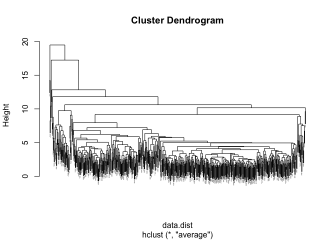
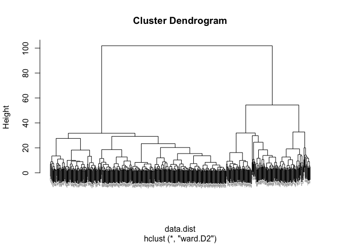
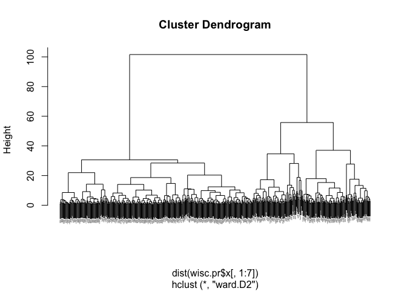

class09: Breast Cancer Mini-Project
================
Andrew Kapinos
10/27/2021

## Getting organized, Preparing the Data

Before we begin our analyses, we’ll need to download and import the
WisconsinCancer.csv data file using read.csv() and assign the data to an
object called “wisc.df”.

We can take a look at the data by using head().

``` r
fna.data <- "WisconsinCancer.csv"
wisc.df <- read.csv(fna.data, row.names=1)
head(wisc.df)
```

    ##          diagnosis radius_mean texture_mean perimeter_mean area_mean
    ## 842302           M       17.99        10.38         122.80    1001.0
    ## 842517           M       20.57        17.77         132.90    1326.0
    ## 84300903         M       19.69        21.25         130.00    1203.0
    ## 84348301         M       11.42        20.38          77.58     386.1
    ## 84358402         M       20.29        14.34         135.10    1297.0
    ## 843786           M       12.45        15.70          82.57     477.1
    ##          smoothness_mean compactness_mean concavity_mean concave.points_mean
    ## 842302           0.11840          0.27760         0.3001             0.14710
    ## 842517           0.08474          0.07864         0.0869             0.07017
    ## 84300903         0.10960          0.15990         0.1974             0.12790
    ## 84348301         0.14250          0.28390         0.2414             0.10520
    ## 84358402         0.10030          0.13280         0.1980             0.10430
    ## 843786           0.12780          0.17000         0.1578             0.08089
    ##          symmetry_mean fractal_dimension_mean radius_se texture_se perimeter_se
    ## 842302          0.2419                0.07871    1.0950     0.9053        8.589
    ## 842517          0.1812                0.05667    0.5435     0.7339        3.398
    ## 84300903        0.2069                0.05999    0.7456     0.7869        4.585
    ## 84348301        0.2597                0.09744    0.4956     1.1560        3.445
    ## 84358402        0.1809                0.05883    0.7572     0.7813        5.438
    ## 843786          0.2087                0.07613    0.3345     0.8902        2.217
    ##          area_se smoothness_se compactness_se concavity_se concave.points_se
    ## 842302    153.40      0.006399        0.04904      0.05373           0.01587
    ## 842517     74.08      0.005225        0.01308      0.01860           0.01340
    ## 84300903   94.03      0.006150        0.04006      0.03832           0.02058
    ## 84348301   27.23      0.009110        0.07458      0.05661           0.01867
    ## 84358402   94.44      0.011490        0.02461      0.05688           0.01885
    ## 843786     27.19      0.007510        0.03345      0.03672           0.01137
    ##          symmetry_se fractal_dimension_se radius_worst texture_worst
    ## 842302       0.03003             0.006193        25.38         17.33
    ## 842517       0.01389             0.003532        24.99         23.41
    ## 84300903     0.02250             0.004571        23.57         25.53
    ## 84348301     0.05963             0.009208        14.91         26.50
    ## 84358402     0.01756             0.005115        22.54         16.67
    ## 843786       0.02165             0.005082        15.47         23.75
    ##          perimeter_worst area_worst smoothness_worst compactness_worst
    ## 842302            184.60     2019.0           0.1622            0.6656
    ## 842517            158.80     1956.0           0.1238            0.1866
    ## 84300903          152.50     1709.0           0.1444            0.4245
    ## 84348301           98.87      567.7           0.2098            0.8663
    ## 84358402          152.20     1575.0           0.1374            0.2050
    ## 843786            103.40      741.6           0.1791            0.5249
    ##          concavity_worst concave.points_worst symmetry_worst
    ## 842302            0.7119               0.2654         0.4601
    ## 842517            0.2416               0.1860         0.2750
    ## 84300903          0.4504               0.2430         0.3613
    ## 84348301          0.6869               0.2575         0.6638
    ## 84358402          0.4000               0.1625         0.2364
    ## 843786            0.5355               0.1741         0.3985
    ##          fractal_dimension_worst
    ## 842302                   0.11890
    ## 842517                   0.08902
    ## 84300903                 0.08758
    ## 84348301                 0.17300
    ## 84358402                 0.07678
    ## 843786                   0.12440

The first column in the data frame contains a pathologist-provided
diagnosis, which is basically the “answer” to the questions we’ll be
asking today.

Let’s create a data frame that we may work with that omits the column,
then save the diagnosis information to a separate vector that we can use
to check our results later on.

``` r
wisc.data <- wisc.df[,-1]
diagnosis <- as.factor(wisc.df[,1])
```

Time to further familiarize ourselves with the data.

The functions dim(), nrow(), table(), length() and grep() may be useful
for answering the first 3 questions.

> **Q1. How many observations are in this dataset?**

``` r
nrow(wisc.data)
```

    ## [1] 569

****

> **Q2. How many of the observations have a malignant diagnosis?**

``` r
table(diagnosis)
```

    ## diagnosis
    ##   B   M 
    ## 357 212

****

> **Q3. How many variables/features in the data are suffixed with
> \_mean?**

``` r
length(grep("_mean",colnames(wisc.data)))
```

    ## [1] 10

****

## Performing PCA

The next step in our data analysis is to perform a PCA on wisc.data.

First, we’ll check the column means and standard deviations to see if
the data needs to be scaled, using colMeans() and apply().

``` r
colMeans(wisc.data)
```

    ##             radius_mean            texture_mean          perimeter_mean 
    ##            1.412729e+01            1.928965e+01            9.196903e+01 
    ##               area_mean         smoothness_mean        compactness_mean 
    ##            6.548891e+02            9.636028e-02            1.043410e-01 
    ##          concavity_mean     concave.points_mean           symmetry_mean 
    ##            8.879932e-02            4.891915e-02            1.811619e-01 
    ##  fractal_dimension_mean               radius_se              texture_se 
    ##            6.279761e-02            4.051721e-01            1.216853e+00 
    ##            perimeter_se                 area_se           smoothness_se 
    ##            2.866059e+00            4.033708e+01            7.040979e-03 
    ##          compactness_se            concavity_se       concave.points_se 
    ##            2.547814e-02            3.189372e-02            1.179614e-02 
    ##             symmetry_se    fractal_dimension_se            radius_worst 
    ##            2.054230e-02            3.794904e-03            1.626919e+01 
    ##           texture_worst         perimeter_worst              area_worst 
    ##            2.567722e+01            1.072612e+02            8.805831e+02 
    ##        smoothness_worst       compactness_worst         concavity_worst 
    ##            1.323686e-01            2.542650e-01            2.721885e-01 
    ##    concave.points_worst          symmetry_worst fractal_dimension_worst 
    ##            1.146062e-01            2.900756e-01            8.394582e-02

``` r
apply(wisc.data,2,sd)
```

    ##             radius_mean            texture_mean          perimeter_mean 
    ##            3.524049e+00            4.301036e+00            2.429898e+01 
    ##               area_mean         smoothness_mean        compactness_mean 
    ##            3.519141e+02            1.406413e-02            5.281276e-02 
    ##          concavity_mean     concave.points_mean           symmetry_mean 
    ##            7.971981e-02            3.880284e-02            2.741428e-02 
    ##  fractal_dimension_mean               radius_se              texture_se 
    ##            7.060363e-03            2.773127e-01            5.516484e-01 
    ##            perimeter_se                 area_se           smoothness_se 
    ##            2.021855e+00            4.549101e+01            3.002518e-03 
    ##          compactness_se            concavity_se       concave.points_se 
    ##            1.790818e-02            3.018606e-02            6.170285e-03 
    ##             symmetry_se    fractal_dimension_se            radius_worst 
    ##            8.266372e-03            2.646071e-03            4.833242e+00 
    ##           texture_worst         perimeter_worst              area_worst 
    ##            6.146258e+00            3.360254e+01            5.693570e+02 
    ##        smoothness_worst       compactness_worst         concavity_worst 
    ##            2.283243e-02            1.573365e-01            2.086243e-01 
    ##    concave.points_worst          symmetry_worst fractal_dimension_worst 
    ##            6.573234e-02            6.186747e-02            1.806127e-02

Since the input variables have quite different means, we’ll want to
scale the data using scale=TRUE argument in the prcomp() function.

Let’s run the PCA and inspect the results using summary().

``` r
wisc.pr <- prcomp(wisc.data,scale=TRUE)
summary(wisc.pr)
```

    ## Importance of components:
    ##                           PC1    PC2     PC3     PC4     PC5     PC6     PC7
    ## Standard deviation     3.6444 2.3857 1.67867 1.40735 1.28403 1.09880 0.82172
    ## Proportion of Variance 0.4427 0.1897 0.09393 0.06602 0.05496 0.04025 0.02251
    ## Cumulative Proportion  0.4427 0.6324 0.72636 0.79239 0.84734 0.88759 0.91010
    ##                            PC8    PC9    PC10   PC11    PC12    PC13    PC14
    ## Standard deviation     0.69037 0.6457 0.59219 0.5421 0.51104 0.49128 0.39624
    ## Proportion of Variance 0.01589 0.0139 0.01169 0.0098 0.00871 0.00805 0.00523
    ## Cumulative Proportion  0.92598 0.9399 0.95157 0.9614 0.97007 0.97812 0.98335
    ##                           PC15    PC16    PC17    PC18    PC19    PC20   PC21
    ## Standard deviation     0.30681 0.28260 0.24372 0.22939 0.22244 0.17652 0.1731
    ## Proportion of Variance 0.00314 0.00266 0.00198 0.00175 0.00165 0.00104 0.0010
    ## Cumulative Proportion  0.98649 0.98915 0.99113 0.99288 0.99453 0.99557 0.9966
    ##                           PC22    PC23   PC24    PC25    PC26    PC27    PC28
    ## Standard deviation     0.16565 0.15602 0.1344 0.12442 0.09043 0.08307 0.03987
    ## Proportion of Variance 0.00091 0.00081 0.0006 0.00052 0.00027 0.00023 0.00005
    ## Cumulative Proportion  0.99749 0.99830 0.9989 0.99942 0.99969 0.99992 0.99997
    ##                           PC29    PC30
    ## Standard deviation     0.02736 0.01153
    ## Proportion of Variance 0.00002 0.00000
    ## Cumulative Proportion  1.00000 1.00000

> **Q4. From your results, what proportion of the original variance is
> captured by the first principal components (PC1)?**

``` r
summary(wisc.pr)$importance[2,]
```

    ##     PC1     PC2     PC3     PC4     PC5     PC6     PC7     PC8     PC9    PC10 
    ## 0.44272 0.18971 0.09393 0.06602 0.05496 0.04025 0.02251 0.01589 0.01390 0.01169 
    ##    PC11    PC12    PC13    PC14    PC15    PC16    PC17    PC18    PC19    PC20 
    ## 0.00980 0.00871 0.00805 0.00523 0.00314 0.00266 0.00198 0.00175 0.00165 0.00104 
    ##    PC21    PC22    PC23    PC24    PC25    PC26    PC27    PC28    PC29    PC30 
    ## 0.00100 0.00091 0.00081 0.00060 0.00052 0.00027 0.00023 0.00005 0.00002 0.00000

****

> **Q5. How many principal components (PCs) are required to describe at
> least 70% of the original variance in the data?**

``` r
summary(wisc.pr)$importance[3,]
```

    ##     PC1     PC2     PC3     PC4     PC5     PC6     PC7     PC8     PC9    PC10 
    ## 0.44272 0.63243 0.72636 0.79239 0.84734 0.88759 0.91010 0.92598 0.93988 0.95157 
    ##    PC11    PC12    PC13    PC14    PC15    PC16    PC17    PC18    PC19    PC20 
    ## 0.96137 0.97007 0.97812 0.98335 0.98649 0.98915 0.99113 0.99288 0.99453 0.99557 
    ##    PC21    PC22    PC23    PC24    PC25    PC26    PC27    PC28    PC29    PC30 
    ## 0.99657 0.99749 0.99830 0.99890 0.99942 0.99969 0.99992 0.99997 1.00000 1.00000

****

> **Q6. How many principal components (PCs) are required to describe at
> least 90% of the original variance in the data?**

****

## Interpreting PCA results

We’ll now use data visualizations to better understand our PCA results.
We’ll start by using a “biplot” and the biplot() function, but this may
lead to some problems if we have a non-trivial number of observations
and variables. Let’s give it a shot.

``` r
biplot(wisc.pr)
```

<!-- -->

> **Q7. What stands out to you about this plot? Is it easy or difficult
> to understand? Why?**

****

Inclusion of rownames can make interpretation of the biplot rather
difficult. Let’s instead try to analyze a scatter plot of our
observations along principal components 1 and 2, using wisc.pr$x and the
plot() function.

**Scatter plot of obs. by PC1 and PC2**

``` r
plot(wisc.pr$x[,1:2],col=diagnosis,xlab="PC1",ylab="PC2")
```

<!-- -->

> **Q8. Generate a similar plot for principal components 1 and 3. What
> do you notice about these plots?**

**Scatter plot of obs. by PC1 and PC3**

``` r
plot(wisc.pr$x[,1],wisc.pr$x[,3],col=diagnosis,xlab="PC1",ylab="PC2")
```

<!-- -->

****

****

## Using ggplot2 for analysis of PCA

That visualization was much more striking than the biplot, so let’s try
using ggplot2 to make a fancier figure.

We’ll need to store our PC1 and PC2 data as a data frame, as well as add
our diagnosis vector as a column to be used for the color aesthetic.

``` r
# Create a data frame for ggplot
df <- as.data.frame(wisc.pr$x)
df$diagnosis <- diagnosis

# Load the ggplot2 package
library(ggplot2)

# Make a scatter plot, colored by diagnosis
ggplot(df) + 
  aes(PC1, PC2, col=diagnosis) + 
  geom_point()
```

<!-- -->

Nice!

## Variance explained (using scree plots)

Next, we’ll produce scree plots to display the proportion of variance
explained as the number of principal components increases.

To do this, we’ll need to first calculate the variance of each component
by squaring the sdev component of wisc.pr.

``` r
pr.var <- wisc.pr$sdev^2
head(pr.var)
```

    ## [1] 13.281608  5.691355  2.817949  1.980640  1.648731  1.207357

Next, we’ll calculate the variance explained by each principal component
by dividing the variance each component by the total variance (ie. sum
of each component’s variance).

We can then plot this using plot().

``` r
pve <- pr.var/sum(pr.var)
plot(pve, xlab = "Principal Component", 
     ylab = "Proportion of Variance Explained", 
     ylim = c(0, 1),type = "o")
```

<!-- -->

It looks like the ‘elbow’ of the curve happens at around 3-4 PCs. After
3 or 4 PCs, the use of additional PCs does little to improve the total
amount of original variance explained.

We can make an alternative scree plot of the same data using barplot().
Note the data driven y-axis!

``` r
barplot(pve,ylab="Precent of Variance Explained",
     names.arg=paste0("PC",1:length(pve)),las=2,axes=FALSE)
axis(2,at=pve,labels=round(pve,2)*100)
```

<!-- -->

**Optional:** There are quite a few CRAN packages that are helpful for
PCA, including the factoextra package.

``` r
library(factoextra)
```

    ## Welcome! Want to learn more? See two factoextra-related books at https://goo.gl/ve3WBa

``` r
fviz_eig(wisc.pr, addlabels = TRUE)
```

<!-- -->

## Communicating PCA results

Let’s check our understanding of the PCA results, in particular the
loadings and variance explained.

Loadings, represented as vectors, explain the mapping from the original
features onto the principal components. Principal components are
automatically ordered from the most to least variance explained.

> **Q9. For the first principal component, what is the component of the
> loading vector (i.e. wisc.pr$rotation\[,1\]) for the feature
> concave.points_mean?**

``` r
wisc.pr$rotation[,1]
```

    ##             radius_mean            texture_mean          perimeter_mean 
    ##             -0.21890244             -0.10372458             -0.22753729 
    ##               area_mean         smoothness_mean        compactness_mean 
    ##             -0.22099499             -0.14258969             -0.23928535 
    ##          concavity_mean     concave.points_mean           symmetry_mean 
    ##             -0.25840048             -0.26085376             -0.13816696 
    ##  fractal_dimension_mean               radius_se              texture_se 
    ##             -0.06436335             -0.20597878             -0.01742803 
    ##            perimeter_se                 area_se           smoothness_se 
    ##             -0.21132592             -0.20286964             -0.01453145 
    ##          compactness_se            concavity_se       concave.points_se 
    ##             -0.17039345             -0.15358979             -0.18341740 
    ##             symmetry_se    fractal_dimension_se            radius_worst 
    ##             -0.04249842             -0.10256832             -0.22799663 
    ##           texture_worst         perimeter_worst              area_worst 
    ##             -0.10446933             -0.23663968             -0.22487053 
    ##        smoothness_worst       compactness_worst         concavity_worst 
    ##             -0.12795256             -0.21009588             -0.22876753 
    ##    concave.points_worst          symmetry_worst fractal_dimension_worst 
    ##             -0.25088597             -0.12290456             -0.13178394

****

> **Q10. What is the minimum number of principal components required to
> explain 80% of the variance of the data?**

``` r
summary(wisc.pr)$importance[3,]
```

    ##     PC1     PC2     PC3     PC4     PC5     PC6     PC7     PC8     PC9    PC10 
    ## 0.44272 0.63243 0.72636 0.79239 0.84734 0.88759 0.91010 0.92598 0.93988 0.95157 
    ##    PC11    PC12    PC13    PC14    PC15    PC16    PC17    PC18    PC19    PC20 
    ## 0.96137 0.97007 0.97812 0.98335 0.98649 0.98915 0.99113 0.99288 0.99453 0.99557 
    ##    PC21    PC22    PC23    PC24    PC25    PC26    PC27    PC28    PC29    PC30 
    ## 0.99657 0.99749 0.99830 0.99890 0.99942 0.99969 0.99992 0.99997 1.00000 1.00000

****

## Hierarchical clustering

The goal of this section is to perform hierarchical clustering of the
original data. This type of clustering does not assume in advance the
number of natural groups that exist in the data.

To perform hierarchical clustering, we’ll need to scale wisc.data, then
calculate the distances between all pairs of observations. Thereafter,
we can perform hierarchical clustering using Hclust.

1.  Scale the wisc.data data using the scale() function

``` r
data.scaled <- scale(wisc.data)
```

2.  Calculate the Euclidean distances between all pairs of observations
    using the dist() function.

``` r
data.dist <- dist(data.scaled)
```

3.  Create a hierarchical clustering model using complete linkage; ie.
    using hclust() and the argument method=“complete”.

``` r
wisc.hclust <- hclust(data.dist, method="complete")
```

We’ll now use our new model to determine a height (or distance between
clusters) where a certain number of clusters exists.

> **Q11. Using the plot() and abline() functions, what is the height at
> which the clustering model has 4 clusters?**

``` r
plot(wisc.hclust,cex=0.1)
abline(h=20, col="red", lty=2)
abline(h=19, col="blue", lty=2)
```

<!-- -->

****

# Selecting number of clusters

In this section, we’ll compar the outputs from our Hclust model to the
actual diagnoses. This exercise will help us to determine if, in this
case, hierarchical clustering provides a promising new feature.

We will use cutree() to cut the tree so that it has 4 clusters. We’ll
also use the table() function to compare the cluster membership to the
actual diagnoses.

``` r
wisc.hclust.clusters <- cutree(wisc.hclust,h=19)
table(wisc.hclust.clusters,diagnosis)
```

    ##                     diagnosis
    ## wisc.hclust.clusters   B   M
    ##                    1  12 165
    ##                    2   2   5
    ##                    3 343  40
    ##                    4   0   2

Using 4 clusters, we can see that cluster 1 largely corresponds to
malignant cells (note: M obs. have diagnosis values of 1), while cluster
3 largely corresponds to benign cells (note: B obs. have diagnosis
values of 0).

Let’s explore how different numbers of clusters can affect the ability
of hierarchical clustring to separate out the different diagnoses.

> **Q12. Can you find a better cluster vs diagnoses match by cutting
> into a different number of clusters between 2 and 10?**

``` r
wisc.hclust.clusters.3 <- cutree(wisc.hclust,h=22)
table(wisc.hclust.clusters.3,diagnosis)
```

    ##                       diagnosis
    ## wisc.hclust.clusters.3   B   M
    ##                      1 355 205
    ##                      2   2   5
    ##                      3   0   2

``` r
wisc.hclust.clusters.5 <- cutree(wisc.hclust,h=18)
table(wisc.hclust.clusters.5,diagnosis)
```

    ##                       diagnosis
    ## wisc.hclust.clusters.5   B   M
    ##                      1  12 165
    ##                      2   0   5
    ##                      3 343  40
    ##                      4   2   0
    ##                      5   0   2

``` r
wisc.hclust.clusters.7 <- cutree(wisc.hclust,h=16)
table(wisc.hclust.clusters.7,diagnosis)
```

    ##                       diagnosis
    ## wisc.hclust.clusters.7   B   M
    ##                      1  12 165
    ##                      2   0   3
    ##                      3 331  39
    ##                      4   2   0
    ##                      5  12   1
    ##                      6   0   2
    ##                      7   0   2

``` r
wisc.hclust.clusters.9 <- cutree(wisc.hclust,h=14)
table(wisc.hclust.clusters.9,diagnosis)
```

    ##                       diagnosis
    ## wisc.hclust.clusters.9   B   M
    ##                      1  12  86
    ##                      2   0  79
    ##                      3   0   3
    ##                      4 331  39
    ##                      5   2   0
    ##                      6  12   0
    ##                      7   0   2
    ##                      8   0   2
    ##                      9   0   1

****

****

# Using different methods

There are other methods which we can use to combine points during
hierarchical clustering. These include “single”, “complete”, “average”,
and “ward.D2”.

> **Q13. Which method gives your favorite results for the same data.dist
> dataset? Explain your reasoning.**

``` r
plot(hclust(data.dist,method="single"),cex=0.1)
```

<!-- -->

``` r
plot(hclust(data.dist,method="complete"),cex=0.1)
```

<!-- -->

``` r
plot(hclust(data.dist,method="average"),cex=0.1)
```

<!-- -->

``` r
plot(hclust(data.dist,method="ward.D2"),cex=0.1)
```

<!-- -->

****

Side-note from lab handout: The method=“ward.D2” creates groups such
that variance is minimized within clusters. This has the effect of
looking for spherical clusters with the process starting with all points
in individual clusters (bottom up) and then repeatedly merging a pair of
clusters such that when merged there is a minimum increase in total
within-cluster variance This process continues until a single group
including all points (the top of the tree) is defined.

## K-means clustering

We can also create a k-means clustering model based on our dataset and
compare our new results to the actual diagnoses (and the Hclust model’s
results).

We’ll create a k-means model on wisc.data, assigning the result to
wisc.km, using k=2 and 20 starts. We’ll also want to scale the data as
before.

After creating our model, we will use the table() function to compare
the cluster membership of the k-means model to the actual diagnoses
contained in the diagnosis vector.

``` r
data.scaled <- scale(wisc.data)
wisc.km <- kmeans(data.scaled, centers=2, nstart=20)
table(wisc.km$cluster,diagnosis)
```

    ##    diagnosis
    ##       B   M
    ##   1 343  37
    ##   2  14 175

``` r
wisc.hclust <- hclust(data.dist, method="complete")
wisc.hclust.clusters.4 <- cutree(wisc.hclust,h=19)
table(wisc.hclust.clusters.4,diagnosis)
```

    ##                       diagnosis
    ## wisc.hclust.clusters.4   B   M
    ##                      1  12 165
    ##                      2   2   5
    ##                      3 343  40
    ##                      4   0   2

``` r
wisc.hclust.clusters.2 <- cutree(wisc.hclust,h=24)
table(wisc.hclust.clusters.2,diagnosis)
```

    ##                       diagnosis
    ## wisc.hclust.clusters.2   B   M
    ##                      1 357 210
    ##                      2   0   2

> **Q14. How well does k-means separate the two diagnoses? How does it
> compare to your hclust results?**

****

****

Let’s use the table function to compare the cluster membership of the
k-means model to the Hclust model from above.

``` r
table(wisc.hclust.clusters,wisc.km$cluster)
```

    ##                     
    ## wisc.hclust.clusters   1   2
    ##                    1  17 160
    ##                    2   0   7
    ##                    3 363  20
    ##                    4   0   2

We can see that clusters 1, 2, and 4 from the Hclust model generally
correspond with cluster 1 from the k-means model. Cluster 3 from the
Hclust model generally corresponds with cluster 2 from the k-means
model.

## Combining methods, clustering on PCA results

In this final section, we’ll put together several steps from earlier.

Let’s see first if PCA improves or degrades the performance of
hierarchical clustersing. Using the minimum number of PCs required to
describe at least 90% of the data (PC1 through PC7), we’ll create a
hierarchical clustering model with linkage method=“ward.D2”. We’ll
assign the results to wisc.pr.hclust.

``` r
wisc.pr.hclust <- hclust(dist(wisc.pr$x[,1:7]),method="ward.D2")
plot(wisc.pr.hclust,cex=0.1)
```

<!-- -->

This looks promising! There appears to be two main branches (ie.
clusters), which may correspond with M and B observations. Let’s see if
this is the case using cutree() and table(), then plot the results using
plot().

``` r
grps <- cutree(wisc.pr.hclust,k=2)
table(grps)
```

    ## grps
    ##   1   2 
    ## 216 353

``` r
table(grps,diagnosis)
```

    ##     diagnosis
    ## grps   B   M
    ##    1  28 188
    ##    2 329  24

``` r
plot(wisc.pr$x[,1:2],col=grps)
```

<!-- -->

Let’s compare the groupings predicted by Hclust to the actual diagnoses,
by setting the color mapping argument to the diagnosis vector.

``` r
plot(wisc.pr$x[,1:2],col=diagnosis)
```

<!-- -->

**Optional from lab handout:** Note the color swap here as the hclust
cluster 1 is mostly “M” and cluster 2 is mostly “B” as we saw from the
results of calling table(grps, diagnosis). To match things up we can
turn our groups into a factor and reorder the levels so cluster 2 comes
first and thus gets the first color (black) and cluster 1 gets the
second color (red).

``` r
g <- as.factor(grps)
levels(g)
```

    ## [1] "1" "2"

``` r
g <- relevel(g,2)
levels(g)
```

    ## [1] "2" "1"

``` r
plot(wisc.pr$x[,1:2], col=g)
```

<!-- -->

``` r
# Optional 3D render of results
# library(rgl)
# plot3d(wisc.pr$x[,1:3], xlab="PC 1", ylab="PC 2", zlab="PC 3", cex=1.5, size=1, type="s", col=grps)
# rglwidget(width = 400, height = 400)
```

This seems to be a fairly good predictor of the actual diagnoses when
looking at the plots alone; let’s use table() to specifically compare
the results from our new Hclust model to the actual diagnosis vector,
though, just to be sure.

``` r
wisc.pr.hclust <- hclust(dist(wisc.pr$x[,1:7]),method="ward.D2")
wisc.pr.hclust.clusters <- cutree(wisc.pr.hclust,k=2)
table(wisc.pr.hclust.clusters,diagnosis)
```

    ##                        diagnosis
    ## wisc.pr.hclust.clusters   B   M
    ##                       1  28 188
    ##                       2 329  24

> **Q15. How well does the newly created model with four clusters
> separate out the two diagnoses?**

****

> **Q16. How well do the k-means and hierarchical clustering models you
> created in previous sections (i.e. before PCA) do in terms of
> separating the diagnoses? Again, use the table() function to compare
> the output of each model (wisc.km$cluster and wisc.hclust.clusters)
> with the vector containing the actual diagnoses.**

``` r
table(wisc.km$cluster,diagnosis)
```

    ##    diagnosis
    ##       B   M
    ##   1 343  37
    ##   2  14 175

``` r
table(wisc.hclust.clusters,diagnosis)
```

    ##                     diagnosis
    ## wisc.hclust.clusters   B   M
    ##                    1  12 165
    ##                    2   2   5
    ##                    3 343  40
    ##                    4   0   2

****

# Sensitivity and specificity

**From lab handout:**

> Sensitivity refers to a test’s ability to correctly detect ill
> patients who do have the condition. In our example here the
> sensitivity is the total number of samples in the cluster identified
> as predominantly malignant (cancerous) divided by the total number of
> known malignant samples. In other words: TP/(TP+FN).

> Specificity relates to a test’s ability to correctly reject healthy
> patients without a condition. In our example specificity is the
> proportion of benign (not cancerous) samples in the cluster identified
> as predominantly benign that are known to be benign. In other words:
> TN/(TN+FN).

> **Q17. Which of your analysis procedures resulted in a clustering
> model with the best specificity? How about sensitivity?**

Let’s display each model’s results alongside the diagnosis data once
again to determine specificity and sensitivity.

> Sensitivity = TP/(TP+FN)

> Specificity = TN/(TN+FP)

**Hclust (scaled data alone)**

``` r
table(wisc.hclust.clusters,diagnosis)
```

    ##                     diagnosis
    ## wisc.hclust.clusters   B   M
    ##                    1  12 165
    ##                    2   2   5
    ##                    3 343  40
    ##                    4   0   2

``` r
Hclust.scaled.accuracy <- (165+5+343+2)/nrow(wisc.data)
Hclust.scaled.sensitivity <- (165+5+2)/(165+5+2+40)
Hclust.scaled.specificity <- (343)/(343+12+2)
paste("Hclust scaled accuracy is", Hclust.scaled.accuracy)
```

    ## [1] "Hclust scaled accuracy is 0.905096660808436"

``` r
paste("Hclust scaled sensitivity is", Hclust.scaled.sensitivity)
```

    ## [1] "Hclust scaled sensitivity is 0.811320754716981"

``` r
paste("Hclust scaled specificity is", Hclust.scaled.specificity)
```

    ## [1] "Hclust scaled specificity is 0.96078431372549"

Malignant clusters: 1, 2, 4

Benign clusters: 3

**Hclust (PCA data)**

``` r
table(wisc.pr.hclust.clusters,diagnosis)
```

    ##                        diagnosis
    ## wisc.pr.hclust.clusters   B   M
    ##                       1  28 188
    ##                       2 329  24

``` r
Hclust.pr.accuracy <- (188+329)/nrow(wisc.data)
Hclust.pr.sensitivity <- (188)/(188+24)
Hclust.pr.specificity <- (329)/(329+28)
paste("Hclust PCA accuracy is", Hclust.pr.accuracy)
```

    ## [1] "Hclust PCA accuracy is 0.908611599297012"

``` r
paste("Hclust PCA sensitivity is", Hclust.pr.sensitivity)
```

    ## [1] "Hclust PCA sensitivity is 0.886792452830189"

``` r
paste("Hclust PCA specificity is", Hclust.pr.specificity)
```

    ## [1] "Hclust PCA specificity is 0.92156862745098"

Malignant clusters: 1

Benign clusters: 2

**K-means**

``` r
table(wisc.km$cluster,diagnosis)
```

    ##    diagnosis
    ##       B   M
    ##   1 343  37
    ##   2  14 175

``` r
kmeans.accuracy <- (175+343)/nrow(wisc.data)
kmeans.sensitivity <- (175)/(175+37)
kmeans.specificity <- (343)/(343+14)
paste("Kmeans accuracy is", kmeans.accuracy)
```

    ## [1] "Kmeans accuracy is 0.910369068541301"

``` r
paste("Kmeans sensitivity is", kmeans.sensitivity)
```

    ## [1] "Kmeans sensitivity is 0.825471698113208"

``` r
paste("Kmeans specificity is", kmeans.specificity)
```

    ## [1] "Kmeans specificity is 0.96078431372549"

Malignant clusters: 1

Benign clusters: 2

****

# Prediction

We will use the predict() function, which takes our PCA model of the
Wisconsin cancer data and projects new cancer cell data onto our PCA
space.

``` r
url <- "https://tinyurl.com/new-samples-CSV"
new <- read.csv(url)
npc <- predict(wisc.pr, newdata=new)
npc
```

    ##            PC1       PC2        PC3        PC4       PC5        PC6        PC7
    ## [1,]  2.576616 -3.135913  1.3990492 -0.7631950  2.781648 -0.8150185 -0.3959098
    ## [2,] -4.754928 -3.009033 -0.1660946 -0.6052952 -1.140698 -1.2189945  0.8193031
    ##             PC8       PC9       PC10      PC11      PC12      PC13     PC14
    ## [1,] -0.2307350 0.1029569 -0.9272861 0.3411457  0.375921 0.1610764 1.187882
    ## [2,] -0.3307423 0.5281896 -0.4855301 0.7173233 -1.185917 0.5893856 0.303029
    ##           PC15       PC16        PC17        PC18        PC19       PC20
    ## [1,] 0.3216974 -0.1743616 -0.07875393 -0.11207028 -0.08802955 -0.2495216
    ## [2,] 0.1299153  0.1448061 -0.40509706  0.06565549  0.25591230 -0.4289500
    ##            PC21       PC22       PC23       PC24        PC25         PC26
    ## [1,]  0.1228233 0.09358453 0.08347651  0.1223396  0.02124121  0.078884581
    ## [2,] -0.1224776 0.01732146 0.06316631 -0.2338618 -0.20755948 -0.009833238
    ##              PC27        PC28         PC29         PC30
    ## [1,]  0.220199544 -0.02946023 -0.015620933  0.005269029
    ## [2,] -0.001134152  0.09638361  0.002795349 -0.019015820

Let’s plot the new data points onto our older PCA space using plot(),
points(), and text().

``` r
plot(wisc.pr$x[,1:2], col=g)
points(npc[,1], npc[,2], col="blue", pch=16, cex=3)
text(npc[,1], npc[,2], c(1,2), col="white")
```

<!-- -->

> **Q18. Which of these new patients should we prioritize for follow up
> based on your results?**

****
