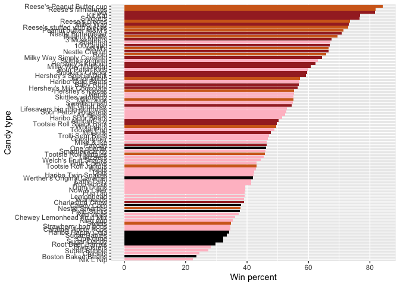
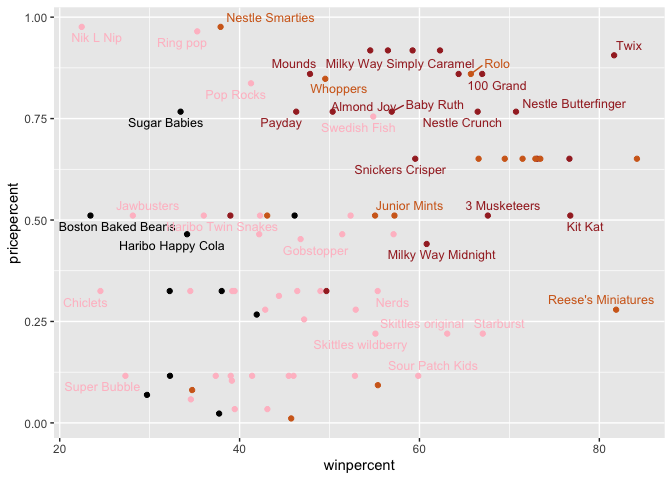
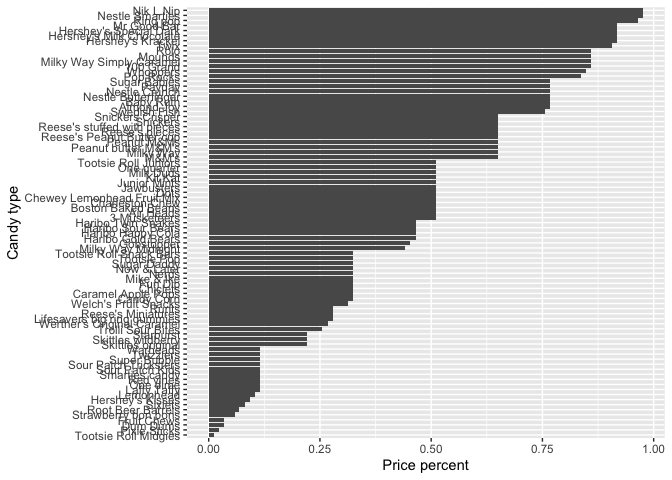
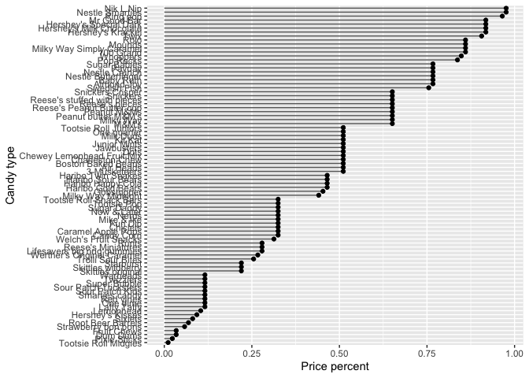
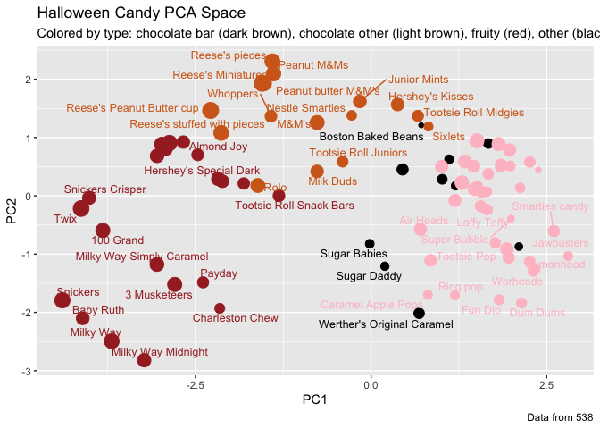

Class 10: Halloween Mini-Project
================
Andrew Kapinos
10/29/2021

## 1. Importing Candy Data

First, let’s import the dataset using read.csv(), then assign the data
to a data frame object using the first column as row titles.

``` r
url <- "https://raw.githubusercontent.com/fivethirtyeight/data/master/candy-power-ranking/candy-data.csv"
candy_file <- read.csv(url)
candy = data.frame(candy_file, row.names=1)
rownames(candy) <- gsub("Õ","'",rownames(candy))
head(candy)
```

    ##              chocolate fruity caramel peanutyalmondy nougat crispedricewafer
    ## 100 Grand            1      0       1              0      0                1
    ## 3 Musketeers         1      0       0              0      1                0
    ## One dime             0      0       0              0      0                0
    ## One quarter          0      0       0              0      0                0
    ## Air Heads            0      1       0              0      0                0
    ## Almond Joy           1      0       0              1      0                0
    ##              hard bar pluribus sugarpercent pricepercent winpercent
    ## 100 Grand       0   1        0        0.732        0.860   66.97173
    ## 3 Musketeers    0   1        0        0.604        0.511   67.60294
    ## One dime        0   0        0        0.011        0.116   32.26109
    ## One quarter     0   0        0        0.011        0.511   46.11650
    ## Air Heads       0   0        0        0.906        0.511   52.34146
    ## Almond Joy      0   1        0        0.465        0.767   50.34755

> Q1. How many different candy types are in this dataset?

``` r
nrow(candy)
```

    ## [1] 85

There are 85 types of candy in the dataset.

> Q2. How many fruity candy types are in the dataset?

``` r
sum(candy$fruity)
```

    ## [1] 38

There are 38 fruity candy types.

## 2. What is your favorite candy?

The variable “winpercent” is the percentage of people who prefer this
candy over another randlomly chosen candy in the dataset.

Let’s determine the winpercent value for Twix:

``` r
candy["Twix",]$winpercent
```

    ## [1] 81.64291

> Q3. What is your favorite candy in the dataset and what is it’s
> winpercent value?

Reese’s Peanut Butter cup

``` r
candy["Reese's Peanut Butter cup",]$winpercent
```

    ## [1] 84.18029

> Q4. What is the winpercent value for “Kit Kat”?

``` r
candy["Kit Kat",]$winpercent
```

    ## [1] 76.7686

> Q5. What is the winpercent value for “Tootsie Roll Snack Bars”?

``` r
candy["Tootsie Roll Snack Bars",]$winpercent
```

    ## [1] 49.6535

Let’s use skim() in the skimr package to get a quickl overview of the
dataset.

``` r
library("skimr")
skim(candy)
```

|                                                  |       |
|:-------------------------------------------------|:------|
| Name                                             | candy |
| Number of rows                                   | 85    |
| Number of columns                                | 12    |
| \_\_\_\_\_\_\_\_\_\_\_\_\_\_\_\_\_\_\_\_\_\_\_   |       |
| Column type frequency:                           |       |
| numeric                                          | 12    |
| \_\_\_\_\_\_\_\_\_\_\_\_\_\_\_\_\_\_\_\_\_\_\_\_ |       |
| Group variables                                  | None  |

Data summary

**Variable type: numeric**

| skim_variable    | n_missing | complete_rate |  mean |    sd |    p0 |   p25 |   p50 |   p75 |  p100 | hist  |
|:-----------------|----------:|--------------:|------:|------:|------:|------:|------:|------:|------:|:------|
| chocolate        |         0 |             1 |  0.44 |  0.50 |  0.00 |  0.00 |  0.00 |  1.00 |  1.00 | ▇▁▁▁▆ |
| fruity           |         0 |             1 |  0.45 |  0.50 |  0.00 |  0.00 |  0.00 |  1.00 |  1.00 | ▇▁▁▁▆ |
| caramel          |         0 |             1 |  0.16 |  0.37 |  0.00 |  0.00 |  0.00 |  0.00 |  1.00 | ▇▁▁▁▂ |
| peanutyalmondy   |         0 |             1 |  0.16 |  0.37 |  0.00 |  0.00 |  0.00 |  0.00 |  1.00 | ▇▁▁▁▂ |
| nougat           |         0 |             1 |  0.08 |  0.28 |  0.00 |  0.00 |  0.00 |  0.00 |  1.00 | ▇▁▁▁▁ |
| crispedricewafer |         0 |             1 |  0.08 |  0.28 |  0.00 |  0.00 |  0.00 |  0.00 |  1.00 | ▇▁▁▁▁ |
| hard             |         0 |             1 |  0.18 |  0.38 |  0.00 |  0.00 |  0.00 |  0.00 |  1.00 | ▇▁▁▁▂ |
| bar              |         0 |             1 |  0.25 |  0.43 |  0.00 |  0.00 |  0.00 |  0.00 |  1.00 | ▇▁▁▁▂ |
| pluribus         |         0 |             1 |  0.52 |  0.50 |  0.00 |  0.00 |  1.00 |  1.00 |  1.00 | ▇▁▁▁▇ |
| sugarpercent     |         0 |             1 |  0.48 |  0.28 |  0.01 |  0.22 |  0.47 |  0.73 |  0.99 | ▇▇▇▇▆ |
| pricepercent     |         0 |             1 |  0.47 |  0.29 |  0.01 |  0.26 |  0.47 |  0.65 |  0.98 | ▇▇▇▇▆ |
| winpercent       |         0 |             1 | 50.32 | 14.71 | 22.45 | 39.14 | 47.83 | 59.86 | 84.18 | ▃▇▆▅▂ |

> Q6. Is there any variable/column that looks to be on a different scale
> to the majority of the other columns in the dataset?

Yes; the last variable is scaled differently (0-100 instead of 0-1, as
the other variables are scaled).

> Q7. What do you think a zero and one represent for the candy$chocolate
> column?

Zero means that the candy type is not chocolatey, while a one means that
it is.

> Q8. Plot a histogram of winpercent values

``` r
hist(candy$winpercent)
```

<!-- -->

> Q9. Is the distribution of winpercent values symmetrical?

No, the distribution skews right (positive skew).

> Q10. Is the center of the distribution above or below 50%?

Below 50%.

> Q11. On average is chocolate candy higher or lower ranked than fruit
> candy?

``` r
t.test(candy$winpercent[as.logical(candy$chocolate)],candy$winpercent[as.logical(candy$fruit)])
```

    ## 
    ##  Welch Two Sample t-test
    ## 
    ## data:  candy$winpercent[as.logical(candy$chocolate)] and candy$winpercent[as.logical(candy$fruit)]
    ## t = 6.2582, df = 68.882, p-value = 2.871e-08
    ## alternative hypothesis: true difference in means is not equal to 0
    ## 95 percent confidence interval:
    ##  11.44563 22.15795
    ## sample estimates:
    ## mean of x mean of y 
    ##  60.92153  44.11974

On average, chocolate has a higher win percent than fruit. The mean
winpercent for chocolate = 60.92153, while the mean winpercent for fruit
= 44.11974.

> Q12. Is this difference statistically significant?

Yes, it is significant using a significance threshold of p\<0.05. The
p-value for this comparison is 2.871e-08.

## 3. Overall candy rankings

Let’s order the dataset based on the winpercent variable, in ascending
order, using dplyr and arrange().

> Q13. What are the five least liked candy types in this set?

``` r
library("dplyr")
```

    ## 
    ## Attaching package: 'dplyr'

    ## The following objects are masked from 'package:stats':
    ## 
    ##     filter, lag

    ## The following objects are masked from 'package:base':
    ## 
    ##     intersect, setdiff, setequal, union

``` r
candy %>% arrange(winpercent) %>% head(5)
```

    ##                    chocolate fruity caramel peanutyalmondy nougat
    ## Nik L Nip                  0      1       0              0      0
    ## Boston Baked Beans         0      0       0              1      0
    ## Chiclets                   0      1       0              0      0
    ## Super Bubble               0      1       0              0      0
    ## Jawbusters                 0      1       0              0      0
    ##                    crispedricewafer hard bar pluribus sugarpercent pricepercent
    ## Nik L Nip                         0    0   0        1        0.197        0.976
    ## Boston Baked Beans                0    0   0        1        0.313        0.511
    ## Chiclets                          0    0   0        1        0.046        0.325
    ## Super Bubble                      0    0   0        0        0.162        0.116
    ## Jawbusters                        0    1   0        1        0.093        0.511
    ##                    winpercent
    ## Nik L Nip            22.44534
    ## Boston Baked Beans   23.41782
    ## Chiclets             24.52499
    ## Super Bubble         27.30386
    ## Jawbusters           28.12744

The five least liked candies are Nik L Nip, Boston Baked Beans,
Chiclets, Super Bubble, and Jawbusters.

> Q14. What are the top 5 all time favorite candy types out of this set?

``` r
candy %>% arrange(desc(winpercent)) %>% head(5)
```

    ##                           chocolate fruity caramel peanutyalmondy nougat
    ## Reese's Peanut Butter cup         1      0       0              1      0
    ## Reese's Miniatures                1      0       0              1      0
    ## Twix                              1      0       1              0      0
    ## Kit Kat                           1      0       0              0      0
    ## Snickers                          1      0       1              1      1
    ##                           crispedricewafer hard bar pluribus sugarpercent
    ## Reese's Peanut Butter cup                0    0   0        0        0.720
    ## Reese's Miniatures                       0    0   0        0        0.034
    ## Twix                                     1    0   1        0        0.546
    ## Kit Kat                                  1    0   1        0        0.313
    ## Snickers                                 0    0   1        0        0.546
    ##                           pricepercent winpercent
    ## Reese's Peanut Butter cup        0.651   84.18029
    ## Reese's Miniatures               0.279   81.86626
    ## Twix                             0.906   81.64291
    ## Kit Kat                          0.511   76.76860
    ## Snickers                         0.651   76.67378

The top 5 all time favorite candy types are Reese’s Peanut Butter cup,
Reese’s Miniatures, Twix, Kit Kat, and Snickers.

> Q15. Make a first barplot of candy ranking based on winpercent values.

``` r
library(ggplot2)
ggplot(candy) +
  aes(winpercent, rownames(candy)) +
  geom_col()
```

<!-- -->

> Q16. This is quite ugly, use the reorder() function to get the bars
> sorted by winpercent?

``` r
ggplot(candy) +
  aes(winpercent, reorder(rownames(candy),winpercent)) +
  geom_col() + labs(x="Win percent",y="Candy type")
```

<!-- -->

``` r
my_cols=rep("black", nrow(candy))
my_cols[as.logical(candy$chocolate)] = "chocolate"
my_cols[as.logical(candy$bar)] = "brown"
my_cols[as.logical(candy$fruity)] = "pink"
ggplot(candy) +
  aes(winpercent, reorder(rownames(candy),winpercent)) +
  geom_col(fill=my_cols) + labs(x="Win percent",y="Candy type")
```

<!-- -->

> Q17. What is the worst ranked chocolate candy?

Sixlets is the worst ranked chocolate candy.

> Q18. What is the best ranked fruity candy?

Starburst is the best ranked fruity candy.

## 4. Taking a look at pricepercent

``` r
library(ggrepel)

# How about a plot of price vs win
ggplot(candy) +
  aes(winpercent, pricepercent, label=rownames(candy)) +
  geom_point(col=my_cols) + 
  geom_text_repel(col=my_cols, size=3.3, max.overlaps = 5)
```

    ## Warning: ggrepel: 50 unlabeled data points (too many overlaps). Consider
    ## increasing max.overlaps

<!-- -->

> Q19. Which candy type is the highest ranked in terms of winpercent for
> the least money - i.e. offers the most bang for your buck?

Reese’s Miniatures is the highest ranked in terms of winpercent for the
least money.

> Q20. What are the top 5 most expensive candy types in the dataset and
> of these which is the least popular?

``` r
candy %>% arrange(desc(pricepercent)) %>% head(5)
```

    ##                          chocolate fruity caramel peanutyalmondy nougat
    ## Nik L Nip                        0      1       0              0      0
    ## Nestle Smarties                  1      0       0              0      0
    ## Ring pop                         0      1       0              0      0
    ## Hershey's Krackel                1      0       0              0      0
    ## Hershey's Milk Chocolate         1      0       0              0      0
    ##                          crispedricewafer hard bar pluribus sugarpercent
    ## Nik L Nip                               0    0   0        1        0.197
    ## Nestle Smarties                         0    0   0        1        0.267
    ## Ring pop                                0    1   0        0        0.732
    ## Hershey's Krackel                       1    0   1        0        0.430
    ## Hershey's Milk Chocolate                0    0   1        0        0.430
    ##                          pricepercent winpercent
    ## Nik L Nip                       0.976   22.44534
    ## Nestle Smarties                 0.976   37.88719
    ## Ring pop                        0.965   35.29076
    ## Hershey's Krackel               0.918   62.28448
    ## Hershey's Milk Chocolate        0.918   56.49050

Nik L Nip, Nestle Smarties, Ring pop, Hershey’s Krackel, and Hershey’s
Milk Chocolate are the 5 most expensive candy types. Of these, the least
popular is Nik L Nip.

> Optional Q21. Make a barplot again with geom_col() this time using
> pricepercent and then improve this step by step, first ordering the
> x-axis by value and finally making a so called “dot chat” or
> “lollipop” chart by swapping geom_col() for geom_point() +
> geom_segment().

``` r
ggplot(candy) +
  aes(pricepercent, reorder(rownames(candy),pricepercent)) +
  geom_col() + labs(x="Price percent",y="Candy type")
```

<!-- -->

``` r
ggplot(candy) +
  aes(pricepercent, reorder(rownames(candy), pricepercent)) +
  geom_segment(aes(yend = reorder(rownames(candy), pricepercent), xend = 0), col="gray40") +
    geom_point() + labs(x="Price percent",y="Candy type")
```

<!-- -->

## Exploring the correlation structure

Now that we’ve explored the dataset a little, let’s see how the
variables interact with one another, using the corrplot package to get a
correlation matrix.

``` r
library(corrplot)
```

    ## corrplot 0.92 loaded

``` r
cij <- cor(candy)
corrplot(cij)
```

<!-- -->

> Q22. Examining this plot, what two variables are anti-correlated
> (i.e. have minus values)?

1.  Chocolate and fruity, (2) Bar and pluribus, (3) fruity and bar

> Q23. Similarly, what two variables are most positively correlated?

1.  Chocolate and winpercent, (2) Chocolate and bar, (3) Chocolate and
    pricepercent

## 6. Principal Component Analysis

Let’s perform PCA on our candy dataset, using the prcomp() function and
the scale=TRUE argument.

``` r
pca <- prcomp(candy,scale=TRUE)
summary(pca)
```

    ## Importance of components:
    ##                           PC1    PC2    PC3     PC4    PC5     PC6     PC7
    ## Standard deviation     2.0788 1.1378 1.1092 1.07533 0.9518 0.81923 0.81530
    ## Proportion of Variance 0.3601 0.1079 0.1025 0.09636 0.0755 0.05593 0.05539
    ## Cumulative Proportion  0.3601 0.4680 0.5705 0.66688 0.7424 0.79830 0.85369
    ##                            PC8     PC9    PC10    PC11    PC12
    ## Standard deviation     0.74530 0.67824 0.62349 0.43974 0.39760
    ## Proportion of Variance 0.04629 0.03833 0.03239 0.01611 0.01317
    ## Cumulative Proportion  0.89998 0.93832 0.97071 0.98683 1.00000

Let’s plot our PCA score plot of PC1 v. PC2.

``` r
plot(pca$x[,1:2])
```

<!-- -->

Let’s change the plotting character and add some color.

``` r
plot(pca$x[,1:2], col=my_cols, pch=16)
```

<!-- -->

Much nicer! Let’s make a ggplot version using an input data.frame
containing our PCA results.

``` r
my_data <- cbind(candy, pca$x[,1:3])
p <- ggplot(my_data) + 
        aes(x=PC1, y=PC2, 
            size=winpercent/100,  
            text=rownames(my_data),
            label=rownames(my_data)) +
        geom_point(col=my_cols)

p
```

<!-- -->

Again, we can use ggrepel to label the plot with non-overlapping candy
names.

``` r
library(ggrepel)

p + geom_text_repel(size=3.3, col=my_cols, max.overlaps = 7)  + 
  theme(legend.position = "none") +
  labs(title="Halloween Candy PCA Space",
       subtitle="Colored by type: chocolate bar (dark brown), chocolate other (light brown), fruity (red), other (black)",
       caption="Data from 538")
```

    ## Warning: ggrepel: 39 unlabeled data points (too many overlaps). Consider
    ## increasing max.overlaps

<!-- -->

We can use plotly to create an interactive plot that we can mouse over
to view labels.

``` r
# library(plotly)
# ggplotly(p)
```

Finally, let’s take a look at the PC loadings.

``` r
par(mar=c(8,4,2,2))
barplot(pca$rotation[,1], las=2, ylab="PC1 Contribution")
```

<!-- -->

> Q24. What original variables are picked up strongly by PC1 in the
> positive direction? Do these make sense to you?

Fruity, hard, and pluribus are variables that are picked up strongly by
PC1 in the positive direction. This makes sense, given that typically
fruity candies are hard and come in bags with multiple candies (eg.
lollipops, starburst, etc.)

These variables also correlate with each other on the correlation matrix
from Q22-23 and anti-correlate with the other variables. This would
suggest that a lot of the original variance may be described in the
separation between fruity/hard/pluribus candies and all others.
