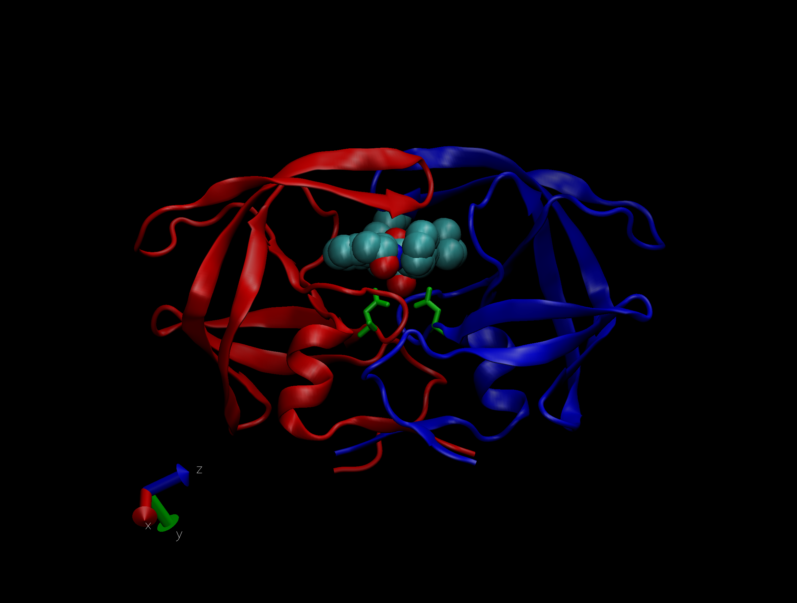

Today, we'll be investigating protein structure.

## 1: Introduction to the RCSB Protein Data Bank (PDB)

Let's start by downloading a CSV file from the PDB site (accessible from “Analyze” > “PDB Statistics” > “by Experimental Method and Molecular Type”. We'll move this CSV file into our project directory and load it in using read.csv().

After assigning it to a variable, we'll look at it's structure using head().

```{r}
pdb.data <- read.csv("dataexportsummary.csv",row.names = 1)
head(pdb.data)
```
> Q1: What percentage of structures in the PDB are solved by X-Ray and Electron Microscopy.

```{r}
x.ray <- round((sum(pdb.data$X.ray)/sum(pdb.data$Total)*100),2)

print(paste(x.ray,"% of structures in the PDB are solved by X-Ray"))

e.m <- round((sum(pdb.data$EM)/sum(pdb.data$Total)*100),2)

print(paste(e.m,"% of structures in the PDB are solved by EM"))
```

What about doing this for all columns at once?

```{r}
round(colSums(pdb.data)/sum(pdb.data$Total)*100,2)
```

> Q2: What proportion of structures in the PDB are protein?

```{r}
prop.prot <- round(pdb.data$Total[1]/sum(pdb.data$Total)*100,2)

print(paste(prop.prot,"% of structures in the PDB are protein"))
```

> Q3: Type HIV in the PDB website search box on the home page and determine how many HIV-1 protease structures are in the current PDB?

There are 1205 structures containing both the terms "HIV" and "protease."

## 2. Visualizing the HIV-1 protease structure

> Q4: Water molecules normally have 3 atoms. Why do we see just one atom per water molecule in this structure?

The single atom that we are seeing is the oxygen atom in the water molecule. The resolution of the protein structure is at 2 Angstroms and, in order to visualize hydrogen (which is quite small), we would need a resolution of at least 1 Angstrom. Oxygen is large enough to be resolved at this level.

> Q5: There is a conserved water molecule in the binding site. Can you identify this water molecule? What residue number does this water molecule have?

Yes, I can! The residue number is 308 (atom label is OH308:O).

My render image of the protein structure:



## 3. Introduction to Bio3D in R

Bio3D is an R package that we'll be using for structural bioinformatics. Let's load Bio3D and read in a PDB file using read.pdb().

```{r}
library(bio3d)
pdb <- read.pdb("1hel")
pdb
```

> Q7: How many amino acid residues are there in this pdb object? 


> Q8: Name one of the two non-protein residues? 


> Q9: How many protein chains are in this structure? 

Let's use nma() for Normal Mode Analysis (NMA) a prediction of the conformational variability and intrinsic dynamics of this protein.

```{r}
m <- nma(pdb)
plot(m)
```

The mktrj() command makes a trajectory file that we can read into VMD for viewing.

```{r}
mktrj(m,file="nma.pdb")
```

Note: to view, use graphic presentation settings Tube and Index.
