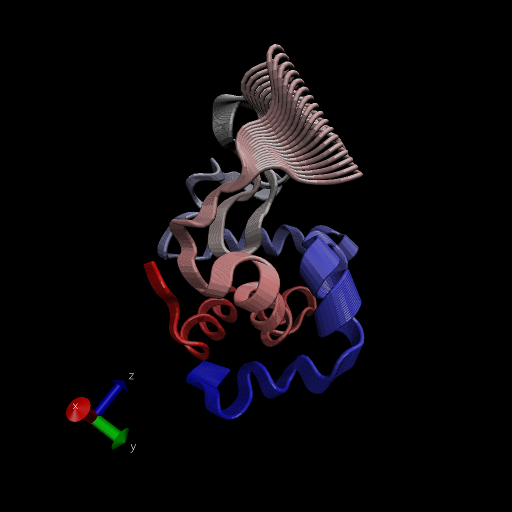

# Working with bio3D
 
 Today we're continuing our work from class 11. Let's start by reviewing some basic functions used in the bio3d package for structural bioinformatics.
 
```{r}
library(bio3d)
pdb <- read.pdb("1hel")
pdb
```
 
 Let's review the type of data contained in the atom attribute.
 
```{r}
head(pdb$atom)
```
 
 Let's do a quick prediction of protein dynamics (or "flexibility"). We use the 'nma()' function for this, which uses a method called "normal mode analysis".
 
```{r}
modes <- nma(pdb)
plot(modes)
```
 
 Let's make something that we can load and view (basically a movie) which will help us to understand the fluctuations of these residues/flexibility of the protein.
 
 We'll make a trajectory of this "modes" prediction using the "mktrj()" function. The "file" argument will specify the name of the output.
 
```{r}
mktrj(modes,file="nma.pdb")
```
 
 We'll open this file using VMD. We'll need to change the representation using Graphics > Representation. We'll create a representation, using Color > Index (color scale by residue position), and Drawing Method > Tube.
 
 We can show all of the positions at once by using Trajectories > Draw Multiple Frames > 1:100.
 
 To save the image, use File > Render > Browse (select R directory for file destination, changename.tga) > Start Rendering.
 
 And the image from VMD:
 
 
 