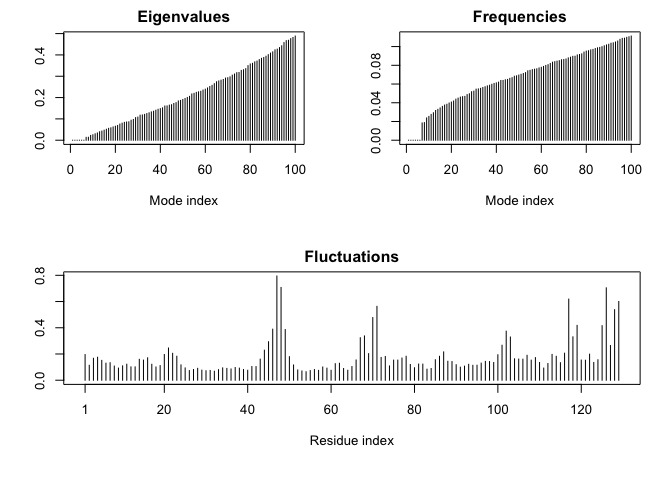

Class 12: Structural Bioinformatics II
================

# Working with bio3D

Today we’re continuing our work from class 11. Let’s start by reviewing
some basic functions used in the bio3d package for structural
bioinformatics.

``` r
library(bio3d)
pdb <- read.pdb("1hel")
```

    ##   Note: Accessing on-line PDB file

``` r
pdb
```

    ## 
    ##  Call:  read.pdb(file = "1hel")
    ## 
    ##    Total Models#: 1
    ##      Total Atoms#: 1186,  XYZs#: 3558  Chains#: 1  (values: A)
    ## 
    ##      Protein Atoms#: 1001  (residues/Calpha atoms#: 129)
    ##      Nucleic acid Atoms#: 0  (residues/phosphate atoms#: 0)
    ## 
    ##      Non-protein/nucleic Atoms#: 185  (residues: 185)
    ##      Non-protein/nucleic resid values: [ HOH (185) ]
    ## 
    ##    Protein sequence:
    ##       KVFGRCELAAAMKRHGLDNYRGYSLGNWVCAAKFESNFNTQATNRNTDGSTDYGILQINS
    ##       RWWCNDGRTPGSRNLCNIPCSALLSSDITASVNCAKKIVSDGNGMNAWVAWRNRCKGTDV
    ##       QAWIRGCRL
    ## 
    ## + attr: atom, xyz, seqres, helix, sheet,
    ##         calpha, remark, call

Let’s review the type of data contained in the atom attribute.

``` r
head(pdb$atom)
```

    ##   type eleno elety  alt resid chain resno insert      x      y      z o     b
    ## 1 ATOM     1     N <NA>   LYS     A     1   <NA>  3.294 10.164 10.266 1 11.18
    ## 2 ATOM     2    CA <NA>   LYS     A     1   <NA>  2.388 10.533  9.168 1  9.68
    ## 3 ATOM     3     C <NA>   LYS     A     1   <NA>  2.438 12.049  8.889 1 14.00
    ## 4 ATOM     4     O <NA>   LYS     A     1   <NA>  2.406 12.898  9.815 1 14.00
    ## 5 ATOM     5    CB <NA>   LYS     A     1   <NA>  0.949 10.101  9.559 1 13.29
    ## 6 ATOM     6    CG <NA>   LYS     A     1   <NA> -0.050 10.621  8.573 1 13.52
    ##   segid elesy charge
    ## 1  <NA>     N   <NA>
    ## 2  <NA>     C   <NA>
    ## 3  <NA>     C   <NA>
    ## 4  <NA>     O   <NA>
    ## 5  <NA>     C   <NA>
    ## 6  <NA>     C   <NA>

Let’s do a quick prediction of protein dynamics (or “flexibility”). We
use the ‘nma()’ function for this, which uses a method called “normal
mode analysis”.

``` r
modes <- nma(pdb)
```

    ##  Building Hessian...     Done in 0.026 seconds.
    ##  Diagonalizing Hessian...    Done in 0.131 seconds.

``` r
plot(modes)
```

<!-- -->

Let’s make something that we can load and view (basically a movie) which
will help us to understand the fluctuations of these
residues/flexibility of the protein.

We’ll make a trajectory of this “modes” prediction using the “mktrj()”
function. The “file” argument will specify the name of the output.

``` r
mktrj(modes,file="nma.pdb")
```

We’ll open this file using VMD. We’ll need to change the representation
using Graphics \> Representation. We’ll create a representation, using
Color \> Index (color scale by residue position), and Drawing Method \>
Tube.

We can show all of the positions at once by using Trajectories \> Draw
Multiple Frames \> 1:100.

To save the image, use File \> Render \> Browse (select R directory for
file destination, changename.tga) \> Start Rendering.

And the image from VMD:


