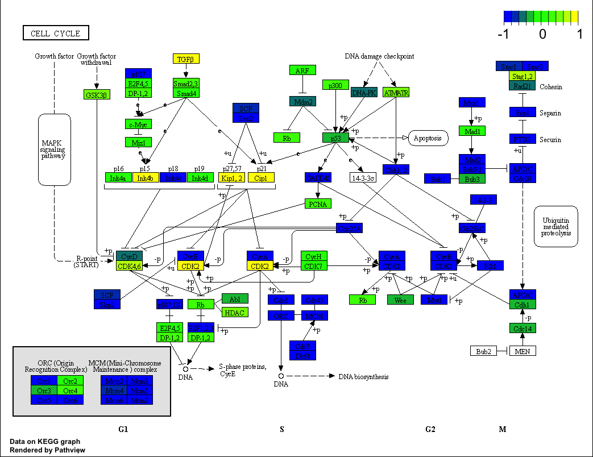
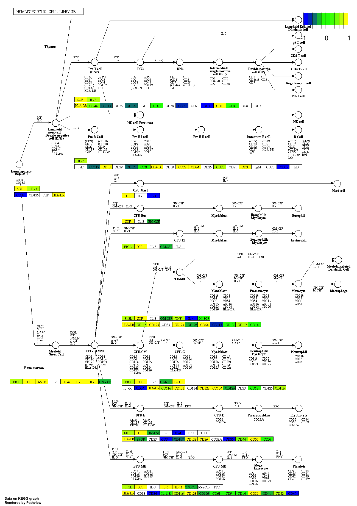
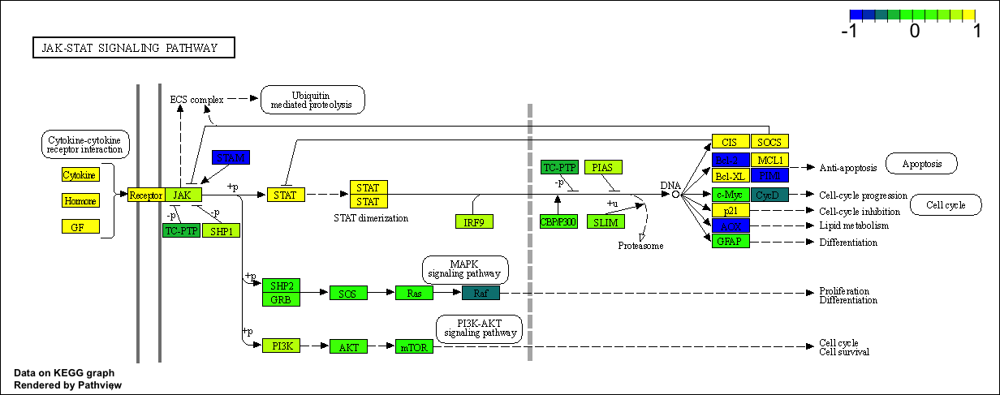
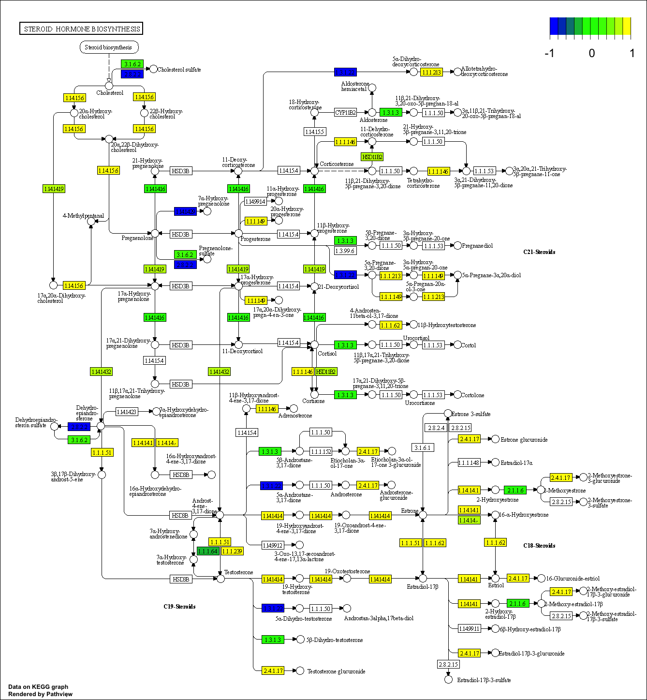
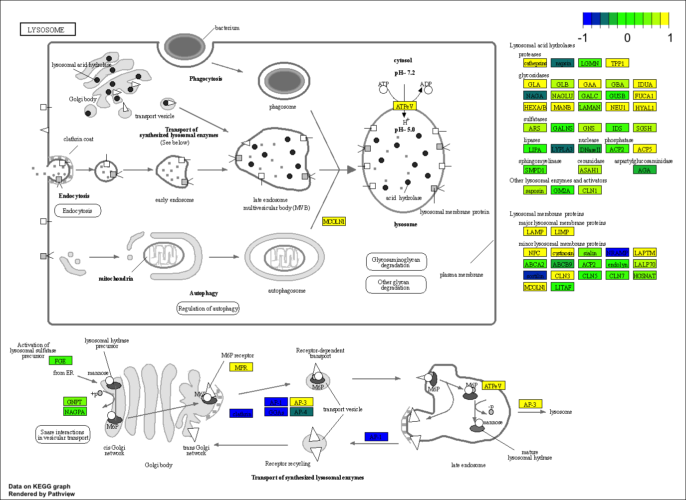
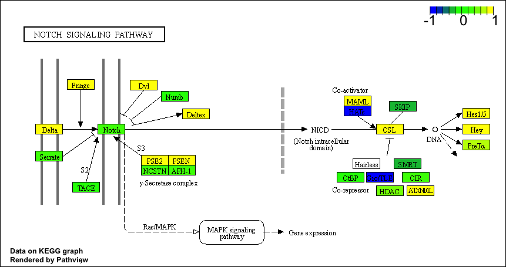
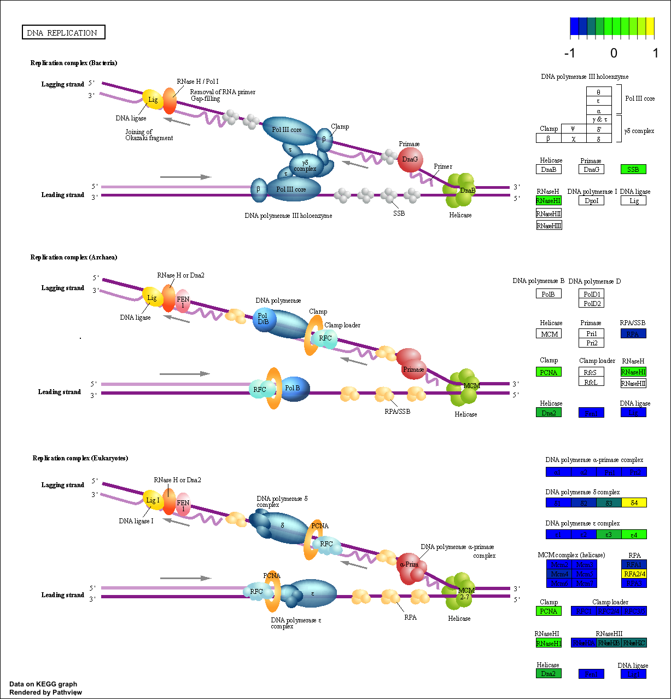
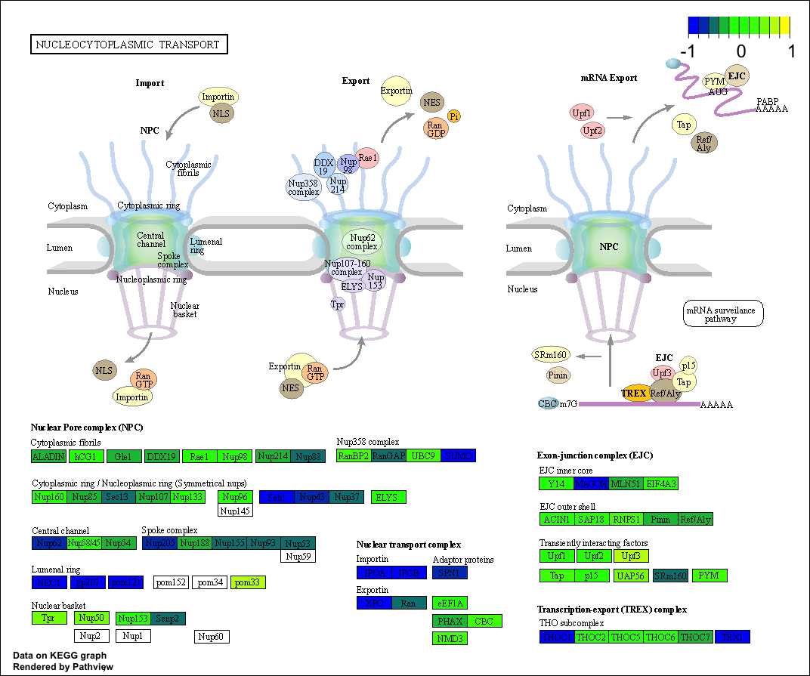
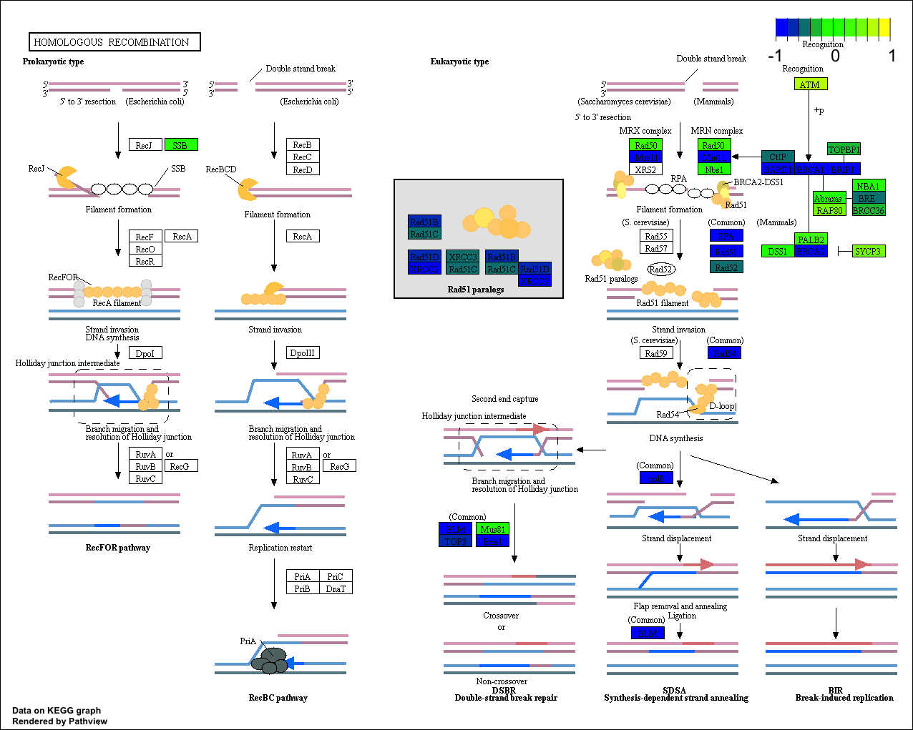
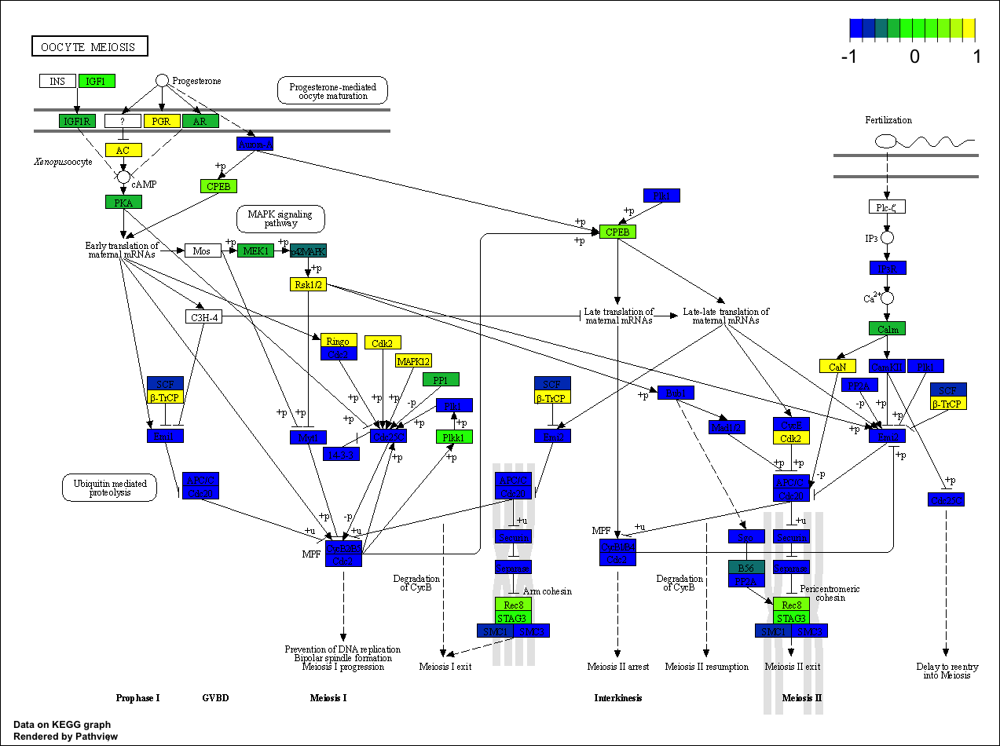

## Section 1. Differential Expression Analysis

```{r message=FALSE}
library(DESeq2)
```

Let's load our count and metagene data files. We can then import our metadata.

```{r}
metaFile <- "GSE37704_metadata.csv"
countFile <- "GSE37704_featurecounts.csv"

# Import metadata and take a look
colData = read.csv(metaFile, row.names=1)
head(colData)
```

Let's import our count data as well.

```{r}
countData.raw = read.csv(countFile, row.names=1)
head(countData.raw)
```

>Q. Complete the code below to remove the troublesome first column from countData.

```{r}
countData <- as.matrix(countData.raw[,-1])
head(countData)
```

>Q. Complete the code below to filter countData to exclude genes (i.e. rows) where we have 0 read count across all samples (i.e. columns).

Tip: What will rowSums() of countData return and how could you use it in this context?

rowSums(countData)==0 will return the row numbers of rows will all 0s, which we
want to remove. We can add the minus symbol to select rows that don't have all
0s.

```{r}
# Filter count data where you have 0 read count across all samples.
countData = countData[-which(rowSums(countData)==0),]
head(countData)
```

## Optional: PCA Analysis

Let's perform PCA to ensure that the data looks well separated.

```{r}
pca.counts <- prcomp(t(countData))
attributes(pca.counts)
summary(pca.counts$x)
plot(pca.counts$x[,1], pca.counts$x[,2], 
     xlim=c(-300000,300000), ylim=c(-200000,100000), 
     xlab="PC1", 
     ylab="PC2",col=as.factor(colData$condition),pch=16)
text(pca.counts$x[,1], pca.counts$x[,2], colnames(countData), pos=1)
```

It looks like the data has some trends between the two groups based on their
separation along PC1 in the PC plot. Let's continue to DESeq2.

## Running DESEq2

>Q. Call the summary() function on your results to get a sense of how many genes are up or down-regulated at the default 0.1 p-value cutoff.

```{r message=FALSE, warning=FALSE}
dds = DESeqDataSetFromMatrix(countData=countData,
                             colData=colData,
                             design=~condition)
dds = DESeq(dds)
res = results(dds)
summary(res)
```

27% are upregulated and 28% are downlregulated.

## Volcano plot

```{r}
plot(res$log2FoldChange, -log(res$padj))
```

>Q. Improve this plot by completing the below code, which adds color and axis labels

```{r}
# Make a color vector for all genes
mycols <- rep("gray", nrow(res) )

# Color red the genes with absolute fold change above 2
mycols[ abs(res$log2FoldChange) > 2 ] <- "red"

# Color blue those with adjusted p-value less than 0.01
#  and absolute fold change more than 2
inds <- (res$padj < 0.01) & (abs(res$log2FoldChange) > 2 )
mycols[ inds ] <- "blue"

plot( res$log2FoldChange, -log(res$padj), col=mycols, xlab="Log2(FoldChange)", ylab="-Log(P-value)" )

# Cut-off lines
abline(v=c(-2,2), col="gray", lty=2)
abline(h=-log(0.1), col="gray", lty=2)
```

## Adding gene annotation

>Q. Use the mapIDs() function multiple times to add SYMBOL, ENTREZID and GENENAME annotation to our results by completing the code below.

```{r message=FALSE}
library("AnnotationDbi")
library("org.Hs.eg.db")

columns(org.Hs.eg.db)

res$symbol = mapIds(org.Hs.eg.db,
                    keys=row.names(res), 
                    keytype="ENSEMBL",
                    column="SYMBOL",
                    multiVals="first")

res$entrez = mapIds(org.Hs.eg.db,
                    keys=row.names(res),
                    keytype="ENSEMBL",
                    column="ENTREZID",
                    multiVals="first")

res$name =   mapIds(org.Hs.eg.db,
                    keys=row.names(res),
                    keytype="ENSEMBL",
                    column="GENENAME",
                    multiVals="first")

head(res, 10)
```

>Q. Finally for this section let's reorder these results by adjusted p-value and save them to a CSV file in your current project directory.

```{r}
res = res[order(res$pvalue),]
write.csv(res, file="deseq_results.csv")
```

## Section 2: Pathway Analysis

Let's load the packages and data we'll need.
```{r warning=FALSE}
library(pathview)
library(gage)
library(gageData)

data(kegg.sets.hs)
data(sigmet.idx.hs)

# Focus on signaling and metabolic pathways only
kegg.sets.hs = kegg.sets.hs[sigmet.idx.hs]

# Examine the first 3 pathways
head(kegg.sets.hs, 3)
```

To use gage() we'll need a named vector of fold changes.

```{r}
foldchanges = res$log2FoldChange
names(foldchanges) = res$entrez
head(foldchanges)
```

Now let's run the gage pathway analysis.

```{r}
keggres = gage(foldchanges, gsets=kegg.sets.hs)
```

Let's take a look at the result structure and the first few down (less) pathways.

```{r}
attributes(keggres)
head(keggres$less)
```

And let's generate a pathview figure from KEGG data using our results.
```{r message=FALSE, warning=FALSE}
pathview(gene.data=foldchanges, pathway.id="hsa04110", low="blue", mid="green", high="yellow")
```


Let's take a look at the up (more) pathways, too.
```{r}
## Focus on top 5 upregulated pathways here for demo purposes only
keggrespathways <- rownames(keggres$greater)[1:5]

# Extract the 8 character long IDs part of each string
keggresids = substr(keggrespathways, start=1, stop=8)
keggresids
```

Let's pass these 5 IDs to the pathview() function, which will give us a combined
output.

```{r message=FALSE, warning=FALSE}
pathview(gene.data=foldchanges, pathway.id=keggresids, species="hsa", low="blue", mid="green", high="yellow")
```







>Q. Can you do the same procedure as above to plot the pathview figures for the top 5 down-reguled pathways?

```{r}
## Focus on top 5 downregulated pathways here for demo purposes only
keggrespathways.down <- rownames(keggres$less)[1:5]

# Extract the 8 character long IDs part of each string
keggresids.down = substr(keggrespathways.down, start=1, stop=8)
keggresids.down
```

```{r message=FALSE, warning=FALSE}
pathview(gene.data=foldchanges, pathway.id=keggresids.down, species="hsa", low="blue", mid="green", high="yellow")
```










