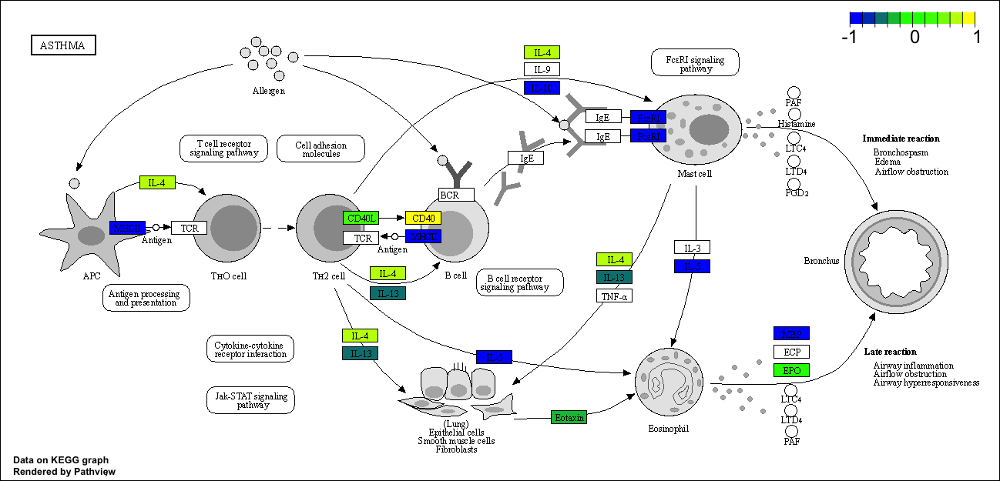

## 1. Bioconductor and DESeq2 setup

We will need to install Bioconductor in the console (if not already installed), as well as DESeq2 through the Bioconductor installer. 

Then, we can call the BiocManager and DESeq2 packages.

```{r message=FALSE, warning=FALSE}
library(BiocManager)
library(DESeq2)
```

## 2. Import countData and colData

Let's start by importing our data files. 

```{r message=FALSE}
counts <- read.csv("airway_scaledcounts.csv", row.names=1)
metadata <- read.csv("airway_metadata.csv")
```

Now we can take a look.

```{r}
head(counts)
```

```{r}
head(metadata)
```

>Q1. How many genes are in this dataset?

```{r}
nrow(counts)
```

There are 38694 genes in the dataset.

>Q2. How many ‘control’ cell lines do we have?

```{r}
sum(metadata$dex=="control")
```

There are 4 control cell lines.

## 3. Toy differential gene expression

Let's check the correspondence of the metadata and count data setup. We will
need to extract the 'id' column from metadata and the column names from count.
We can then use "==" to check if they are the same. This will return a vector
with TRUE or FALSE, depending on if each position in the two vectors is the
same. By wrapping with "all()", then TRUE will only be returned if all positions
in the vector are TRUE. If any are FALSE, then all() will return FALSE.

```{r}
all(metadata$id == colnames(counts))
```

Let's try to filter metadata and counts by dex using dplyr.

```{r message=FALSE}
library(dplyr)
control <- metadata %>% filter(dex=="control")
control.counts <- counts %>% dplyr::select(control$id) 
control.mean <- rowSums(control.counts)/4
head(control.mean)
```

Let's try to filter counts to only display control data using base R functions. We can then calculate the mean counts per gene across these samples.

```{r}
control.inds <- metadata$dex == "control"
control.ids <- metadata[control.inds,]$id

# We can use the ids to access the control columns of our "counts" data and
#   calculate the mean expression (columns) for each gene (row).

head(counts[,control.ids])
control.mean <- rowMeans(counts[,control.ids])
head(control.mean)
```

>Q3. How would you make the above code in either approach more robust?

The example provided in the lab handout uses rowSums(control.counts)/4 to calculate the mean manually, which would not work properly if any additional samples were added to the dataset (ie. the denominator in the mean calculation would no longer be 4, as there would be more than 4 samples).

This can be made more robust by using rowMeans() instead, as seen above.

>Q4. Follow the same procedure for the treated samples (i.e. calculate the mean per gene across drug treated samples and assign to a labeled vector called treated.mean)

```{r}
treated.inds <- metadata$dex == "treated"
treated.ids <- metadata[treated.inds,]$id
head(counts[,treated.ids])
treated.mean <- rowMeans(counts[,treated.ids])
head(treated.mean)
```

Let's put the control and treated means together for the sake of organization.

```{r}
meancounts <- data.frame(control.mean,treated.mean)
head(meancounts)
```

>Q5 (a). Create a scatter plot showing the mean of the treated samples against the mean of the control samples.

Let's make a plot of our meancounts data frame.

```{r}
plot(meancounts)
```

>Q5 (b).You could also use the ggplot2 package to make this figure producing the plot below. What geom_?() function would you use for this plot?

```{r}
library(ggplot2)
ggplot(meancounts,aes(control.mean,treated.mean)) +
  geom_point(alpha=0.2)
```

We would use the geom_point() function here.

>Q6. Try plotting both axes on a log scale. What is the argument to plot() that allows you to do this?

```{r}
plot(meancounts,log="xy")
```

The log argument, using "xy", allows for the axes to be rescaled.

If we are using ggplot have a look at the function scale_x_continuous(trans="log2") and of course do the same for the y axis.

```{r}
library(ggplot2)
ggplot(meancounts,aes(control.mean,treated.mean)) +
  geom_point(alpha=0.2) + scale_x_continuous(trans="log10") +
  scale_y_continuous(trans="log10")
```

We can use a log2-fold change to determine if expression has increased or decreased. See below:

```{r}
log2(10/10)
log2(20/10)
log2(10/20)
```

We can see that when expression remains unchanged (ie, log2 of 1), the output is
0. When increasing, the log2 is positive. When decreasing, log2 is negative.

```{r}
meancounts$log2fc <- log2(meancounts[,"treated.mean"]/meancounts[,"control.mean"])
head(meancounts)
```

We get some whacky results, like "NaN" (not a number) and -Inf (negative
infinity). Let's fix this and drop the zero count genes/rows.

The "which()" function will tell us the indices of TRUE entries in a logical
vector. However, it's not that useful in default mode on our type of 
multi-column input.

>Q7. What is the purpose of the arr.ind argument in the which() function call above? Why would we then take the first column of the output and need to call the unique() function?

In default mode, which() will return the column *and* row indices with zeroes.
We only want to focus on the rows, so we can use the arr.ind=TRUE argument to 
only return the value of rows in which a column value is 0.

```{r}
inds <- which(meancounts[,1:2]==0, arr.ind=TRUE)

# After this, we now have rows containing zeroes; however, some rows are
#   repeated if there are zeroes in both columns! We need to show only unique
#   row numbers.

rm.doubles <- unique(inds[,1])
head(meancounts[rm.doubles,])

# This gives us the rows which have zeroes, but we want non-zero rows (genes).
#   We'll use the minus symbol to select for the opposite of our rm.doubles
#   vector.

mycounts <- meancounts[-rm.doubles,]
head(mycounts)
```

We now have 'r nrow(mycounts)' genes remaining.

```{r}
nrow(mycounts)
```

How many of these genes are up regulated at the log2-fold-change threshold of 
+2 or greater?

```{r}
up.ind <- mycounts$log2fc > 2
down.ind <- mycounts$log2fc < (-2)
```

>Q8. Using the up.ind vector above can you determine how many up regulated genes we have at the greater than 2 fc level? 

```{r}
sum(up.ind)
```

250 genes are up-regulated above the log2-fold-change threshold of +2.

What percentage is this?

```{r}
round((sum(mycounts$log2fc > +2)/nrow(mycounts))*100,2)
```

1.15% of genes are up-regulated.

>Q9. Using the down.ind vector above can you determine how many down regulated genes we have at the greater than 2 fc level?

```{r}
sum(down.ind)
```

367 genes are down-regulated below the log2-fold-change threshold of -2.

>Q10. Do you trust these results? Why or why not?

Not necessarily; there is a problem with this line of reasoning (ie. relying on
log2-fold-change only), because observations can have large log2-fold-changes
without necessarily having statistically significant p-values. Without p-values,
we cannot state whether the changes to expression are truly significant.

## 4. DESeq2 Analysis

Let's load the package & citation.

```{r}
library(DESeq2)
citation("DESeq2")
```

Let's start by importing our data.

```{r}
dds <- DESeqDataSetFromMatrix(countData=counts, 
                              colData=metadata, 
                              design=~dex)
dds
```

Let's run DESeq on the dataset.

```{r}
dds <- DESeq(dds)
res <- results(dds)
head(res)
```

## 5. Adding annotation data

We want to add meaningful gene names to our dataset so we can make sense of
what is going on in our viz. To do so, we'll need two packages.

**AnnotationDbi** will do the work, and **org.Hs.eg.db** contains the data we 
will map between. We'll install these using BiocManager in the console.

```{r warning=FALSE}
library("AnnotationDbi")
library("org.Hs.eg.db")
```

We can look at the types of data contained in org.Hs.eg.db using column().

```{r}
columns(org.Hs.eg.db)
```

Here we'll map to "SYMBOL" the common gene name that the world understands,
which will make interpretation of our viz by others easier.

```{r}
res$symbol <- mapIds(org.Hs.eg.db,
                     keys=row.names(res),      # Our genenames
                     keytype="ENSEMBL",        # The format of our genenames
                     column="SYMBOL",          # The new format we want to add
                     multiVals="first")
```

Let's take a look now.

```{r}
head(res)
```

>Q11. Run the mapIds() function two more times to add the Entrez ID and UniProt accession and GENENAME as new columns called res$entrez, res$uniprot and res$genename.

```{r}
res$entrez <- mapIds(org.Hs.eg.db,
                     keys=row.names(res),
                     column="ENTREZID",
                     keytype="ENSEMBL",
                     multiVals="first")

res$uniprot <- mapIds(org.Hs.eg.db,
                     keys=row.names(res),
                     column="UNIPROT",
                     keytype="ENSEMBL",
                     multiVals="first")

res$genename <- mapIds(org.Hs.eg.db,
                     keys=row.names(res),
                     column="GENENAME",
                     keytype="ENSEMBL",
                     multiVals="first")
```

Let's take a look at the output now.

```{r}
head(res)
```

Let's write res to a file to save our progress thus far.

```{r}
write.csv(res,file="allmyresults.csv")
```

# 6. Data Visualization

Let's generate a Volcano plot, which is a common viz approach for DESeq data.

```{r}
plot(res$log2FoldChange, res$padj,
     xlab="Log2(FoldChange)",
     ylab="padj")
```

Let's generate a more useful plot to identify genes of interest (with high
log2-fold-changes and low p-values).

```{r}
plot(res$log2FoldChange,-log(res$padj),
     xlab="Log2(FoldChange)",
     ylab="-Log(P-value)")
abline(v=c(2,-2),col="darkgray", lty=2)
abline(h=-log(0.05),col="darkgray", lty=2)
```

We want to focus on points in the upper left and right sectors, because these
observations have log2-fold-changes with magnitude greater than 2 and 
padj lower than 0.05.

We can add some additional information by coloring the points associated with these features.

```{r}
# Setup our custom point color vector 
mycols <- rep("gray", nrow(res))
mycols[ abs(res$log2FoldChange) > 2 ]  <- "red" 

inds <- (res$padj < 0.01) & (abs(res$log2FoldChange) > 2 )
mycols[ inds ] <- "blue"

# Volcano plot with custom colors 
plot( res$log2FoldChange,  -log(res$padj), 
 col=mycols, ylab="-Log(P-value)", xlab="Log2(FoldChange)" )

# Cut-off lines
abline(v=c(-2,2), col="gray", lty=2)
abline(h=-log(0.1), col="gray", lty=2)
```

There is also a package called EnhancedVolcano that makes our visualization even more powerful.

```{r message=FALSE, warning=FALSE}
library(EnhancedVolcano)
x <- as.data.frame(res)
EnhancedVolcano(x,
    lab = x$symbol,
    x = 'log2FoldChange',
    y = 'pvalue')
```

## 7. Pathway analysis

We will try to gain some biological insight using KEGG and looking for
geneset enrichment.

After installing "pathview", "gage", and "gageData" using BiocManager, we'll
load the packages.

```{r message=FALSE}
library(pathview)
library(gage)
library(gageData)

data(kegg.sets.hs)

# Examine the first 2 pathways in this kegg set for humans
head(kegg.sets.hs, 2)
```

Before we are able to us KEGG, we need to get our gene identifiers in the
correct format, which is ENTREZ (at least for KEGG). I've already done this
above, under Q11. Let's take another look using head().

```{r}
head(res)
```

From lab handout: The main gage() function requires a named vector of fold 
changes, where the names of the values are the Entrez gene IDs.

Note that we used the mapIDs() function above to obtain Entrez gene IDs 
(stored in res$entrez) and we have the fold change results from DESeq2 
analysis (stored in res$log2FoldChange).

We can use the names() function to assign names (ie. entrez IDs) to observations 
(ie. fold-changes) in the vector.

```{r}
foldchanges = res$log2FoldChange
names(foldchanges) = res$entrez
head(foldchanges)
```

Now we have our input and can pass it to gage(). We'll provide the vector and
the geneset to look at.

```{r}
keggres = gage(foldchanges, gsets=kegg.sets.hs)

# View object attributes using attributes(), tells us what is in the object.
attributes(keggres)
```

We can use head() with dollar syntax to view named elements, like the first
few down- (less) or up- (more) regulated pathways.

Let's look at the first 3 down (less) pathways.

```{r}
head(keggres$less, 3)
```

Let's take a look at the Asthma pathway; to further investigate this pathway,
we'll need to use the pathway ID (hsa05310). We can use pathview() to make a 
figure from our KEGG analysis output.

```{r message=FALSE}
pathview(gene.data=foldchanges, pathway.id="hsa05310", low="blue", mid="green", high="yellow")
```



## Optional: Plotting counts for genes of interest

DESeq2 offers a function called plotCounts() that plots the DESeqDataSet by gene and variable of interest in colData.

Let's take a look at the the geneID is for the CRISPLD2 gene.

```{r}
i <- grep("CRISPLD2", res$symbol)
res[i,]
rownames(res[i,])
```

Now, with the geneID in hand, we can plot counts for our intgroup, ie. the dex column.

```{r}
plotCounts(dds, gene="ENSG00000103196", intgroup="dex")
```

Nice, but let's try piping this to ggplot to make a better figure.

```{r}
d <- plotCounts(dds, gene="ENSG00000103196", intgroup="dex", returnData=TRUE)
head(d)
boxplot(count ~ dex , data=d)
```

This is looking good, now let's take the data.frame returned by R to plot using ggplot2.

```{r}
library(ggplot2)
ggplot(d, aes(dex, count, fill=dex)) + 
  geom_boxplot() + 
  scale_y_log10() + 
  ggtitle("CRISPLD2")
```

