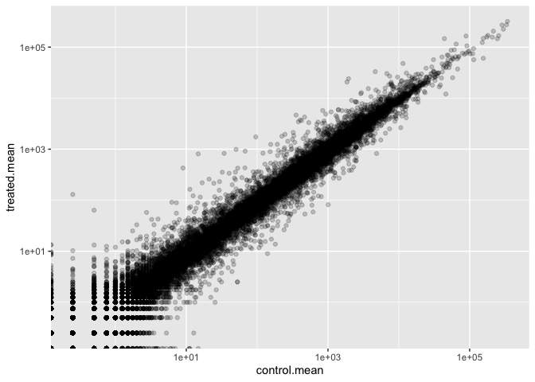

Class 15: Transcriptomics and the analysis of RNA-Seq data
================
Andrew Kapinos
11/17/2021

## 1. Bioconductor and DESeq2 setup

We will need to install Bioconductor in the console (if not already
installed), as well as DESeq2 through the Bioconductor installer.

Then, we can call the BiocManager and DESeq2 packages.

``` r
library(BiocManager)
library(DESeq2)
```

    ## Loading required package: S4Vectors

    ## Loading required package: stats4

    ## Loading required package: BiocGenerics

    ## 
    ## Attaching package: 'BiocGenerics'

    ## The following objects are masked from 'package:stats':
    ## 
    ##     IQR, mad, sd, var, xtabs

    ## The following objects are masked from 'package:base':
    ## 
    ##     anyDuplicated, append, as.data.frame, basename, cbind, colnames,
    ##     dirname, do.call, duplicated, eval, evalq, Filter, Find, get, grep,
    ##     grepl, intersect, is.unsorted, lapply, Map, mapply, match, mget,
    ##     order, paste, pmax, pmax.int, pmin, pmin.int, Position, rank,
    ##     rbind, Reduce, rownames, sapply, setdiff, sort, table, tapply,
    ##     union, unique, unsplit, which.max, which.min

    ## 
    ## Attaching package: 'S4Vectors'

    ## The following objects are masked from 'package:base':
    ## 
    ##     expand.grid, I, unname

    ## Loading required package: IRanges

    ## Loading required package: GenomicRanges

    ## Warning: package 'GenomicRanges' was built under R version 4.1.2

    ## Loading required package: GenomeInfoDb

    ## Loading required package: SummarizedExperiment

    ## Loading required package: MatrixGenerics

    ## Loading required package: matrixStats

    ## 
    ## Attaching package: 'MatrixGenerics'

    ## The following objects are masked from 'package:matrixStats':
    ## 
    ##     colAlls, colAnyNAs, colAnys, colAvgsPerRowSet, colCollapse,
    ##     colCounts, colCummaxs, colCummins, colCumprods, colCumsums,
    ##     colDiffs, colIQRDiffs, colIQRs, colLogSumExps, colMadDiffs,
    ##     colMads, colMaxs, colMeans2, colMedians, colMins, colOrderStats,
    ##     colProds, colQuantiles, colRanges, colRanks, colSdDiffs, colSds,
    ##     colSums2, colTabulates, colVarDiffs, colVars, colWeightedMads,
    ##     colWeightedMeans, colWeightedMedians, colWeightedSds,
    ##     colWeightedVars, rowAlls, rowAnyNAs, rowAnys, rowAvgsPerColSet,
    ##     rowCollapse, rowCounts, rowCummaxs, rowCummins, rowCumprods,
    ##     rowCumsums, rowDiffs, rowIQRDiffs, rowIQRs, rowLogSumExps,
    ##     rowMadDiffs, rowMads, rowMaxs, rowMeans2, rowMedians, rowMins,
    ##     rowOrderStats, rowProds, rowQuantiles, rowRanges, rowRanks,
    ##     rowSdDiffs, rowSds, rowSums2, rowTabulates, rowVarDiffs, rowVars,
    ##     rowWeightedMads, rowWeightedMeans, rowWeightedMedians,
    ##     rowWeightedSds, rowWeightedVars

    ## Loading required package: Biobase

    ## Welcome to Bioconductor
    ## 
    ##     Vignettes contain introductory material; view with
    ##     'browseVignettes()'. To cite Bioconductor, see
    ##     'citation("Biobase")', and for packages 'citation("pkgname")'.

    ## 
    ## Attaching package: 'Biobase'

    ## The following object is masked from 'package:MatrixGenerics':
    ## 
    ##     rowMedians

    ## The following objects are masked from 'package:matrixStats':
    ## 
    ##     anyMissing, rowMedians

## 2. Import countData and colData

Let’s start by importing our data files.

``` r
counts <- read.csv("airway_scaledcounts.csv", row.names=1)
metadata <- read.csv("airway_metadata.csv")
```

Now we can take a look.

``` r
head(counts)
```

    ##                 SRR1039508 SRR1039509 SRR1039512 SRR1039513 SRR1039516
    ## ENSG00000000003        723        486        904        445       1170
    ## ENSG00000000005          0          0          0          0          0
    ## ENSG00000000419        467        523        616        371        582
    ## ENSG00000000457        347        258        364        237        318
    ## ENSG00000000460         96         81         73         66        118
    ## ENSG00000000938          0          0          1          0          2
    ##                 SRR1039517 SRR1039520 SRR1039521
    ## ENSG00000000003       1097        806        604
    ## ENSG00000000005          0          0          0
    ## ENSG00000000419        781        417        509
    ## ENSG00000000457        447        330        324
    ## ENSG00000000460         94        102         74
    ## ENSG00000000938          0          0          0

``` r
head(metadata)
```

    ##           id     dex celltype     geo_id
    ## 1 SRR1039508 control   N61311 GSM1275862
    ## 2 SRR1039509 treated   N61311 GSM1275863
    ## 3 SRR1039512 control  N052611 GSM1275866
    ## 4 SRR1039513 treated  N052611 GSM1275867
    ## 5 SRR1039516 control  N080611 GSM1275870
    ## 6 SRR1039517 treated  N080611 GSM1275871

> Q1. How many genes are in this dataset?

``` r
nrow(counts)
```

    ## [1] 38694

There are 38694 genes in the dataset.

> Q2. How many ‘control’ cell lines do we have?

``` r
sum(metadata$dex=="control")
```

    ## [1] 4

There are 4 control cell lines.

## 3. Toy differential gene expression

Let’s check the correspondence of the metadata and count data setup. We
will need to extract the ‘id’ column from metadata and the column names
from count. We can then use “==” to check if they are the same. This
will return a vector with TRUE or FALSE, depending on if each position
in the two vectors is the same. By wrapping with “all()”, then TRUE will
only be returned if all positions in the vector are TRUE. If any are
FALSE, then all() will return FALSE.

``` r
all(metadata$id == colnames(counts))
```

    ## [1] TRUE

Let’s try to filter metadata and counts by dex using dplyr.

``` r
library(dplyr)
control <- metadata %>% filter(dex=="control")
control.counts <- counts %>% dplyr::select(control$id) 
control.mean <- rowSums(control.counts)/4
head(control.mean)
```

    ## ENSG00000000003 ENSG00000000005 ENSG00000000419 ENSG00000000457 ENSG00000000460 
    ##          900.75            0.00          520.50          339.75           97.25 
    ## ENSG00000000938 
    ##            0.75

Let’s try to filter counts to only display control data using base R
functions. We can then calculate the mean counts per gene across these
samples.

``` r
control.inds <- metadata$dex == "control"
control.ids <- metadata[control.inds,]$id

# We can use the ids to access the control columns of our "counts" data and
#   calculate the mean expression (columns) for each gene (row).

head(counts[,control.ids])
```

    ##                 SRR1039508 SRR1039512 SRR1039516 SRR1039520
    ## ENSG00000000003        723        904       1170        806
    ## ENSG00000000005          0          0          0          0
    ## ENSG00000000419        467        616        582        417
    ## ENSG00000000457        347        364        318        330
    ## ENSG00000000460         96         73        118        102
    ## ENSG00000000938          0          1          2          0

``` r
control.mean <- rowMeans(counts[,control.ids])
head(control.mean)
```

    ## ENSG00000000003 ENSG00000000005 ENSG00000000419 ENSG00000000457 ENSG00000000460 
    ##          900.75            0.00          520.50          339.75           97.25 
    ## ENSG00000000938 
    ##            0.75

> Q3. How would you make the above code in either approach more robust?

The example provided in the lab handout uses rowSums(control.counts)/4
to calculate the mean manually, which would not work properly if any
additional samples were added to the dataset (ie. the denominator in the
mean calculation would no longer be 4, as there would be more than 4
samples).

This can be made more robust by using rowMeans() instead, as seen above.

> Q4. Follow the same procedure for the treated samples (i.e. calculate
> the mean per gene across drug treated samples and assign to a labeled
> vector called treated.mean)

``` r
treated.inds <- metadata$dex == "treated"
treated.ids <- metadata[treated.inds,]$id
head(counts[,treated.ids])
```

    ##                 SRR1039509 SRR1039513 SRR1039517 SRR1039521
    ## ENSG00000000003        486        445       1097        604
    ## ENSG00000000005          0          0          0          0
    ## ENSG00000000419        523        371        781        509
    ## ENSG00000000457        258        237        447        324
    ## ENSG00000000460         81         66         94         74
    ## ENSG00000000938          0          0          0          0

``` r
treated.mean <- rowMeans(counts[,treated.ids])
head(treated.mean)
```

    ## ENSG00000000003 ENSG00000000005 ENSG00000000419 ENSG00000000457 ENSG00000000460 
    ##          658.00            0.00          546.00          316.50           78.75 
    ## ENSG00000000938 
    ##            0.00

Let’s put the control and treated means together for the sake of
organization.

``` r
meancounts <- data.frame(control.mean,treated.mean)
head(meancounts)
```

    ##                 control.mean treated.mean
    ## ENSG00000000003       900.75       658.00
    ## ENSG00000000005         0.00         0.00
    ## ENSG00000000419       520.50       546.00
    ## ENSG00000000457       339.75       316.50
    ## ENSG00000000460        97.25        78.75
    ## ENSG00000000938         0.75         0.00

> Q5 (a). Create a scatter plot showing the mean of the treated samples
> against the mean of the control samples.

Let’s make a plot of our meancounts data frame.

``` r
plot(meancounts)
```

<!-- -->

> Q5 (b).You could also use the ggplot2 package to make this figure
> producing the plot below. What geom\_?() function would you use for
> this plot?

``` r
library(ggplot2)
ggplot(meancounts,aes(control.mean,treated.mean)) +
  geom_point(alpha=0.2)
```

<!-- -->

We would use the geom_point() function here.

> Q6. Try plotting both axes on a log scale. What is the argument to
> plot() that allows you to do this?

``` r
plot(meancounts,log="xy")
```

    ## Warning in xy.coords(x, y, xlabel, ylabel, log): 15032 x values <= 0 omitted
    ## from logarithmic plot

    ## Warning in xy.coords(x, y, xlabel, ylabel, log): 15281 y values <= 0 omitted
    ## from logarithmic plot

<!-- -->

The log argument, using “xy”, allows for the axes to be rescaled.

If we are using ggplot have a look at the function
scale_x\_continuous(trans=“log2”) and of course do the same for the y
axis.

``` r
library(ggplot2)
ggplot(meancounts,aes(control.mean,treated.mean)) +
  geom_point(alpha=0.2) + scale_x_continuous(trans="log10") +
  scale_y_continuous(trans="log10")
```

    ## Warning: Transformation introduced infinite values in continuous x-axis

    ## Warning: Transformation introduced infinite values in continuous y-axis

<!-- -->

We can use a log2-fold change to determine if expression has increased
or decreased. See below:

``` r
log2(10/10)
```

    ## [1] 0

``` r
log2(20/10)
```

    ## [1] 1

``` r
log2(10/20)
```

    ## [1] -1

We can see that when expression remains unchanged (ie, log2 of 1), the
output is 0. When increasing, the log2 is positive. When decreasing,
log2 is negative.

``` r
meancounts$log2fc <- log2(meancounts[,"treated.mean"]/meancounts[,"control.mean"])
head(meancounts)
```

    ##                 control.mean treated.mean      log2fc
    ## ENSG00000000003       900.75       658.00 -0.45303916
    ## ENSG00000000005         0.00         0.00         NaN
    ## ENSG00000000419       520.50       546.00  0.06900279
    ## ENSG00000000457       339.75       316.50 -0.10226805
    ## ENSG00000000460        97.25        78.75 -0.30441833
    ## ENSG00000000938         0.75         0.00        -Inf

We get some whacky results, like “NaN” (not a number) and -Inf (negative
infinity). Let’s fix this and drop the zero count genes/rows.

The “which()” function will tell us the indices of TRUE entries in a
logical vector. However, it’s not that useful in default mode on our
type of multi-column input.

> Q7. What is the purpose of the arr.ind argument in the which()
> function call above? Why would we then take the first column of the
> output and need to call the unique() function?

In default mode, which() will return the column *and* row indices with
zeroes. We only want to focus on the rows, so we can use the
arr.ind=TRUE argument to only return the value of rows in which a column
value is 0.

``` r
inds <- which(meancounts[,1:2]==0, arr.ind=TRUE)

# After this, we now have rows containing zeroes; however, some rows are
#   repeated if there are zeroes in both columns! We need to show only unique
#   row numbers.

rm.doubles <- unique(inds[,1])
head(meancounts[rm.doubles,])
```

    ##                 control.mean treated.mean log2fc
    ## ENSG00000000005            0         0.00    NaN
    ## ENSG00000004848            0         0.25    Inf
    ## ENSG00000004948            0         0.00    NaN
    ## ENSG00000005001            0         0.00    NaN
    ## ENSG00000006059            0         0.00    NaN
    ## ENSG00000006071            0         0.00    NaN

``` r
# This gives us the rows which have zeroes, but we want non-zero rows (genes).
#   We'll use the minus symbol to select for the opposite of our rm.doubles
#   vector.

mycounts <- meancounts[-rm.doubles,]
head(mycounts)
```

    ##                 control.mean treated.mean      log2fc
    ## ENSG00000000003       900.75       658.00 -0.45303916
    ## ENSG00000000419       520.50       546.00  0.06900279
    ## ENSG00000000457       339.75       316.50 -0.10226805
    ## ENSG00000000460        97.25        78.75 -0.30441833
    ## ENSG00000000971      5219.00      6687.50  0.35769358
    ## ENSG00000001036      2327.00      1785.75 -0.38194109

We now have ‘r nrow(mycounts)’ genes remaining.

``` r
nrow(mycounts)
```

    ## [1] 21817

How many of these genes are up regulated at the log2-fold-change
threshold of +2 or greater?

``` r
up.ind <- mycounts$log2fc > 2
down.ind <- mycounts$log2fc < (-2)
```

> Q8. Using the up.ind vector above can you determine how many up
> regulated genes we have at the greater than 2 fc level?

``` r
sum(up.ind)
```

    ## [1] 250

250 genes are up-regulated above the log2-fold-change threshold of +2.

What percentage is this?

``` r
round((sum(mycounts$log2fc > +2)/nrow(mycounts))*100,2)
```

    ## [1] 1.15

1.15% of genes are up-regulated.

> Q9. Using the down.ind vector above can you determine how many down
> regulated genes we have at the greater than 2 fc level?

``` r
sum(down.ind)
```

    ## [1] 367

367 genes are down-regulated below the log2-fold-change threshold of -2.

> Q10. Do you trust these results? Why or why not?

Not necessarily; there is a problem with this line of reasoning (ie.
relying on log2-fold-change only), because observations can have large
log2-fold-changes without necessarily having statistically significant
p-values. Without p-values, we cannot state whether the changes to
expression are truly significant.

## 4. DESeq2 Analysis

Let’s load the package & citation.

``` r
library(DESeq2)
citation("DESeq2")
```

    ## 
    ##   Love, M.I., Huber, W., Anders, S. Moderated estimation of fold change
    ##   and dispersion for RNA-seq data with DESeq2 Genome Biology 15(12):550
    ##   (2014)
    ## 
    ## A BibTeX entry for LaTeX users is
    ## 
    ##   @Article{,
    ##     title = {Moderated estimation of fold change and dispersion for RNA-seq data with DESeq2},
    ##     author = {Michael I. Love and Wolfgang Huber and Simon Anders},
    ##     year = {2014},
    ##     journal = {Genome Biology},
    ##     doi = {10.1186/s13059-014-0550-8},
    ##     volume = {15},
    ##     issue = {12},
    ##     pages = {550},
    ##   }

Let’s start by importing our data.

``` r
dds <- DESeqDataSetFromMatrix(countData=counts, 
                              colData=metadata, 
                              design=~dex)
```

    ## converting counts to integer mode

    ## Warning in DESeqDataSet(se, design = design, ignoreRank): some variables in
    ## design formula are characters, converting to factors

``` r
dds
```

    ## class: DESeqDataSet 
    ## dim: 38694 8 
    ## metadata(1): version
    ## assays(1): counts
    ## rownames(38694): ENSG00000000003 ENSG00000000005 ... ENSG00000283120
    ##   ENSG00000283123
    ## rowData names(0):
    ## colnames(8): SRR1039508 SRR1039509 ... SRR1039520 SRR1039521
    ## colData names(4): id dex celltype geo_id

Let’s run DESeq on the dataset.

``` r
dds <- DESeq(dds)
```

    ## estimating size factors

    ## estimating dispersions

    ## gene-wise dispersion estimates

    ## mean-dispersion relationship

    ## final dispersion estimates

    ## fitting model and testing

``` r
res <- results(dds)
head(res)
```

    ## log2 fold change (MLE): dex treated vs control 
    ## Wald test p-value: dex treated vs control 
    ## DataFrame with 6 rows and 6 columns
    ##                   baseMean log2FoldChange     lfcSE      stat    pvalue
    ##                  <numeric>      <numeric> <numeric> <numeric> <numeric>
    ## ENSG00000000003 747.194195     -0.3507030  0.168246 -2.084470 0.0371175
    ## ENSG00000000005   0.000000             NA        NA        NA        NA
    ## ENSG00000000419 520.134160      0.2061078  0.101059  2.039475 0.0414026
    ## ENSG00000000457 322.664844      0.0245269  0.145145  0.168982 0.8658106
    ## ENSG00000000460  87.682625     -0.1471420  0.257007 -0.572521 0.5669691
    ## ENSG00000000938   0.319167     -1.7322890  3.493601 -0.495846 0.6200029
    ##                      padj
    ##                 <numeric>
    ## ENSG00000000003  0.163035
    ## ENSG00000000005        NA
    ## ENSG00000000419  0.176032
    ## ENSG00000000457  0.961694
    ## ENSG00000000460  0.815849
    ## ENSG00000000938        NA

## 5. Adding annotation data

We want to add meaningful gene names to our dataset so we can make sense
of what is going on in our viz. To do so, we’ll need two packages.

**AnnotationDbi** will do the work, and **org.Hs.eg.db** contains the
data we will map between. We’ll install these using BiocManager in the
console.

``` r
library("AnnotationDbi")
```

    ## 
    ## Attaching package: 'AnnotationDbi'

    ## The following object is masked from 'package:dplyr':
    ## 
    ##     select

``` r
library("org.Hs.eg.db")
```

    ## 

We can look at the types of data contained in org.Hs.eg.db using
column().

``` r
columns(org.Hs.eg.db)
```

    ##  [1] "ACCNUM"       "ALIAS"        "ENSEMBL"      "ENSEMBLPROT"  "ENSEMBLTRANS"
    ##  [6] "ENTREZID"     "ENZYME"       "EVIDENCE"     "EVIDENCEALL"  "GENENAME"    
    ## [11] "GENETYPE"     "GO"           "GOALL"        "IPI"          "MAP"         
    ## [16] "OMIM"         "ONTOLOGY"     "ONTOLOGYALL"  "PATH"         "PFAM"        
    ## [21] "PMID"         "PROSITE"      "REFSEQ"       "SYMBOL"       "UCSCKG"      
    ## [26] "UNIPROT"

Here we’ll map to “SYMBOL” the common gene name that the world
understands, which will make interpretation of our viz by others easier.

``` r
res$symbol <- mapIds(org.Hs.eg.db,
                     keys=row.names(res),      # Our genenames
                     keytype="ENSEMBL",        # The format of our genenames
                     column="SYMBOL",          # The new format we want to add
                     multiVals="first")
```

    ## 'select()' returned 1:many mapping between keys and columns

Let’s take a look now.

``` r
head(res)
```

    ## log2 fold change (MLE): dex treated vs control 
    ## Wald test p-value: dex treated vs control 
    ## DataFrame with 6 rows and 7 columns
    ##                   baseMean log2FoldChange     lfcSE      stat    pvalue
    ##                  <numeric>      <numeric> <numeric> <numeric> <numeric>
    ## ENSG00000000003 747.194195     -0.3507030  0.168246 -2.084470 0.0371175
    ## ENSG00000000005   0.000000             NA        NA        NA        NA
    ## ENSG00000000419 520.134160      0.2061078  0.101059  2.039475 0.0414026
    ## ENSG00000000457 322.664844      0.0245269  0.145145  0.168982 0.8658106
    ## ENSG00000000460  87.682625     -0.1471420  0.257007 -0.572521 0.5669691
    ## ENSG00000000938   0.319167     -1.7322890  3.493601 -0.495846 0.6200029
    ##                      padj      symbol
    ##                 <numeric> <character>
    ## ENSG00000000003  0.163035      TSPAN6
    ## ENSG00000000005        NA        TNMD
    ## ENSG00000000419  0.176032        DPM1
    ## ENSG00000000457  0.961694       SCYL3
    ## ENSG00000000460  0.815849    C1orf112
    ## ENSG00000000938        NA         FGR

> Q11. Run the mapIds() function two more times to add the Entrez ID and
> UniProt accession and GENENAME as new columns called
> res*e**n**t**r**e**z*, *r**e**s*uniprot and res$genename.

``` r
res$entrez <- mapIds(org.Hs.eg.db,
                     keys=row.names(res),
                     column="ENTREZID",
                     keytype="ENSEMBL",
                     multiVals="first")
```

    ## 'select()' returned 1:many mapping between keys and columns

``` r
res$uniprot <- mapIds(org.Hs.eg.db,
                     keys=row.names(res),
                     column="UNIPROT",
                     keytype="ENSEMBL",
                     multiVals="first")
```

    ## 'select()' returned 1:many mapping between keys and columns

``` r
res$genename <- mapIds(org.Hs.eg.db,
                     keys=row.names(res),
                     column="GENENAME",
                     keytype="ENSEMBL",
                     multiVals="first")
```

    ## 'select()' returned 1:many mapping between keys and columns

Let’s take a look at the output now.

``` r
head(res)
```

    ## log2 fold change (MLE): dex treated vs control 
    ## Wald test p-value: dex treated vs control 
    ## DataFrame with 6 rows and 10 columns
    ##                   baseMean log2FoldChange     lfcSE      stat    pvalue
    ##                  <numeric>      <numeric> <numeric> <numeric> <numeric>
    ## ENSG00000000003 747.194195     -0.3507030  0.168246 -2.084470 0.0371175
    ## ENSG00000000005   0.000000             NA        NA        NA        NA
    ## ENSG00000000419 520.134160      0.2061078  0.101059  2.039475 0.0414026
    ## ENSG00000000457 322.664844      0.0245269  0.145145  0.168982 0.8658106
    ## ENSG00000000460  87.682625     -0.1471420  0.257007 -0.572521 0.5669691
    ## ENSG00000000938   0.319167     -1.7322890  3.493601 -0.495846 0.6200029
    ##                      padj      symbol      entrez     uniprot
    ##                 <numeric> <character> <character> <character>
    ## ENSG00000000003  0.163035      TSPAN6        7105  A0A024RCI0
    ## ENSG00000000005        NA        TNMD       64102      Q9H2S6
    ## ENSG00000000419  0.176032        DPM1        8813      O60762
    ## ENSG00000000457  0.961694       SCYL3       57147      Q8IZE3
    ## ENSG00000000460  0.815849    C1orf112       55732  A0A024R922
    ## ENSG00000000938        NA         FGR        2268      P09769
    ##                               genename
    ##                            <character>
    ## ENSG00000000003          tetraspanin 6
    ## ENSG00000000005            tenomodulin
    ## ENSG00000000419 dolichyl-phosphate m..
    ## ENSG00000000457 SCY1 like pseudokina..
    ## ENSG00000000460 chromosome 1 open re..
    ## ENSG00000000938 FGR proto-oncogene, ..

Let’s write res to a file to save our progress thus far.

``` r
write.csv(res,file="allmyresults.csv")
```

# 6. Data Visualization

Let’s generate a Volcano plot, which is a common viz approach for DESeq
data.

``` r
plot(res$log2FoldChange, res$padj,
     xlab="Log2(FoldChange)",
     ylab="padj")
```

<!-- --> Let’s
generate a more useful plot to identify genes of interest (with high
log2-fold-changes and low p-values).

``` r
plot(res$log2FoldChange,-log(res$padj),
     xlab="Log2(FoldChange)",
     ylab="-Log(P-value)")
abline(v=c(2,-2),col="darkgray", lty=2)
abline(h=-log(0.05),col="darkgray", lty=2)
```

<!-- -->

We want to focus on points in the upper left and right sectors, because
these observations have log2-fold-changes with magnitude greater than 2
and padj lower than 0.05.

We can add some additional information by coloring the points associated
with these features.

``` r
# Setup our custom point color vector 
mycols <- rep("gray", nrow(res))
mycols[ abs(res$log2FoldChange) > 2 ]  <- "red" 

inds <- (res$padj < 0.01) & (abs(res$log2FoldChange) > 2 )
mycols[ inds ] <- "blue"

# Volcano plot with custom colors 
plot( res$log2FoldChange,  -log(res$padj), 
 col=mycols, ylab="-Log(P-value)", xlab="Log2(FoldChange)" )

# Cut-off lines
abline(v=c(-2,2), col="gray", lty=2)
abline(h=-log(0.1), col="gray", lty=2)
```

<!-- -->

There is also a package called EnhancedVolcano that makes our
visualization even more powerful.

``` r
library(EnhancedVolcano)
x <- as.data.frame(res)
EnhancedVolcano(x,
    lab = x$symbol,
    x = 'log2FoldChange',
    y = 'pvalue')
```

<!-- -->

## 7. Pathway analysis

We will try to gain some biological insight using KEGG and looking for
geneset enrichment.

After installing “pathview”, “gage”, and “gageData” using BiocManager,
we’ll load the packages.

``` r
library(pathview)
library(gage)
library(gageData)

data(kegg.sets.hs)

# Examine the first 2 pathways in this kegg set for humans
head(kegg.sets.hs, 2)
```

    ## $`hsa00232 Caffeine metabolism`
    ## [1] "10"   "1544" "1548" "1549" "1553" "7498" "9"   
    ## 
    ## $`hsa00983 Drug metabolism - other enzymes`
    ##  [1] "10"     "1066"   "10720"  "10941"  "151531" "1548"   "1549"   "1551"  
    ##  [9] "1553"   "1576"   "1577"   "1806"   "1807"   "1890"   "221223" "2990"  
    ## [17] "3251"   "3614"   "3615"   "3704"   "51733"  "54490"  "54575"  "54576" 
    ## [25] "54577"  "54578"  "54579"  "54600"  "54657"  "54658"  "54659"  "54963" 
    ## [33] "574537" "64816"  "7083"   "7084"   "7172"   "7363"   "7364"   "7365"  
    ## [41] "7366"   "7367"   "7371"   "7372"   "7378"   "7498"   "79799"  "83549" 
    ## [49] "8824"   "8833"   "9"      "978"

Before we are able to us KEGG, we need to get our gene identifiers in
the correct format, which is ENTREZ (at least for KEGG). I’ve already
done this above, under Q11. Let’s take another look using head().

``` r
head(res)
```

    ## log2 fold change (MLE): dex treated vs control 
    ## Wald test p-value: dex treated vs control 
    ## DataFrame with 6 rows and 10 columns
    ##                   baseMean log2FoldChange     lfcSE      stat    pvalue
    ##                  <numeric>      <numeric> <numeric> <numeric> <numeric>
    ## ENSG00000000003 747.194195     -0.3507030  0.168246 -2.084470 0.0371175
    ## ENSG00000000005   0.000000             NA        NA        NA        NA
    ## ENSG00000000419 520.134160      0.2061078  0.101059  2.039475 0.0414026
    ## ENSG00000000457 322.664844      0.0245269  0.145145  0.168982 0.8658106
    ## ENSG00000000460  87.682625     -0.1471420  0.257007 -0.572521 0.5669691
    ## ENSG00000000938   0.319167     -1.7322890  3.493601 -0.495846 0.6200029
    ##                      padj      symbol      entrez     uniprot
    ##                 <numeric> <character> <character> <character>
    ## ENSG00000000003  0.163035      TSPAN6        7105  A0A024RCI0
    ## ENSG00000000005        NA        TNMD       64102      Q9H2S6
    ## ENSG00000000419  0.176032        DPM1        8813      O60762
    ## ENSG00000000457  0.961694       SCYL3       57147      Q8IZE3
    ## ENSG00000000460  0.815849    C1orf112       55732  A0A024R922
    ## ENSG00000000938        NA         FGR        2268      P09769
    ##                               genename
    ##                            <character>
    ## ENSG00000000003          tetraspanin 6
    ## ENSG00000000005            tenomodulin
    ## ENSG00000000419 dolichyl-phosphate m..
    ## ENSG00000000457 SCY1 like pseudokina..
    ## ENSG00000000460 chromosome 1 open re..
    ## ENSG00000000938 FGR proto-oncogene, ..

From lab handout: The main gage() function requires a named vector of
fold changes, where the names of the values are the Entrez gene IDs.

Note that we used the mapIDs() function above to obtain Entrez gene IDs
(stored in
res*e**n**t**r**e**z*)*a**n**d**w**e**h**a**v**e**t**h**e**f**o**l**d**c**h**a**n**g**e**r**e**s**u**l**t**s**f**r**o**m**D**E**S**e**q*2*a**n**a**l**y**s**i**s*(*s**t**o**r**e**d**i**n**r**e**s*log2FoldChange).

We can use the names() function to assign names (ie. entrez IDs) to
observations (ie. fold-changes) in the vector.

``` r
foldchanges = res$log2FoldChange
names(foldchanges) = res$entrez
head(foldchanges)
```

    ##        7105       64102        8813       57147       55732        2268 
    ## -0.35070302          NA  0.20610777  0.02452695 -0.14714205 -1.73228897

Now we have our input and can pass it to gage(). We’ll provide the
vector and the geneset to look at.

``` r
keggres = gage(foldchanges, gsets=kegg.sets.hs)

# View object attributes using attributes(), tells us what is in the object.
attributes(keggres)
```

    ## $names
    ## [1] "greater" "less"    "stats"

We can use head() with dollar syntax to view named elements, like the
first few down- (less) or up- (more) regulated pathways.

Let’s look at the first 3 down (less) pathways.

``` r
head(keggres$less, 3)
```

    ##                                       p.geomean stat.mean        p.val
    ## hsa05332 Graft-versus-host disease 0.0004250461 -3.473346 0.0004250461
    ## hsa04940 Type I diabetes mellitus  0.0017820293 -3.002352 0.0017820293
    ## hsa05310 Asthma                    0.0020045888 -3.009050 0.0020045888
    ##                                         q.val set.size         exp1
    ## hsa05332 Graft-versus-host disease 0.09053483       40 0.0004250461
    ## hsa04940 Type I diabetes mellitus  0.14232581       42 0.0017820293
    ## hsa05310 Asthma                    0.14232581       29 0.0020045888

Let’s take a look at the Asthma pathway; to further investigate this
pathway, we’ll need to use the pathway ID (hsa05310). We can use
pathview() to make a figure from our KEGG analysis output.

``` r
pathview(gene.data=foldchanges, pathway.id="hsa05310", low="blue", mid="green", high="yellow")
```


## Optional: Plotting counts for genes of interest

DESeq2 offers a function called plotCounts() that plots the DESeqDataSet
by gene and variable of interest in colData.

Let’s take a look at the the geneID is for the CRISPLD2 gene.

``` r
i <- grep("CRISPLD2", res$symbol)
res[i,]
```

    ## log2 fold change (MLE): dex treated vs control 
    ## Wald test p-value: dex treated vs control 
    ## DataFrame with 1 row and 10 columns
    ##                  baseMean log2FoldChange     lfcSE      stat      pvalue
    ##                 <numeric>      <numeric> <numeric> <numeric>   <numeric>
    ## ENSG00000103196   3096.16        2.62603  0.267444   9.81899 9.32747e-23
    ##                        padj      symbol      entrez     uniprot
    ##                   <numeric> <character> <character> <character>
    ## ENSG00000103196 3.36344e-20    CRISPLD2       83716  A0A140VK80
    ##                               genename
    ##                            <character>
    ## ENSG00000103196 cysteine rich secret..

``` r
rownames(res[i,])
```

    ## [1] "ENSG00000103196"

Now, with the geneID in hand, we can plot counts for our intgroup, ie.
the dex column.

``` r
plotCounts(dds, gene="ENSG00000103196", intgroup="dex")
```

<!-- -->

Nice, but let’s try piping this to ggplot to make a better figure.

``` r
d <- plotCounts(dds, gene="ENSG00000103196", intgroup="dex", returnData=TRUE)
head(d)
```

    ##                count     dex
    ## SRR1039508  774.5002 control
    ## SRR1039509 6258.7915 treated
    ## SRR1039512 1100.2741 control
    ## SRR1039513 6093.0324 treated
    ## SRR1039516  736.9483 control
    ## SRR1039517 2742.1908 treated

``` r
boxplot(count ~ dex , data=d)
```

<!-- -->

This is looking good, now let’s take the data.frame returned by R to
plot using ggplot2.

``` r
library(ggplot2)
ggplot(d, aes(dex, count, fill=dex)) + 
  geom_boxplot() + 
  scale_y_log10() + 
  ggtitle("CRISPLD2")
```

<!-- -->
