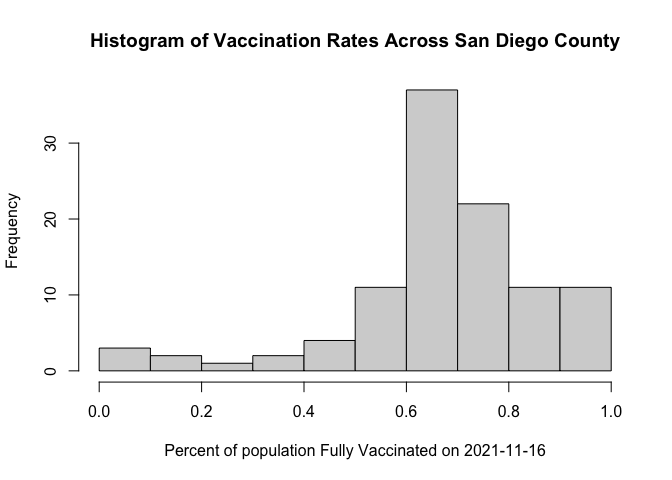
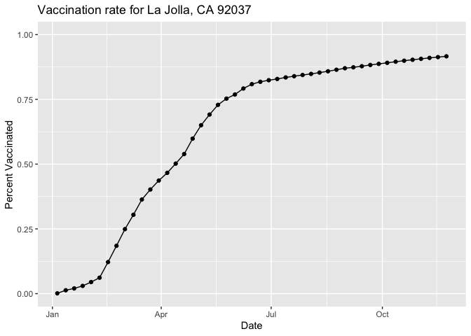
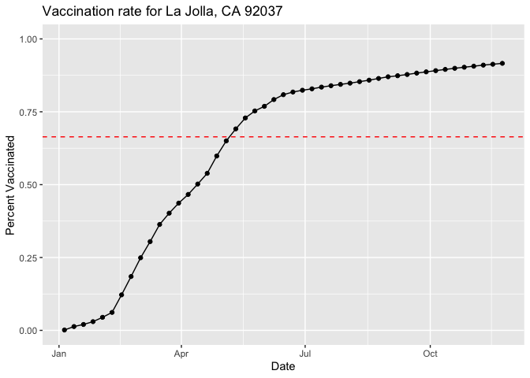
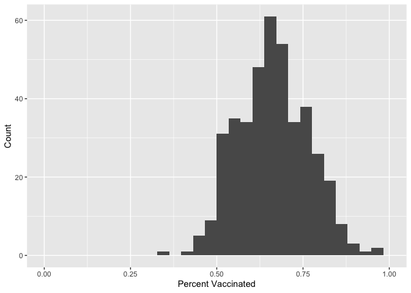
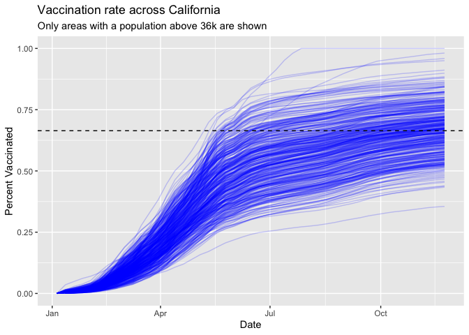

Class 17 Mini-Project: COVID-19 Vaccination Rates
================
Andrew Kapinos
11/28/2021

## Getting Started

Let’s import our csv file as an object called vax.

``` r
# Import vaccination data
vax <- read.csv("vaccinerates.csv")
head(vax)
```

    ##   as_of_date zip_code_tabulation_area local_health_jurisdiction         county
    ## 1 2021-01-05                    92395            San Bernardino San Bernardino
    ## 2 2021-01-05                    93206                      Kern           Kern
    ## 3 2021-01-05                    91006               Los Angeles    Los Angeles
    ## 4 2021-01-05                    91901                 San Diego      San Diego
    ## 5 2021-01-05                    92230                 Riverside      Riverside
    ## 6 2021-01-05                    92662                    Orange         Orange
    ##   vaccine_equity_metric_quartile                 vem_source
    ## 1                              1 Healthy Places Index Score
    ## 2                              1 Healthy Places Index Score
    ## 3                              3 Healthy Places Index Score
    ## 4                              3 Healthy Places Index Score
    ## 5                              1 Healthy Places Index Score
    ## 6                              4 Healthy Places Index Score
    ##   age12_plus_population age5_plus_population persons_fully_vaccinated
    ## 1               35915.3                40888                       NA
    ## 2                1237.5                 1521                       NA
    ## 3               28742.7                31347                       19
    ## 4               15549.8                16905                       12
    ## 5                2320.2                 2526                       NA
    ## 6                2349.5                 2397                       NA
    ##   persons_partially_vaccinated percent_of_population_fully_vaccinated
    ## 1                           NA                                     NA
    ## 2                           NA                                     NA
    ## 3                          873                               0.000606
    ## 4                          271                               0.000710
    ## 5                           NA                                     NA
    ## 6                           NA                                     NA
    ##   percent_of_population_partially_vaccinated
    ## 1                                         NA
    ## 2                                         NA
    ## 3                                   0.027850
    ## 4                                   0.016031
    ## 5                                         NA
    ## 6                                         NA
    ##   percent_of_population_with_1_plus_dose
    ## 1                                     NA
    ## 2                                     NA
    ## 3                               0.028456
    ## 4                               0.016741
    ## 5                                     NA
    ## 6                                     NA
    ##                                                                redacted
    ## 1 Information redacted in accordance with CA state privacy requirements
    ## 2 Information redacted in accordance with CA state privacy requirements
    ## 3                                                                    No
    ## 4                                                                    No
    ## 5 Information redacted in accordance with CA state privacy requirements
    ## 6 Information redacted in accordance with CA state privacy requirements

> Q1. What column details the total number of people fully vaccinated?

persons_fully_vaccinated

> Q2. What column details the Zip code tabulation area?

zip_code_tabulation_area

> Q3. What is the earliest date in this dataset?

``` r
min(vax$as_of_date)
```

    ## [1] "2021-01-05"

The earliest date in this dataset is 2021-01-05.

> Q4. What is the latest date in this dataset?

``` r
max(vax$as_of_date)
```

    ## [1] "2021-11-23"

The latest date in this dataset is 2021-11-23.

Let’s call the skim() function to get a quick overview of the dataset.

``` r
skimr::skim(vax)
```

|                                                  |       |
|:-------------------------------------------------|:------|
| Name                                             | vax   |
| Number of rows                                   | 82908 |
| Number of columns                                | 14    |
| \_\_\_\_\_\_\_\_\_\_\_\_\_\_\_\_\_\_\_\_\_\_\_   |       |
| Column type frequency:                           |       |
| character                                        | 5     |
| numeric                                          | 9     |
| \_\_\_\_\_\_\_\_\_\_\_\_\_\_\_\_\_\_\_\_\_\_\_\_ |       |
| Group variables                                  | None  |

Data summary

**Variable type: character**

| skim_variable             | n_missing | complete_rate | min | max | empty | n_unique | whitespace |
|:--------------------------|----------:|--------------:|----:|----:|------:|---------:|-----------:|
| as_of_date                |         0 |             1 |  10 |  10 |     0 |       47 |          0 |
| local_health_jurisdiction |         0 |             1 |   0 |  15 |   235 |       62 |          0 |
| county                    |         0 |             1 |   0 |  15 |   235 |       59 |          0 |
| vem_source                |         0 |             1 |  15 |  26 |     0 |        3 |          0 |
| redacted                  |         0 |             1 |   2 |  69 |     0 |        2 |          0 |

**Variable type: numeric**

| skim_variable                              | n_missing | complete_rate |     mean |       sd |    p0 |      p25 |      p50 |      p75 |     p100 | hist  |
|:-------------------------------------------|----------:|--------------:|---------:|---------:|------:|---------:|---------:|---------:|---------:|:------|
| zip_code_tabulation_area                   |         0 |          1.00 | 93665.11 |  1817.39 | 90001 | 92257.75 | 93658.50 | 95380.50 |  97635.0 | ▃▅▅▇▁ |
| vaccine_equity_metric_quartile             |      4089 |          0.95 |     2.44 |     1.11 |     1 |     1.00 |     2.00 |     3.00 |      4.0 | ▇▇▁▇▇ |
| age12_plus_population                      |         0 |          1.00 | 18895.04 | 18993.94 |     0 |  1346.95 | 13685.10 | 31756.12 |  88556.7 | ▇▃▂▁▁ |
| age5_plus_population                       |         0 |          1.00 | 20875.24 | 21106.04 |     0 |  1460.50 | 15364.00 | 34877.00 | 101902.0 | ▇▃▂▁▁ |
| persons_fully_vaccinated                   |      8355 |          0.90 |  9585.35 | 11609.12 |    11 |   516.00 |  4210.00 | 16095.00 |  71219.0 | ▇▂▁▁▁ |
| persons_partially_vaccinated               |      8355 |          0.90 |  1894.87 |  2105.55 |    11 |   198.00 |  1269.00 |  2880.00 |  20159.0 | ▇▁▁▁▁ |
| percent_of_population_fully_vaccinated     |      8355 |          0.90 |     0.43 |     0.27 |     0 |     0.20 |     0.44 |     0.63 |      1.0 | ▇▆▇▆▂ |
| percent_of_population_partially_vaccinated |      8355 |          0.90 |     0.10 |     0.10 |     0 |     0.06 |     0.07 |     0.11 |      1.0 | ▇▁▁▁▁ |
| percent_of_population_with_1\_plus_dose    |      8355 |          0.90 |     0.51 |     0.26 |     0 |     0.31 |     0.53 |     0.71 |      1.0 | ▅▅▇▇▃ |

> Q5. How many numeric columns are in this dataset?

There are 9 numeric columns in this dataset.

> Q6. Note that there are “missing values” in the dataset. How many NA
> values there in the persons_fully_vaccinated column?

``` r
sum(is.na(vax$persons_fully_vaccinated))
```

    ## [1] 8355

There are 8355 NA values in the persons_fully_vaccinated column.

> Q7. What percent of persons_fully_vaccinated values are missing (to 2
> significant figures)?

``` r
round(sum(is.na(vax$persons_fully_vaccinated))/(length(vax$persons_fully_vaccinated))*100,2)
```

    ## [1] 10.08

10.08% of the persons_fully_vaccinated values are missing.

> Q8. \[Optional\]: Why might this data be missing?

The redacted values seem to have been removed in accordance with CA
state privacy requirements, which may protect the health data of
residents. Perhaps there are too few data points to safely report the
data.

## Working with dates

Let’s take a look at the lubridate package (and some of it’s associated
functions) to see how it can help us to investigate this data.

``` r
library(lubridate)
today()
```

    ## [1] "2021-12-03"

``` r
# Convert date column into something R can work with for analysis
vax$as_of_date <- ymd(vax$as_of_date)
```

Now we can do math with dates! Let’s check how many days have passed
since the first vaccination reported in this dataset.

``` r
today() - vax$as_of_date[1]
```

    ## Time difference of 332 days

Using the first and last date values we can determine how many days the
dataset spans.

``` r
vax$as_of_date[nrow(vax)] - vax$as_of_date[1]
```

    ## Time difference of 322 days

> Q9. How many days have passed since the last update of the dataset?

``` r
today() - vax$as_of_date[nrow(vax)]
```

    ## Time difference of 10 days

5 days have passed since the last update.

> Q10. How many unique dates are in the dataset (i.e. how many different
> dates are detailed)?

``` r
length(unique(vax$as_of_date))
```

    ## [1] 47

There are 47 unique dates in the dataset.

## Working with ZIP codes

We can use the zipcodeR package to work with ZIP codes and start some
geographic analyses.

``` r
library(zipcodeR)
# Find the centroid of the La Jolla 92037 ZIP code
geocode_zip('92037')
```

    ## # A tibble: 1 × 3
    ##   zipcode   lat   lng
    ##   <chr>   <dbl> <dbl>
    ## 1 92037    32.8 -117.

``` r
# Calculate the distance between the centroids of any two ZIP codes
zip_distance('92037','92109')
```

    ##   zipcode_a zipcode_b distance
    ## 1     92037     92109     2.33

``` r
# Pull census data about ZIP code areas (including median household income, etc.)
reverse_zipcode(c('92037',"92109"))
```

    ## # A tibble: 2 × 24
    ##   zipcode zipcode_type major_city post_office_city common_city_list county state
    ##   <chr>   <chr>        <chr>      <chr>                      <blob> <chr>  <chr>
    ## 1 92037   Standard     La Jolla   La Jolla, CA           <raw 20 B> San D… CA   
    ## 2 92109   Standard     San Diego  San Diego, CA          <raw 21 B> San D… CA   
    ## # … with 17 more variables: lat <dbl>, lng <dbl>, timezone <chr>,
    ## #   radius_in_miles <dbl>, area_code_list <blob>, population <int>,
    ## #   population_density <dbl>, land_area_in_sqmi <dbl>,
    ## #   water_area_in_sqmi <dbl>, housing_units <int>,
    ## #   occupied_housing_units <int>, median_home_value <int>,
    ## #   median_household_income <int>, bounds_west <dbl>, bounds_east <dbl>,
    ## #   bounds_north <dbl>, bounds_south <dbl>

We can also pull census data for all ZIP codes included in the dataset.

``` r
# Pull data for all ZIP codes in the dataset
zipdata <- reverse_zipcode(vax$zip_code_tabulation_area)
```

## Focus on the San Diego area

Let’s focus on the San Diego County area by restricting ourselves to
vax$county==“San Diego” entries. We can do this using either base R or
the dplyr package.

Using base R:

``` r
# Subset to San Diego county only areas
sd <- vax[vax$county=="San Diego",]
rownames(sd) <- c(1:nrow(sd))
nrow(sd)
```

    ## [1] 5029

Using dplyr:

``` r
library(dplyr)
sd.dplyr <- filter(vax, county == "San Diego")
nrow(sd.dplyr)
```

    ## [1] 5029

``` r
identical(sd,sd.dplyr)
```

    ## [1] TRUE

Using dplyr is very useful if we are subsetting across multiple
criteria, eg. all San Diego county areas with populations over 10,000.

``` r
sd.10 <- filter(vax, county == "San Diego" &
                age5_plus_population > 10000)
```

> Q11. How many distinct zip codes are listed for San Diego County?

``` r
length(unique(sd$zip_code_tabulation_area))
```

    ## [1] 107

There are 107 unique ZIP codes listed for San Diego county in this
dataset.

> Q12. What San Diego County Zip code area has the largest 12 +
> Population in this dataset?

``` r
sd[which.max(sd$age12_plus_population),"zip_code_tabulation_area"]
```

    ## [1] 92154

ZIP code 92154 has the larget 12+ population in this dataset.

From lab handout: Using dplyr select all San Diego “county” entries on
“as_of_date” “2021-11-16” and use this for the following questions.

``` r
sd.nov <- filter(sd, as_of_date == "2021-11-16")
```

> Q13. What is the overall average “Percent of Population Fully
> Vaccinated” value for all San Diego “County” as of “2021-11-16”?

``` r
round(sum(sd.nov$persons_fully_vaccinated,na.rm=TRUE)/sum(sd.nov$age5_plus_population,na.rm=TRUE)*100,2)
```

    ## [1] 69.38

The overall average percent of population fully vaccinated in San Diego
County as of 2021-11-16 is 69.38%.

``` r
round(mean(sd$percent_of_population_fully_vaccinated,na.rm=TRUE)*100,2)
```

    ## [1] 44.6

The average of the column “percent_of_population_fully_vaccinated” is
44.6%, which is lower than the actual number observed above. This is
because some counties have many more residents than others, so simply
averaging the averages shifts the overall mean towards the averages of
the smaller counties.

> Q14. Using either ggplot or base R graphics make a summary figure that
> shows the distribution of Percent of Population Fully Vaccinated
> values as of “2021-11-16”?

``` r
hist(sd.nov$percent_of_population_fully_vaccinated, xlab="Percent of population Fully Vaccinated on 2021-11-16",main="Histogram of Vaccination Rates Across San Diego County")
```

<!-- -->

## Focus on UCSD/La Jolla

UC San Diego resides in the ZIP code 92037 and has a 5+ population of
36,144.

``` r
ucsd <- filter(sd, zip_code_tabulation_area=="92037")
ucsd[1,]$age5_plus_population
```

    ## [1] 36144

> Q15. Using ggplot make a graph of the vaccination rate time course for
> the 92037 ZIP code area.

``` r
library(ggplot2)
ggplot(ucsd) +
  aes(as_of_date,
      percent_of_population_fully_vaccinated) +
  geom_point() +
  geom_line(group=1) +
  ylim(c(0,1)) +
  labs(x="Date", y="Percent Vaccinated",title="Vaccination rate for La Jolla, CA 92037")
```

<!-- -->

## Comparing to similarly sized areas

Let’s return to the dataset and compare across all zip codes with a
population at least as large as 92037 on 2021-11-16.

``` r
# Subset to all CA areas with a population as large as 92037
vax.36 <- filter(vax, age5_plus_population > 36144 &
                as_of_date == "2021-11-16")

#head(vax.36)
```

> Q16. Calculate the mean “Percent of Population Fully Vaccinated” for
> ZIP code areas with a population as large as 92037 (La Jolla)
> as_of_date “2021-11-16”. Add this as a straight horizontal line to
> your plot from above with the geom_hline() function.

``` r
mean.vax.36 <- mean(vax.36$percent_of_population_fully_vaccinated,na.rm=TRUE)
mean.vax.36
```

    ## [1] 0.6640413

``` r
ggplot(ucsd) +
  aes(as_of_date,
      percent_of_population_fully_vaccinated) +
  geom_point() +
  geom_line(group=1) +
  ylim(c(0,1)) +
  labs(x="Date", y="Percent Vaccinated",title="Vaccination rate for La Jolla, CA 92037") +
  geom_hline(yintercept=mean.vax.36,color="red",linetype="dashed")
```

<!-- -->

> Q17. What is the 6 number summary (Min, 1st Qu., Median, Mean, 3rd
> Qu., and Max) of the “Percent of Population Fully Vaccinated” values
> for ZIP code areas with a population as large as 92037 (La Jolla)
> as_of_date “2021-11-16”?

``` r
vax.quartiles <- quantile(vax.36$percent_of_population_fully_vaccinated)

print(paste("The minimum value is", vax.quartiles["0%"]))
```

    ## [1] "The minimum value is 0.352891"

``` r
print(paste("The 25% quartile value is", vax.quartiles["25%"]))
```

    ## [1] "The 25% quartile value is 0.590517"

``` r
print(paste("The median value is", vax.quartiles["50%"]))
```

    ## [1] "The median value is 0.666163"

``` r
print(paste("The mean value is", round(mean(vax.36$percent_of_population_fully_vaccinated,na.rm=TRUE),6)))
```

    ## [1] "The mean value is 0.664041"

``` r
print(paste("The 75% quartile value is", vax.quartiles["75%"]))
```

    ## [1] "The 75% quartile value is 0.7297545"

``` r
print(paste("The maximum value is", vax.quartiles["100%"]))
```

    ## [1] "The maximum value is 1"

> Q18. Using ggplot generate a histogram of this data.

``` r
ggplot(vax.36, aes(percent_of_population_fully_vaccinated)) +
  geom_histogram() + xlim(0,1) +
  labs(x="Percent Vaccinated",y="Count")
```

    ## `stat_bin()` using `bins = 30`. Pick better value with `binwidth`.

    ## Warning: Removed 2 rows containing missing values (geom_bar).

<!-- -->

> Q19. Is the 92109 and 92040 ZIP code areas above or below the average
> value you calculated for all these above?

``` r
vax.92109 <- filter(vax.36,zip_code_tabulation_area=="92109")["percent_of_population_fully_vaccinated"]

print(paste("Is 92109 above the mean?",vax.92109 > mean(vax.36$percent_of_population_fully_vaccinated,na.rm=TRUE)))
```

    ## [1] "Is 92109 above the mean? TRUE"

``` r
vax.92040 <- filter(vax.36,zip_code_tabulation_area=="92040")["percent_of_population_fully_vaccinated"]

print(paste("Is 92040 above the mean?",vax.92040 > mean(vax.36$percent_of_population_fully_vaccinated,na.rm=TRUE)))
```

    ## [1] "Is 92040 above the mean? FALSE"

``` r
print(paste("Is 92040 below the mean?",vax.92040 < mean(vax.36$percent_of_population_fully_vaccinated,na.rm=TRUE)))
```

    ## [1] "Is 92040 below the mean? TRUE"

The 92109 ZIP code area is above the mean of this dataset.

The 92040 ZIP code area is below the mean of this dataset.

> Q20. Finally make a time course plot of vaccination progress for all
> areas in the full dataset with a age5_plus_population \> 36144.

``` r
vax.36.all <- filter(vax, age5_plus_population > 36144)


ggplot(vax.36.all) +
  aes(as_of_date,
      percent_of_population_fully_vaccinated, 
      group=zip_code_tabulation_area) +
  geom_line(alpha=0.2, color="blue") +
  ylim(0,1) +
  labs(x="Date", y="Percent Vaccinated",
       title="Vaccination rate across California",
       subtitle="Only areas with a population above 36k are shown") +
  geom_hline(yintercept = mean.vax.36, linetype="dashed")
```

    ## Warning: Removed 176 row(s) containing missing values (geom_path).

<!-- -->
