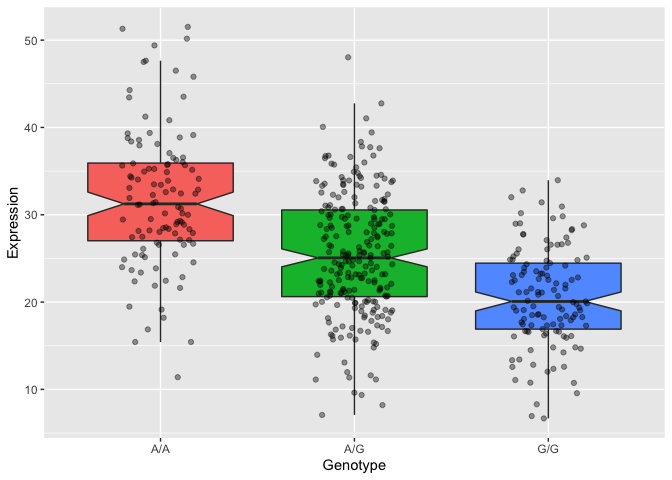

Class 19: Genome informatics
================
Andrew Kapinos
12/1/2021

> Q13: Read this file into R and determine the sample size for each
> genotype and their corresponding median expression levels for each of
> these genotypes.

``` r
data <- read.table("rs8067378_ENSG00000172057.6.txt")
table(data$geno)
```

    ## 
    ## A/A A/G G/G 
    ## 108 233 121

``` r
print(paste("The sample size for genotype A/A is", table(data$geno)["A/A"]))
```

    ## [1] "The sample size for genotype A/A is 108"

``` r
print(paste("The sample size for genotype A/G is", table(data$geno)["A/G"]))
```

    ## [1] "The sample size for genotype A/G is 233"

``` r
print(paste("The sample size for genotype G/G is", table(data$geno)["G/G"]))
```

    ## [1] "The sample size for genotype G/G is 121"

``` r
library(dplyr)
summary(data[data$geno=="A/A",]$exp)
```

    ##    Min. 1st Qu.  Median    Mean 3rd Qu.    Max. 
    ##   11.40   27.02   31.25   31.82   35.92   51.52

``` r
print(paste("The median expression value for genotype A/A is",
            round(summary(data[data$geno=="A/A",]$exp)["Median"],3)))
```

    ## [1] "The median expression value for genotype A/A is 31.248"

``` r
summary(data[data$geno=="A/G",]$exp)
```

    ##    Min. 1st Qu.  Median    Mean 3rd Qu.    Max. 
    ##   7.075  20.626  25.065  25.397  30.552  48.034

``` r
print(paste("The median expression value for genotype A/G is",
            round(summary(data[data$geno=="A/G",]$exp)["Median"],3)))
```

    ## [1] "The median expression value for genotype A/G is 25.065"

``` r
summary(data[data$geno=="G/G",]$exp)
```

    ##    Min. 1st Qu.  Median    Mean 3rd Qu.    Max. 
    ##   6.675  16.903  20.074  20.594  24.457  33.956

``` r
print(paste("The median expression value for genotype G/G is", 
            round(summary(data[data$geno=="G/G",]$exp)["Median"],3)))
```

    ## [1] "The median expression value for genotype G/G is 20.074"

> Q14: Generate a boxplot with a box per genotype, what could you infer
> from the relative expression value between A/A and G/G displayed in
> this plot? Does the SNP effect the expression of ORMDL3?

``` r
library(ggplot2)
ggplot(data,aes(geno,exp)) +
  geom_boxplot(notch=TRUE,aes(fill=geno),outlier.shape=NA) +
  geom_point(alpha=0.4,position=position_jitter(0.2)) +
  labs(x="Genotype", y="Expression") +
  theme(legend.position="none")
```

<!-- -->

``` r
t.test(data[data$geno=="A/A",]$exp,data[data$geno=="G/G",]$exp)
```

    ## 
    ##  Welch Two Sample t-test
    ## 
    ## data:  data[data$geno == "A/A", ]$exp and data[data$geno == "G/G", ]$exp
    ## t = 12.214, df = 191.65, p-value < 2.2e-16
    ## alternative hypothesis: true difference in means is not equal to 0
    ## 95 percent confidence interval:
    ##   9.412243 13.037619
    ## sample estimates:
    ## mean of x mean of y 
    ##  31.81864  20.59371

On average, the A/A genotype results in **relatively higher** expression
levels when compared to the G/G genotype. Given the results of the
boxplot, it would appear as though the SNP does in fact affect
expression of ORMDL3.

A Student’s t-test confirms that the difference in means is
statistically significant, with a p-value of 2.2e-16.
