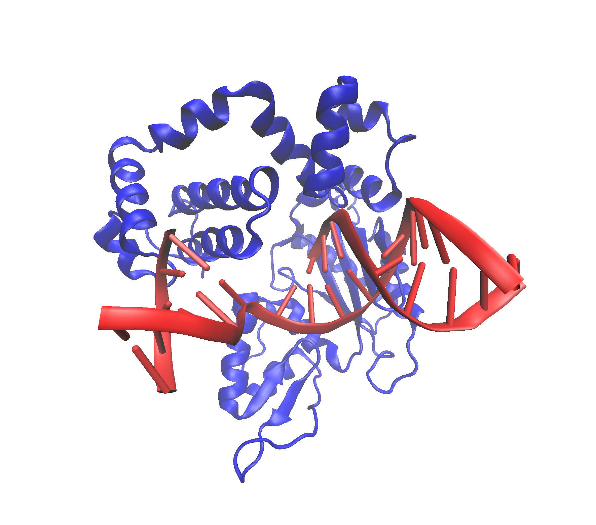

## Question 7

```{r}
library(bio3d)
aln <- read.fasta("find-a-gene_alignment.fasta")
iden <- seqidentity(aln)
heatmap(iden, margins = c(12,12))
```

## Question 8

```{r}
# Write consensus sequence to fasta file, BLAST, identify top hits
consensus <- paste(consensus(aln)$seq,collapse="")
write.fasta(seqs=consensus,file="consensus.fasta")
consensus.fasta <- read.fasta("consensus.fasta")
consensus.blast <- blast.pdb(consensus.fasta)
consensus.IDs <- head(consensus.blast$hit.tbl,3)[,2]

# Construct data frame containing IDs, experimental technique, resolution, and source
library(dplyr)
consensus.hits <- lapply(consensus.IDs,pdb.annotate) %>% bind_rows()
consensus.hits.filtered <- select(consensus.hits, c("structureId","experimentalTechnique","resolution","source"))

# Construct data frame containing e-value and identity values
consensus.hits.eval.iden <- select(head(consensus.blast$hit.tbl,3), c("evalue","identity"))
rownames(consensus.hits.eval.iden) <- as.vector(select(head(consensus.blast$hit.tbl,3),"subjectids"))[1:3,]

# Combine data frames
consensus.hits.final <- cbind(consensus.hits.filtered, consensus.hits.eval.iden)
consensus.hits.final
```

> Question 8 for highest mean row identity (performed first, but decided to use the consensus instead)

```{r}
# Identify row with highest average identity
rowMeans(iden)
print(paste("The highest average row identity belongs to", names(which.max(rowMeans(iden))), "with an average identity of", 
round(max(rowMeans(iden)),4)*100, "%"))

# Import fasta, perform BLAST, identify top hits
ferret <- read.fasta("ferret.fasta")
ferret.blast <- blast.pdb(ferret)
IDs <- head(ferret.blast$hit.tbl,3)[,2]

# Construct data frame containing IDs, experimental technique, resolution, and source
library(dplyr)
hits <- lapply(IDs,pdb.annotate) %>% bind_rows()
hits.filtered <- select(hits, c("structureId","experimentalTechnique","resolution","source"))

# Construct data frame containing e-value and identity values
hits.eval.iden <- select(head(ferret.blast$hit.tbl,3), c("evalue","identity"))
rownames(hits.eval.iden) <- as.vector(select(head(ferret.blast$hit.tbl,3),"subjectids"))[1:3,]

# Combine data frames
hits.final <- cbind(hits.filtered, hits.eval.iden)
hits.final
```

## Question 9




