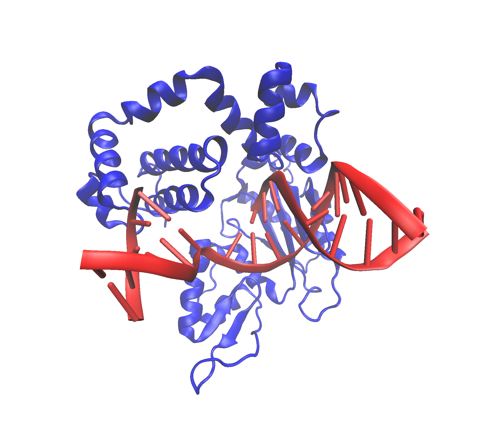

Find-a-gene Project Workspace
================
Andrew Kapinos
11/14/2021

## Question 7

``` r
library(bio3d)
aln <- read.fasta("find-a-gene_alignment.fasta")
iden <- seqidentity(aln)
heatmap(iden, margins = c(12,12))
```

<!-- -->

## Question 8

``` r
library(bio3d)

# Write consensus sequence to fasta file, BLAST, identify top hits
consensus <- paste(consensus(aln)$seq,collapse="")
write.fasta(seqs=consensus,file="consensus.fasta")
consensus.fasta <- read.fasta("consensus.fasta")
consensus.blast <- blast.pdb(consensus.fasta)
```

    ##  Searching ... please wait (updates every 5 seconds) RID = UKJ3PYV001R 
    ##  .
    ##  Reporting 100 hits

``` r
consensus.IDs <- head(consensus.blast$hit.tbl,3)[,2]

# Construct data frame containing IDs, experimental technique, resolution, and source
library(dplyr)
```

    ## 
    ## Attaching package: 'dplyr'

    ## The following objects are masked from 'package:stats':
    ## 
    ##     filter, lag

    ## The following objects are masked from 'package:base':
    ## 
    ##     intersect, setdiff, setequal, union

``` r
consensus.hits <- lapply(consensus.IDs,pdb.annotate) %>% bind_rows()
consensus.hits.filtered <- select(consensus.hits, c("structureId","experimentalTechnique","resolution","source"))

# Construct data frame containing e-value and identity values
consensus.hits.eval.iden <- select(head(consensus.blast$hit.tbl,3), c("evalue","identity"))
rownames(consensus.hits.eval.iden) <- as.vector(select(head(consensus.blast$hit.tbl,3),"subjectids"))[1:3,]

# Combine data frames
consensus.hits.final <- cbind(consensus.hits.filtered, consensus.hits.eval.iden)
consensus.hits.final
```

    ##        structureId experimentalTechnique resolution       source evalue
    ## 1BPX_A        1BPX                 X-ray       2.40 Homo sapiens      0
    ## 5VRW_A        5VRW                 X-ray       2.58 Homo sapiens      0
    ## 4RPX_A        4RPX                 X-ray       1.90 Homo sapiens      0
    ##        identity
    ## 1BPX_A   98.689
    ## 5VRW_A   98.689
    ## 4RPX_A   98.689

> Question 8 for highest mean row identity (performed first, but decided
> to use the consensus instead)

``` r
# Identify row with highest average identity
rowMeans(iden)
```

    ##         Dog_novel_prot     Human_original_seq Domestic_water_buffalo 
    ##              0.8466667              0.9368889              0.9410000 
    ##              Sea_otter                  Sheep               Aardvark 
    ##              0.8502222              0.9157778              0.9380000 
    ##                 Cattle                 Ferret             Polar_bear 
    ##              0.9417778              0.9437778              0.9398889

``` r
print(paste("The highest average row identity belongs to", names(which.max(rowMeans(iden))), "with an average identity of", 
round(max(rowMeans(iden)),4)*100, "%"))
```

    ## [1] "The highest average row identity belongs to Ferret with an average identity of 94.38 %"

``` r
# Import fasta, perform BLAST, identify top hits
ferret <- read.fasta("ferret.fasta")
ferret.blast <- blast.pdb(ferret)
```

    ##  Searching ... please wait (updates every 5 seconds) RID = UKJ400VB01R 
    ##  ...............................
    ##  Reporting 104 hits

``` r
IDs <- head(ferret.blast$hit.tbl,3)[,2]

# Construct data frame containing IDs, experimental technique, resolution, and source
library(dplyr)
hits <- lapply(IDs,pdb.annotate) %>% bind_rows()
hits.filtered <- select(hits, c("structureId","experimentalTechnique","resolution","source"))

# Construct data frame containing e-value and identity values
hits.eval.iden <- select(head(ferret.blast$hit.tbl,3), c("evalue","identity"))
rownames(hits.eval.iden) <- as.vector(select(head(ferret.blast$hit.tbl,3),"subjectids"))[1:3,]

# Combine data frames
hits.final <- cbind(hits.filtered, hits.eval.iden)
hits.final
```

    ##        structureId experimentalTechnique resolution       source evalue
    ## 1BPX_A        1BPX                 X-ray       2.40 Homo sapiens      0
    ## 4F5N_A        4F5N                 X-ray       1.80 Homo sapiens      0
    ## 5VRW_A        5VRW                 X-ray       2.58 Homo sapiens      0
    ##        identity
    ## 1BPX_A   99.104
    ## 4F5N_A   98.806
    ## 5VRW_A   99.104

## Question 9



## Function for Question 8

``` r
consensus.aln.pdb <- function(fasta, x) {
  # Load packages
  library(bio3d)
  library(dplyr)
  # Load fasta file into R
  fasta.file <- read.fasta(fasta)
  # Generate consensus sequence
  consensus.seq <- paste(consensus(fasta.file)$seq,collapse="")
  # Write fasta file from consensus sequence
  write.fasta(seqs=consensus.seq,file="consensusseq.fasta")
  # Create object containing fasta data
  consensusseq.fasta <- read.fasta("consensusseq.fasta")
  # Perform BLAST of PDB using consensus sequence
  consensus.blast.results <- blast.pdb(consensusseq.fasta)
  # Identify top "x" hit IDs and convert to vector
  top.hit.IDs <- head(consensus.blast.results$hit.tbl,x)[,2]
  # Construct data frame containing pdb.annotate data for top hits
  consensus.hits.data <- lapply(top.hit.IDs,pdb.annotate) %>% bind_rows()
  # Filter data frame to include only ID, technique, resolution, and source
  consensus.hits.data.filtered <- select(consensus.hits.data, c("structureId","experimentalTechnique","resolution","source"))
  # Construct data frame containing e-value and identity values for top "x" hits
  consensus.hits.EI <- select(head(consensus.blast.results$hit.tbl,x), c("evalue","identity"))
  # Reassign row names in e-value/identity data frame
  rownames(consensus.hits.EI) <- as.vector(select(head(consensus.blast.results$hit.tbl,x),"subjectids"))[1:x,]
  # Combine data frames
  consensus.hits.combined <- cbind(consensus.hits.data.filtered, consensus.hits.EI)
  # Print result
  consensus.hits.combined
}

consensus.aln.pdb("find-a-gene_alignment.fasta",8)
```

    ##  Searching ... please wait (updates every 5 seconds) RID = UKJA99V101R 
    ##  ...............................................................
    ##  Reporting 100 hits

    ##        structureId experimentalTechnique resolution       source evalue
    ## 1BPX_A        1BPX                 X-ray       2.40 Homo sapiens      0
    ## 5VRW_A        5VRW                 X-ray       2.58 Homo sapiens      0
    ## 4RPX_A        4RPX                 X-ray       1.90 Homo sapiens      0
    ## 4F5N_A        4F5N                 X-ray       1.80 Homo sapiens      0
    ## 4M9G_A        4M9G                 X-ray       2.01 Homo sapiens      0
    ## 4JWM_A        4JWM                 X-ray       2.00 Homo sapiens      0
    ## 6CR3_A        6CR3                 X-ray       1.95 Homo sapiens      0
    ## 6NKR_A        6NKR                 X-ray       2.45 Homo sapiens      0
    ##        identity
    ## 1BPX_A   98.689
    ## 5VRW_A   98.689
    ## 4RPX_A   98.689
    ## 4F5N_A   98.361
    ## 4M9G_A   98.361
    ## 4JWM_A   98.361
    ## 6CR3_A   98.361
    ## 6NKR_A   98.361
